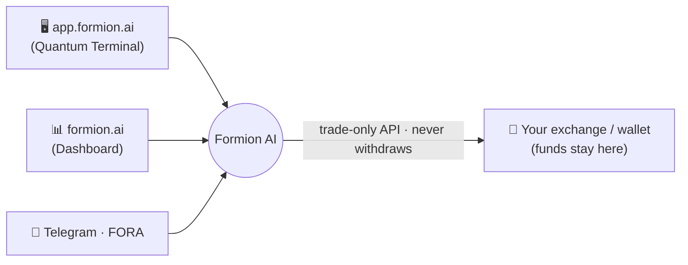

# 📖 Formion AI Ecosystem

<figure><figcaption></figcaption></figure>

## 👀 Overview


🚀 **Welcome to Formion AI** — AI solutions for next-level trading. Crypto, forex, stocks, commodities, options and prediction markets, in one place.


**Formion AI** is a multi-asset, AI-powered trading platform that unifies professional-grade tools into a single ecosystem you can drive from the web app or from Telegram. It combines AI analysis, automated bots, deep market data, backtesting and copy trading — without ever taking custody of your funds (your keys stay on your own exchange).

The platform spans three surfaces:

* **[app.formion.ai](https://app.formion.ai)** — the Quantum Terminal trading app: screeners, charts, analytics, AI advisor, backtesting, signals, bots and journal.
* **[formion.ai](https://formion.ai)** — your account dashboard: portfolio aggregation, exchange/wallet connections, pricing & profile.
* **Telegram (`@formiontradingbot`)** + **FORA** — a conversational AI assistant that mirrors the platform and can place trades, run scans and answer portfolio questions.

## ⚡️ What you can do

* 🤖 **AI trading assistance** — FORA chat, AI Advisor (ranked trade ideas), Trade Vision (chart-image → trade), and a Research RAG-LLM engine.
* 📊 **Deep market data** — multi-exchange screeners, open-interest / funding / long-short analytics, order-flow & footprint, GEX / options, on-chain events and whale tracking.
* 🦾 **Automate trading** — DCA, Grid, Indicator, Trailing, Funding-arb and Alarm bots, plus **TradingView webhook automation** that executes your alerts on your connected CEX or DEX.
* 🧪 **Build & backtest strategies** — no-code Strategy Builder, 5-year backtests, walk-forward validation and a prop-firm simulator.
* 🤝 **Copy trading** — copy traders today through your exchange's native copy trading (e.g. Bybit); native Formion copy-trading for selected bots is **coming soon**.
* 📓 **Trading journal** — auto-import, AI auto-tagging and full performance analytics.
* 🔌 **Connect everything** — 8 CEX, 4 DEX, on-chain wallets (EVM/Solana/Sui/TON) and prediction markets (Polymarket/Kalshi/Limitless).

## 🔐 Security & custody

* Formion **never holds your funds** — it connects to your exchange via API keys (trade-only, no withdrawal) and your funds stay on the exchange.
* All API keys and sensitive data are **AES-256-GCM encrypted at rest**.
* **2FA**, session management and IP-whitelisting are supported.

## 🪙 FOM Token

FOM is the native utility token of the Formion ecosystem (subscription discounts, AI-quota boosts, staking, referral bonuses and — later — a strategy marketplace and governance). **The launch chain and tokenomics are being finalized — see the [FOM token](fom-token.md) page. 🚧 Coming soon.**

## 🗺️ Where to go next

* New here? Start with **[How to Start — API Connection](how-to-start-api-connection.md)**.
* Want the full app tour? See **[The App](the-app.md)**.
* Pricing & plans: **[Pricing & Tiers](pricing.md)**.
* Automate TradingView alerts: **[TradingView Automation](how-to-automate-trades-tradingview-alerts.md)**.
