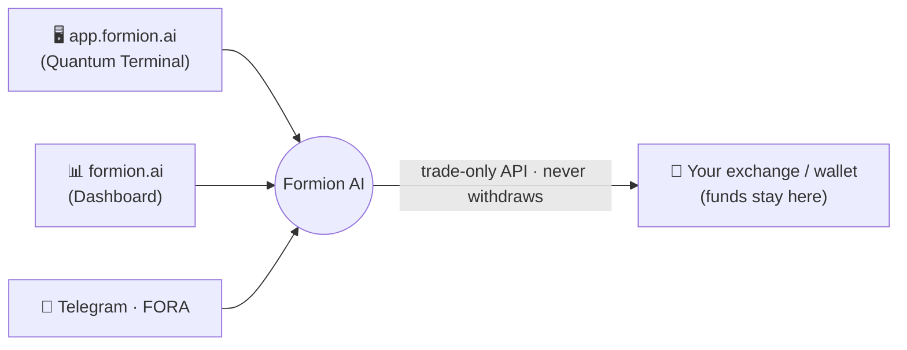

# 📖 Formion AI Ecosystem

<figure><figcaption></figcaption></figure>

## 👀 Overview


🚀 **Welcome to Formion AI** — AI solutions for next-level trading. Crypto, forex, stocks, commodities, options and prediction markets, in one place.


**Formion AI** is a multi-asset, AI-powered trading platform that unifies professional-grade tools into a single ecosystem you can drive from the web app or from Telegram. It combines AI analysis, automated bots, deep market data, backtesting and copy trading — without ever taking custody of your funds (your keys stay on your own exchange).

```mermaid
flowchart LR
  A["🖥️ app.formion.ai<br/>(Quantum Terminal)"] --> F(("Formion AI"))
  D["📊 formion.ai<br/>(Dashboard)"] --> F
  T["💬 Telegram · FORA"] --> F
  F -->|"trade-only API · never withdraws"| K["🔐 Your exchange / wallet<br/>(funds stay here)"]
```

The platform spans three surfaces:

* **[app.formion.ai](https://app.formion.ai)** — the Quantum Terminal trading app: screeners, charts, analytics, AI advisor, backtesting, signals, bots and journal.
* **[formion.ai](https://formion.ai)** — your account dashboard: portfolio aggregation, the Command Center, exchange/wallet/broker connections, pricing & profile.
* **Telegram (`@formiontradingbot`)** + **FORA** — a conversational AI assistant that mirrors the platform: it runs scans, answers portfolio questions and places trades after you confirm them.

## ⚡️ What you can do

* 🤖 **AI trading assistance** — FORA chat, AI Advisor (ranked trade ideas), Trade Vision (chart-image → trade plan), and a Research RAG-LLM engine.
* 📊 **Deep market data** — multi-exchange screeners, open-interest / funding / long-short analytics, order-flow & footprint, GEX / options, on-chain events and whale tracking.
* 🦾 **Automate trading** — follow Formion's catalog bots, run paper bots, set up DCA, Grid, Trailing, Alarm, indicator-signal and funding bots in `@formiontradingbot`, and use **TradingView webhook bots** that execute your alerts on your connected CEX or DEX (rolling out).
* 🧪 **Build, backtest & explore strategies** *(Pro)* — no-code Strategy Builder, an AI strategy agent, **Edge Finder**, historical backtests, and a **Strategy Marketplace** to publish strategies and review their forward record.
* 🤝 **Copy trading** — copy traders today through your exchange's native copy trading (e.g. Bybit); native Formion copy-trading for selected bots is **coming soon**.
* 📓 **Trading journal** — manual entries, read-only exchange import with auto-sync, webhook push, an AI review of your trading and full performance analytics.
* 🔌 **Connect cTrader forex/CFD brokers alongside crypto venues** — see [Brokers](brokers.md).
* 🔌 **Connect everything** — 8 CEX, 4 DEX perps venues, on-chain wallets (EVM, Solana, Sui and TON) and prediction markets (Polymarket/Kalshi/Limitless).

## 🔐 Security & custody

* Formion **never holds your funds** — it connects to your exchange via API keys (trade-only, no withdrawal) and your funds stay on the exchange.
* All API keys and sensitive data are **AES-256-GCM encrypted at rest**.
* **2FA** with backup codes, an optional trading password, session management and sign-in alerts are supported.

## 🪙 FOM Token

**FOM** is Formion's ERC-20 token on **Base** (Ethereum L2): fixed supply of 1,000,000,000, no presale, LP locked 24 months, launching on Uniswap (Base) on **Wed 14 Oct 2026**. USD platform licences and FOM Agent levels serve separate purposes. See [FOM token](fom-token.md) for launch details, allocation, vesting and utility.

## 🗺️ Where to go next

* New here? Start with **[How to Start — API Connection](how-to-start-api-connection.md)**.
* Want the full app tour? See **[The App](the-app.md)**.
* Pricing & plans: **[Pricing & Tiers](pricing.md)**.
* Automate chart alerts: **[Webhook Automation](how-to-automate-trades-tradingview-alerts.md)**.

* Ask FORA from the dashboard: [Command Center](command-center.md).
* Follow events and headlines: [News 24/7 & Macro](news.md).
* Review trader ideas and graded calls: [Swarm](swarm.md).
* Research venue funding spreads: [Funding Carry](funding-carry.md).
* Review tracked outcomes: [Trades History](trades-history.md).
