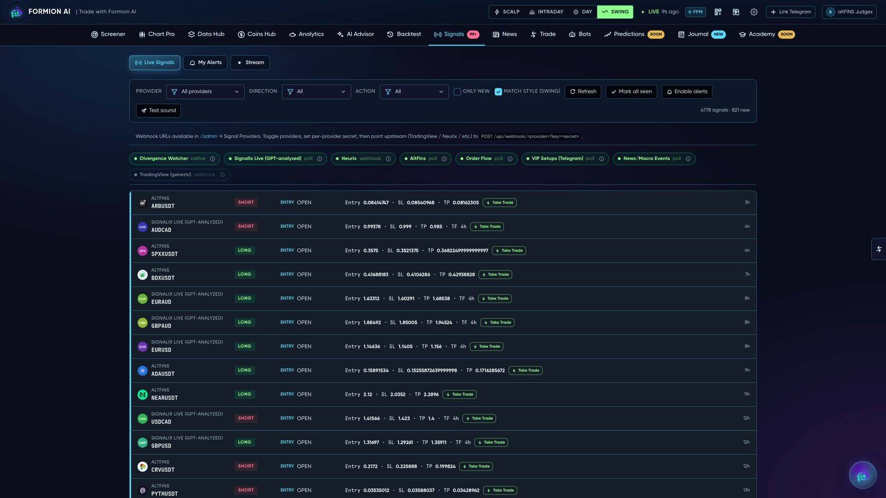

# 🔔 Alerts

<figure><figcaption></figcaption></figure>

Never miss a setup. Formion delivers alerts across **five channels** and lets you build your own rules — plus per-strategy alerts on every bot and engine.

## Channels

| Channel | Use |
|---|---|
| **In-app** | Toast + alert bell while you're on the platform |
| **Sound** | Audio ping for hands-off monitoring |
| **Telegram** | Push to your Telegram so you're alerted with the browser closed — see **[Telegram Signals](telegram-signals.md)** for linking |
| **Email** | Inbox delivery |
| **Webhook** | POST to your own endpoint (automation, Discord, your bot) |

## What you can alert on

* **Custom rules** — price, RSI, moving-average cross, SMC events, liquidation clusters
* **Per-strategy / per-bot** — get pinged when any tracked engine fires a signal (contextual 🔔 on Trade History, Strategy Lab and indicator panels)
* **Market events** — funding extremes, OI surges, GEX flips, whale prints


Free **Neural** includes a few alerts; **Pro** and **Institutional** are unlimited. Rich formatting (levels, meters, context) is included.


The live **Signals** stream shows every provider's alerts in one feed with win/loss coloring, and the **My Alerts** builder is where you create and manage your own rules.
