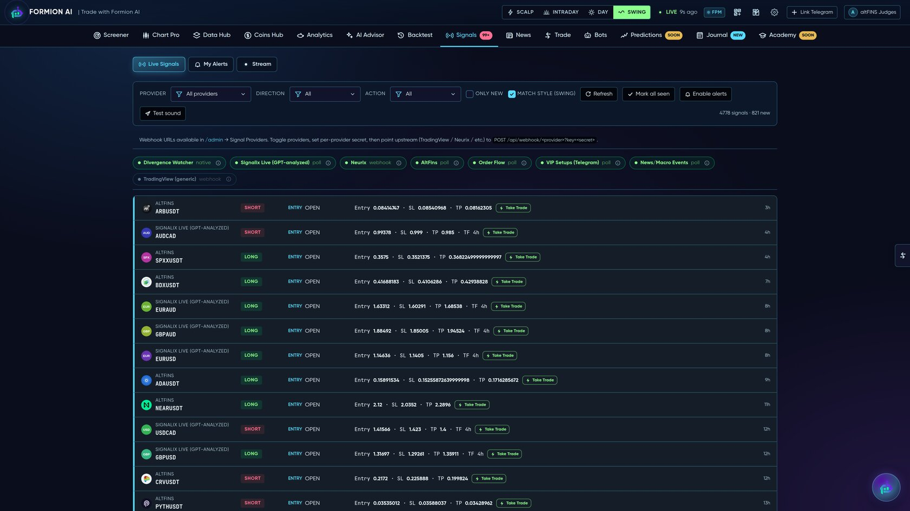

# 🔔 Alerts

<figure><figcaption></figcaption></figure>

Never miss a setup. Formion delivers alerts across **five channels** and lets you build your own rules — plus per-strategy alerts on every bot and engine.

## Channels

| Channel | Use |
|---|---|
| **Browser** | Browser notification + on-page toast while the app is open |
| **Sound** | Audio ping for hands-off monitoring |
| **Telegram** | Push to your Telegram so you're alerted with the browser closed — see **[Telegram Signals](telegram-signals.md)** for linking |
| **Email** | Inbox delivery |
| **Webhook** | POST to your own endpoint (automation, Discord, your bot) |

## What you can alert on

* **Custom rules** — price, % change, RSI, MACD cross, EMA alignment, SMC order-block / FVG events, divergences, liquidation clusters, your drawn zones, custom-indicator conditions and multi-condition confluence
* **Per-strategy / per-bot** — get pinged when any tracked engine fires a signal (contextual 🔔 on Trade History, Strategy Lab and indicator panels)
* **Market events** — funding thresholds, open-interest changes, GEX flips, smart-money (whale) flows, economic-calendar releases and crypto-calendar events


Active custom alerts: **Neural 3**, **Pro 100**, **Institutional unlimited**; Pro and Institutional add email alerts. See **[Pricing & Tiers](pricing.md#daily-limits)**. You can also ask [FORA](fora.md) to prepare an alert for you to confirm.


The **Signals** tab collects every provider's signals into one live feed, and **app.formion.ai/signals/alerts** is where you create and manage your own alert rules. Telegram delivery needs your Telegram linked in profile → Connections with Telegram notifications on in profile → Account → Preferences.

## Current workflow

Use alerts alongside [News](news.md), [Telegram Signals](telegram-signals.md) and your market views. An alert notification is distinct from an authorised trading action. Check the destination and rule before enabling it.
