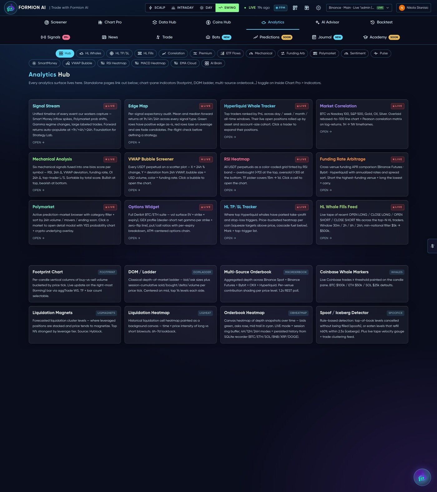
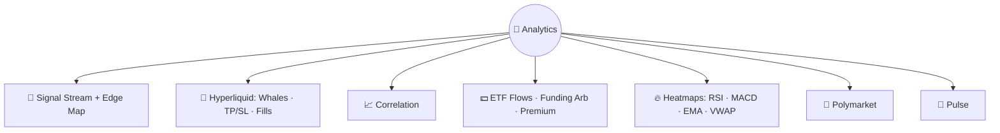

# 🧠 Analytics

<figure><figcaption>A hub of standalone analytics tools, each one tab away.</figcaption></figure>

The **Analytics** hub (app.formion.ai → Analytics) is a collection of focused, standalone tools — each answering one specific question about market structure, smart money or cross-asset behaviour.

## What's inside

* **Signal Stream & Edge Map** — every native signal as a live tape, plus per-signal **expectancy** so you know which signals actually have an edge.
* **Hyperliquid suite** — **Whale Tracker** (largest on-chain perp traders and their open positions), **HL TP/SL** (where the crowd's stops and targets sit), **HL Fills** (live large fills).
* **Correlation** — BTC vs Nasdaq, S&P, Gold, Oil and more — is crypto trading risk-on or decoupling?
* **Flows** — **ETF Flows** (spot BTC/ETH ETF in/outflows), **Funding Arb** (cash-and-carry opportunities), **Premium Index** (perp vs spot).
* **Heatmaps** — market-wide **RSI / MACD / EMA-cloud / VWAP-bubble** grids to spot extremes at a glance.
* **Polymarket** — prediction-market browser + trader leaderboard: live odds on crypto/macro/event markets as a crowd-priced probability input.
* **[Formion Pulse](pulse.md)** — narrative sentiment + influencer accuracy, also reachable here.


These are research tools, not signals to trade blindly. The most useful pairing is **Edge Map** (does this signal pay?) with the **[Screener](screener.md)** (is it firing now?).

