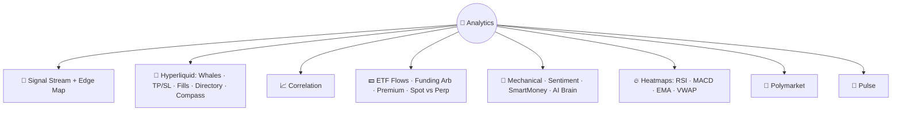

# 🧠 Analytics

<figure><figcaption>A hub of standalone analytics tools, each one tab away.</figcaption></figure>

The **Analytics** hub (app.formion.ai → Analytics) is a collection of focused, standalone tools — each answering one specific question about market structure, smart money or cross-asset behaviour.

## What's inside

```mermaid
flowchart TD
  AN(("🧠 Analytics")) --> SM["📡 Signal Stream + Edge Map"]
  AN --> HL["🐋 Hyperliquid: Whales · TP/SL · Fills · Directory · Compass"]
  AN --> CO["📈 Correlation"]
  AN --> FL["💵 ETF Flows · Funding Arb · Premium · Spot vs Perp"]
  AN --> MS["🧭 Mechanical · Sentiment · SmartMoney · AI Brain"]
  AN --> HM["🔥 Heatmaps: RSI · MACD · EMA · VWAP"]
  AN --> PM["🎲 Polymarket"]
  AN --> PU["📡 Pulse"]
```

* **Signal Stream & Edge Map** — a unified timeline of the events Formion's workers capture (smart-money inflow spikes, Polymarket probability shifts, gamma regime changes, large labeled trades) with forward returns at +1h/+4h/+24h, plus per-signal **expectancy** so you know which signals actually have an edge.
* **Hyperliquid suite** — **HL Whales** (top traders by PnL and their open positions), **HL TP/SL** (where mid-tier accounts park stops and targets), **HL Fills** (live open/close fills from top traders), **HL Directory** (labeled funds, KOLs, market makers and deployers) and **HL Whale Compass** (live feed of labeled-wallet trades).
* **Correlation** — BTC vs Nasdaq 100, S&P 500, Gold, Oil and Silver — is crypto trading risk-on or decoupling?
* **Flows** — **ETF Flows** (spot BTC/ETH ETF in/outflows), **Funding Arb** (cross-venue funding APR across Binance, Bybit, Hyperliquid, Gate, MEXC and KuCoin), **Premium Index** (perp vs spot) and **Spot vs Perp** (which side is pushing price).
* **Mechanical, Sentiment & SmartMoney** — **Mechanical** fuses nine mechanical signals into one bias score per symbol; **Sentiment** combines Fear & Greed, top-trader long/short and funding into a composite score with a 60-day calendar; **SmartMoney** shows smart-money and whale trades, inflows and leaderboards.
* **AI Brain** — one dashboard for Formion's AI subsystems: AI trade ideas with outcomes and the AI consensus pipeline.
* **Heatmaps** — market-wide **RSI / MACD / EMA-cloud / VWAP-bubble** views (shared with the [Screener](screener.md)) to spot extremes at a glance.
* **Polymarket** — prediction-market browser + trader leaderboard: live odds on crypto/macro/event markets as a crowd-priced probability input.
* **[Formion Pulse](pulse.md)** — market-narrative sentiment from X, YouTube and crowd chatter, also reachable here.


These are research tools, not signals to trade blindly. The most useful pairing is **Edge Map** (does this signal pay?) with the **[Screener](screener.md)** (is it firing now?).

