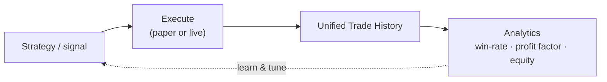

# 🦾 Bots & Automation

<figure><figcaption></figcaption></figure>

Formion runs a catalog of automated strategies in the **Bots** hub. A few run **live**, others on **demo** accounts, and most run **paper-first** for validation. Every strategy's trades flow into the unified **Trade History** hub so you can compare them side by side (KPIs, equity curve, win-rate, per-strategy analytics).


**Live execution** requires a **Pro** plan (5 live bots) or **Institutional** (unlimited). Neural (free) has no live bots but runs unlimited **paper** bots, and demo attachments are open to every plan. You can build your own bot from a strategy, and automate chart alerts — see **[Webhook Automation](how-to-automate-trades-tradingview-alerts.md)**.


## Build your own — Strategy Lab → Bots Hub → Marketplace

You're not limited to Formion's catalog. The full creator flow, **no code required**:

1. **Strategy Lab** — build a strategy from rules, indicators and conditions, then validate it in the **Backtester**. The **Edge Finder** (AutoML) goes further: give it just a symbol and it searches for the best-fitting strategy class (DCA / grid / mean-reversion / breakout…) for the current market regime.
2. **Bots Hub** — build a **paper** bot from a supported catalog strategy (**Bots → Build**), or attach an attachable Formion bot or marketplace strategy to **your own** connected account in **demo** or **live** mode. Live attachments count toward your plan's live-bot limit. Your bots, your keys, your account.
3. **Marketplace** — publish your strategy once it passes the publish quality gate (fresh 1-year backtest, at least 30 trades, drawdown ≤ 30%, positive out-of-sample expectancy). Other traders subscribe, **you earn**, and the platform takes a fee. Paid strategy subscriptions are checked out on formion.ai.

Every strategy and bot — Formion's and yours — streams into the unified **Trade History** with the same analytics suite, so a community strategy is judged on the exact same KPIs as a flagship engine.

## Bot building blocks (@formiontradingbot)

These bot types run from the **@formiontradingbot** Telegram bot on your own connected exchange:

| Bot | Command | What it does |
|---|---|---|
| **DCA** | `/dca` | Buys (or opens long/short) a fixed USDT amount on a repeating interval, with an optional cap on the number of runs. |
| **Grid** | `/grid` | Places a ladder of limit orders between a low and high price (5–30 levels) in neutral, long-only or short-only mode. |
| **Indicator** | `/signal` | Fires when a built-in indicator (RSI, MACD, EMA 20, Bollinger band or price) crosses your threshold, then buys, sells, closes or just notifies. |
| **Trailing** | `/trailing` | Software trailing stop on an open position, trailing by a set % from the peak (long) or trough (short). |
| **Funding-arb** | `/funding_wizard` | Opens a delta-neutral hedge across two venues (long where funding is cheaper, short where it is richer) and closes it after the duration you set. |
| **Alarm** | `/alarm` | Notifies you when price crosses a target (above / below). No order is placed. |

TradingView alerts can also place orders on your connected CEX/DEX through **TradingView Automation** on formion.ai (see **[Webhook Automation](how-to-automate-trades-tradingview-alerts.md)**).

## Strategy catalog

The public **Bots** hub shows each bot's pool (**paper**, **demo** or **live**) on its card. Highlights by category:

### Crypto perps

| Bot | Pool | Summary |
|---|---|---|
| **Talos** | live | Mirrors a top Binance Futures leader onto a Bybit account, sized by balance ratio. |
| **Liqra** | demo | Liquidation-cluster executor on Bybit with an AI confidence score and dynamic TP/SL. |
| **Liqra v3** | paper | Order-book/liquidity-alert BTC short, taken only below the 1h EMA50. |
| **Formion Flow Fade / Hedge / XL** | demo | BTC order-flow exhaustion fades (in training and calibration). |
| **Formion Scalper** | paper | 1-minute oversold-bounce DCA scalper. |
| **Neurix Crypto** | paper | Follows the Neurix crypto signals exactly as they fire. |
| **Hyperliquid Footprint, Liquidation Plays, AI Screener, RSI Divergence, OI Surge** | paper | Hyperliquid signal families (footprint patterns, whale TP/SL-cluster plays, AI-filtered breakouts, RSI divergences, OI spikes). |

### Crypto spot, stocks & forex (Strategy Lab)

| Bot | Pool | Summary |
|---|---|---|
| **Wick Reversal 15m / 1m, EMA 9/21 Cross, VWAP Mean Reversion** (crypto) | paper | Lab strategies on USDT pairs. |
| **Multi-Bull Confluence, Donchian Breakout, EMA 9/21 Cross** (stocks) | paper | Lab strategies on US stocks. |
| **Neurix Stocks** | paper | Follows the Neurix stock signals. |
| **EMA 9/21 Cross, MACD Bull Cross, MACD Bear Cross** (forex) | paper | Lab strategies on FX majors and crosses. |

### Gold

| Bot | Pool | Summary |
|---|---|---|
| **Gold FRVP — Failed Auction + Breakout** | demo | XAUUSD 5m volume-profile (VAH/POC/VAL) failed-auction and breakout setups. |
| **Gold FRVP v1 — Original / Smart (regime)** | paper | Earlier two-way FRVP version and its regime-filtered variant. |
| **Gold DCA — Z-RSI** | demo | Z-score-RSI defensive DCA on gold (cTrader XAUUSD or Bybit XAUTUSDT). |

### Prediction markets

| Bot | Pool | Summary |
|---|---|---|
| **Polymarket Edge** | live | Black-Scholes fair value (from Deribit IV) vs the market YES price on BTC/ETH/SOL markets. |
| **Poly Solo Directional** | live | Bets the Polymarket leg of low-risk arb-scanner signals; attachable to your own Polymarket wallet. |
| **BTC Hourly Arb** | paper + live | Buys both opposite legs across Polymarket and Kalshi when their combined cost is under $1. |
| **PolyScalp v1** | paper + live | Up/down scalper on Polymarket crypto minute markets. |
| **PolyTracker — Whale Copy** | paper | Paper copy of selected Polymarket whales. |

## Tracking performance

Open **Trade History** in the app (Backtest → All Trades) and filter by bot to see its KPIs, equity curve, win-rate, hold-time buckets, and per-symbol / per-session breakdowns. Every new bot automatically inherits the full analytics dashboard.
