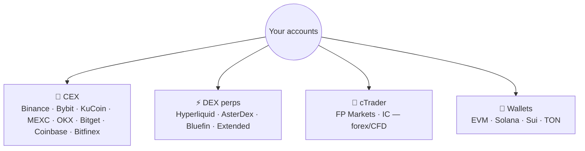

# 🔌 Brokers & Connections

Formion works with **your** accounts — you never move funds to us. Connect at **app.formion.ai → Brokers** (and for exchange API keys, see **[How to Start — API Connection](how-to-start-api-connection.md)**).

## What you can connect

* **CEX (API key):** spot + perps. Create a key with the permissions you want (read-only for tracking, trade for bots — **never enable withdrawals**) and paste it in. Step-by-step with screenshots on the **[API Connection](how-to-start-api-connection.md)** page.
* **cTrader (OAuth):** link FP Markets / IC cTrader (demo + live) for forex, indices, metals and CFDs. OAuth means no API key to manage — you authorise Formion from the broker, and it scales like a CEX connection.
* **DEX perps:** Hyperliquid and other on-chain venues for perps; on-chain **swaps** route best-price across EVM, Solana and Sui.
* **Wallets:** read-only or full (encrypted) across EVM, Solana, Sui and TON.

## Read-only vs full

| Mode | What it does | Use for |
|---|---|---|
| **Read-only** | imports balances, positions & trade history | the **[Journal](journal.md)**, analytics, tracking |
| **Full (trade)** | can place/manage orders you or a bot trigger | manual **[Trade](the-app.md)** dock, **[bots](bots.md)**, marketplace strategies |


Security first: scope API keys to the minimum needed, **disable withdrawals**, and prefer IP-whitelisting where the exchange supports it. Credentials are stored encrypted. See **[Security](security.md)**.


Once connected, your account flows into the **[Trading Journal](journal.md)** automatically and becomes a target for **[bots](bots.md)** and **[Strategy Lab](strategy-lab.md)** strategies.
