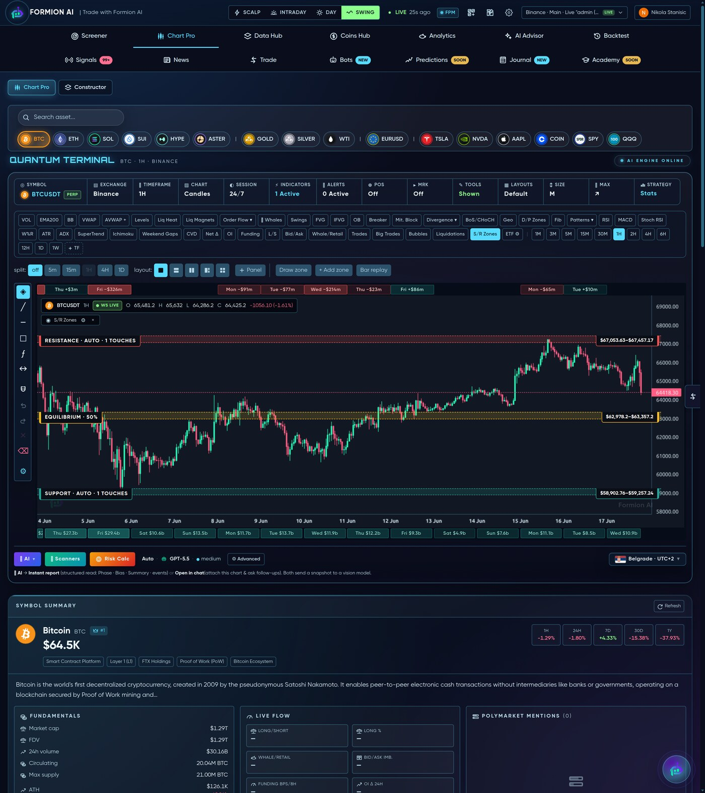
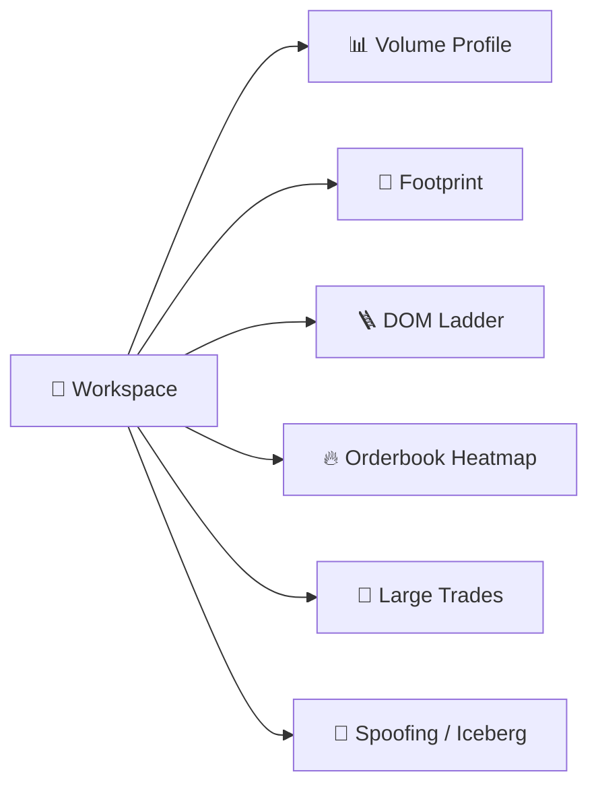

# 📊 Chart Pro

<figure><figcaption>A professional charting workspace with an order-flow layer most platforms charge extra for.</figcaption></figure>

**Chart Pro** (app.formion.ai → Chart Pro) is Formion's full charting workspace — live data, deep indicators, custom scripts and a complete order-flow toolkit.

## Charting

* **Live OHLCV** across crypto, forex, stocks, commodities and indices
* **12 timeframes** (1m → 1W)
* **100+ indicators**, including the proprietary **FormionTSI**
* **Drawing tools**, multi-chart **split view**, and saved **layouts**
* **Replay mode** — step through history bar-by-bar to practice or study a setup

## User Indicator Studio

Upload your own **Pine scripts** and render them on the chart — a Pine-subset compiler handles common scripts, with an AI fallback for the rest (sandboxed). Your custom indicators sit alongside the built-ins.

## Order-flow Workspace

The Workspace exposes microstructure usually reserved for paid terminals:

* **Volume Profile** & **Footprint** — where volume and delta actually traded
* **DOM ladder** & **Orderbook heatmap** — resting liquidity and walls
* **Large-trade tape** and **spoofing / iceberg** detection — spot manipulation and absorption


Open any **[Screener](screener.md)** row straight into Chart Pro to go from "this scored well" to "here's exactly where I'd enter" in one click.

