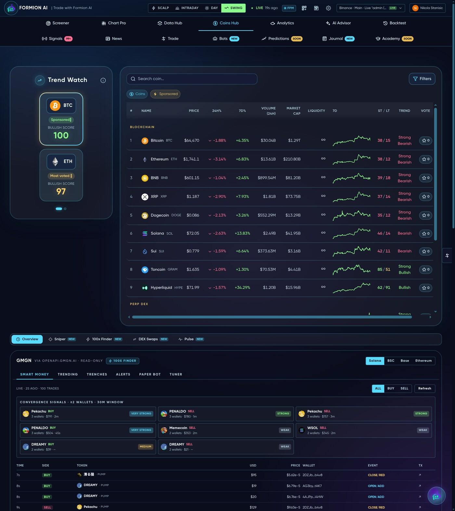
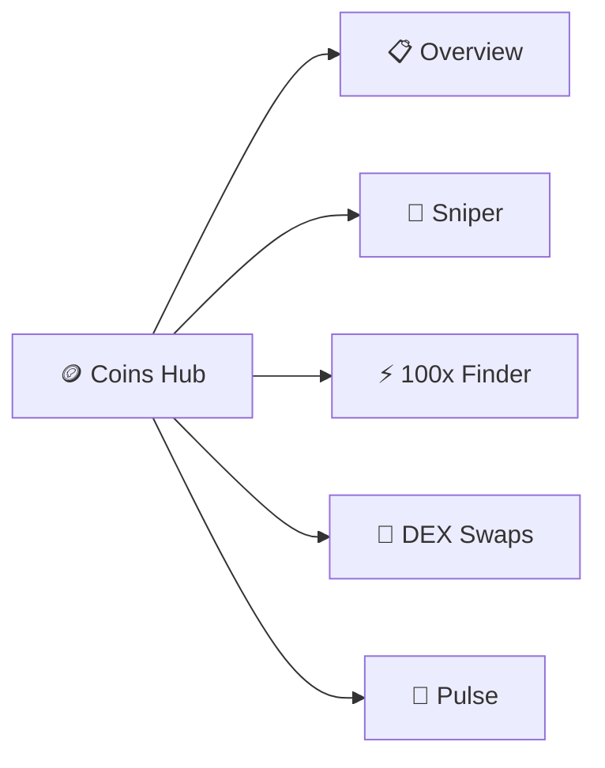

# 🪙 Coins Hub

<figure><figcaption>Discover, research and trade coins — from blue-chips to fresh launches.</figcaption></figure>

The **Coins Hub** (app.formion.ai → Coins Hub) is the discovery and research center for crypto — trend watch, deep coin pages, smart-money flow, low-cap hunting and on-chain swaps in one place.

## Sub-tabs

* **📋 Overview** — **Trend Watch** (top gainers / losers by timeframe), a full coin listing with detail cards (price, market cap, supply, links, socials), and a **GMGN smart-money** panel showing where profitable wallets are flowing.
* **🎯 Sniper** — early-detection for newly listed / trending tokens before they hit the majors.
* **⚡ 100x Finder** — low-cap hunting across **Solana, BSC, Base, ETH, TON, Sui, Hyperliquid, Tron, Arbitrum, Optimism**: filters for liquidity, age, holders and momentum to surface asymmetric bets (with the risk that implies).
* **🔄 DEX Swaps** — trade spot directly from your connected wallet with best-price routing across EVM, Solana and Sui.
* **📡 [Pulse](pulse.md)** — market-narrative sentiment + influencer accuracy, nested here.


Low-cap and freshly launched tokens are high-risk by nature — thin liquidity, possible scams. The 100x Finder and Sniper surface candidates to **research**, never guarantees. Size accordingly.

