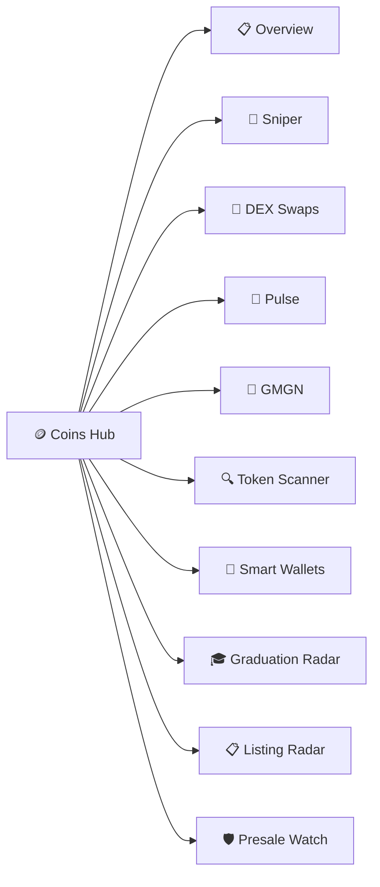

# 🪙 Coins Hub

<figure><figcaption>Discover, research and trade coins — from blue-chips to fresh launches.</figcaption></figure>

The **Coins Hub** (app.formion.ai → Coins Hub) is the discovery and research center for crypto — trend watch, deep coin pages, smart-money flow, low-cap and launch tracking and on-chain swaps in one place. The hub is labelled **BETA · experimental, no performance claim**.

## Sub-tabs

```mermaid
flowchart LR
  CH["🪙 Coins Hub"] --> OV["📋 Overview"]
  CH --> SN["🎯 Sniper"]
  CH --> DX["🔄 DEX Swaps"]
  CH --> PU["📡 Pulse"]
  CH --> GM["🔭 GMGN"]
  CH --> TS["🔍 Token Scanner"]
  CH --> SW["👛 Smart Wallets"]
  CH --> GR["🎓 Graduation Radar"]
  CH --> LR["📋 Listing Radar"]
  CH --> PW["🛡️ Presale Watch"]
```

* **📋 Overview** — **Trend Watch** (top gainers / losers by timeframe), a full coin listing with detail pages (price, market cap, supply, links, socials), and the GMGN panel below it.
* **🎯 Sniper** — launch tracking: **New Pairs** (on-chain observations), **Presale Radar** (PinkSale), **CEX Listings** (exchange listing announcements) and an **IDO Calendar**.
* **🔄 DEX Swaps** — server-signed on-chain swaps from the wallet you connect in the Telegram bot (`/wallet`), routed via Jupiter (Solana), 7K (Sui) and LI.FI / deBridge (EVM and cross-chain), with a ledger of your swaps.
* **📡 [Pulse](pulse.md)** — market-narrative sentiment from X, YouTube and crowd chatter, nested here.
* **🔭 GMGN** — read-only on-chain explorer for Solana, BSC, Base and Ethereum: **Smart Money**, **KOL Trades**, **Trending**, **Trenches** and **Alerts**.
* **🔍 Token Scanner** — pump.fun token scan (launch timing, creator history, net buy flow on the curve).
* **👛 Smart Wallets** — pump.fun wallet P&L leaderboard with per-wallet profiles.
* **🎓 Graduation Radar** — tokens closest to completing the pump.fun bonding curve, plus fresh graduations.
* **📋 Listing Radar** — CoinGecko trending Solana tokens and newly detected CoinGecko listings.
* **🛡️ Presale Watch** — tokens promoted on listing/voting sites across chains.

Overview, GMGN, Token Scanner, Smart Wallets, Graduation Radar, Listing Radar and Presale Watch are also served publicly on hub.formion.ai without a login; Sniper, DEX Swaps and Pulse show a padlock until you sign in.


Low-cap and freshly launched tokens are high-risk by nature — thin liquidity, possible scams. The Sniper and radar tabs surface candidates to **research**, never guarantees. Size accordingly.


## Continue your research

Combine coin details with [Pulse](pulse.md) narrative context, [News](news.md) event timestamps and [FORA](fora.md) text or voice research. Coin research coverage does not establish execution support on a connected venue.
