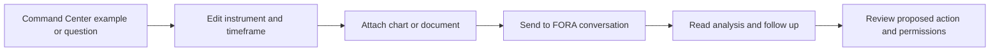

# 🕹️ Command Center

<figure><figcaption>
Formion — Command Center
</figcaption></figure>

The **Command Center** is the FORA launcher on the Formion dashboard. It brings suggested commands, attachments and conversation into the same card, so a research question can start with the context already at hand.

## What you see

**Commands** provides a text field, attachment button, Send button and clickable examples. Categories cover buying/selling, limit orders and leverage, research, strategies, backtests, indicators, bots, alerts and portfolio analysis. Clicking an example fills the field so you can edit it before sending.

When account chat is enabled, **Chat** opens a conversation inside the card. Commands mode sends the request to FORA’s floating conversation. The information button explains the command categories, and the Telegram link opens the Formion bot.

## Start a task

1. Open the dashboard and locate Command Center.
2. Choose a suggested command or type a request such as “show oversold large-caps 4h”. Specify the symbol, timeframe and intended task.
3. If useful, attach a chart image, PDF, DOC/DOCX, text or CSV (up to 12 MB per file, up to 6 files). Selected filenames appear above the field; remove any irrelevant file before sending.
4. Click **Send**, or press Enter. Use Shift+Enter for a new line.
5. Read FORA’s response and refine the request in the conversation. For ongoing text chat inside the card, select Chat when available.
6. For trading tasks, inspect the proposed account, instrument, direction, amount and permissions before authorising the action.

## Useful starting points

Ask “show my balance” for account context, “compare strategies #1 vs #2” for strategy review, or “alert me when BTC crosses 70k” for an alert task. The examples describe requests you can make; successful execution depends on the available tool, licence and account connection.

The in-card Chat is text only. **Live two-way voice** with FORA is available by plan, and its daily limits depend on your plan (see [Plans & Pricing](pricing.md)). In the chart chat you can also turn on read-aloud replies and microphone dictation, which use your browser's speech features. Keep instrument names and sizing explicit either way. See [FORA](fora.md) for the cognitive loop and conversation modes.


An attachment supplies context. Include the question you want answered rather than sending an unexplained file. Suggested trading commands are editable examples, not completed orders.


Related: [Brokers & Connections](brokers.md) · [Strategy Lab](strategy-lab.md) · [Alerts](alerts.md) · [Pricing](pricing.md).

