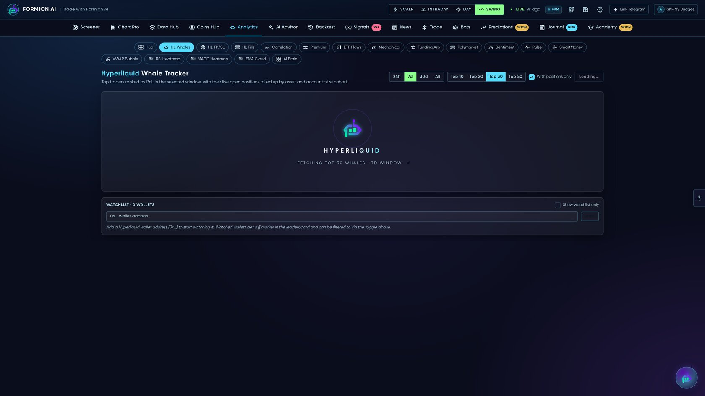
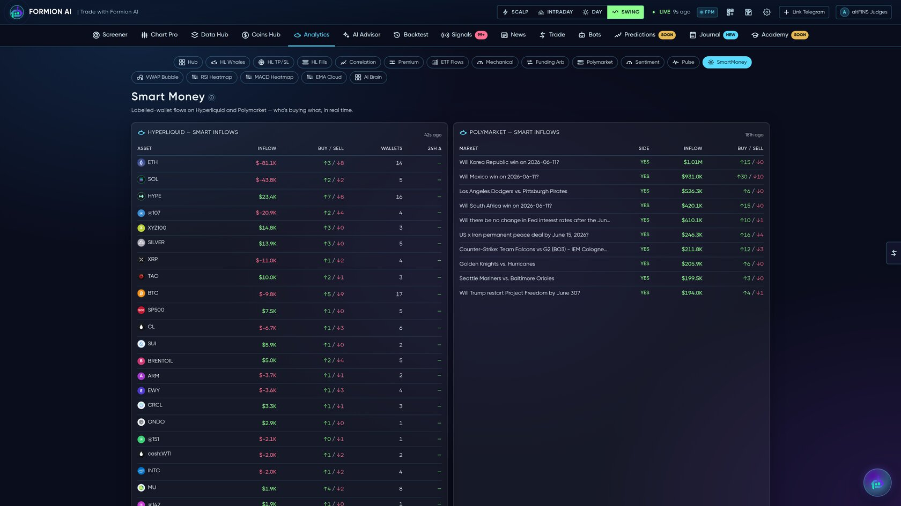

# 🤝 Copy Trading & Whale Tracking

<figure><figcaption></figcaption></figure>

Follow smart money instead of guessing. Formion tracks the biggest on-chain traders in real time and lets you copy trades — through your exchange's native copy today, with Formion-native bot copy on the roadmap.

## Hyperliquid whale tracking

A live window into the largest Hyperliquid traders:

* **Whale leaderboard** — top accounts by size and performance
* **Live positions & fills tape** — what whales are holding and trading right now
* **Wallet drill-down** — open positions, history and PnL per address
* **HL TP/SL engine** — Formion's own strategy family built on whale imbalance, stop-hunt and TP-magnet behavior (tracked in **[Trade History](journal.md)**)

<figure><figcaption></figcaption></figure>

## On-chain smart money

Beyond Hyperliquid, Formion surfaces **on-chain smart-money flow and trenches** (early accumulation, notable wallets) in **Coins Hub** — so you can see where informed capital is rotating across DEX markets.

## Copy trading

| Today | Roadmap |
|---|---|
| Copy traders through your **exchange's native copy** (e.g. Bybit), managed from Formion | **Formion-native copy** — one-click copy of selected Formion bots/strategies onto your own account |


Copy trading runs on **your** account via API keys / your wallet — Formion never holds your funds.

