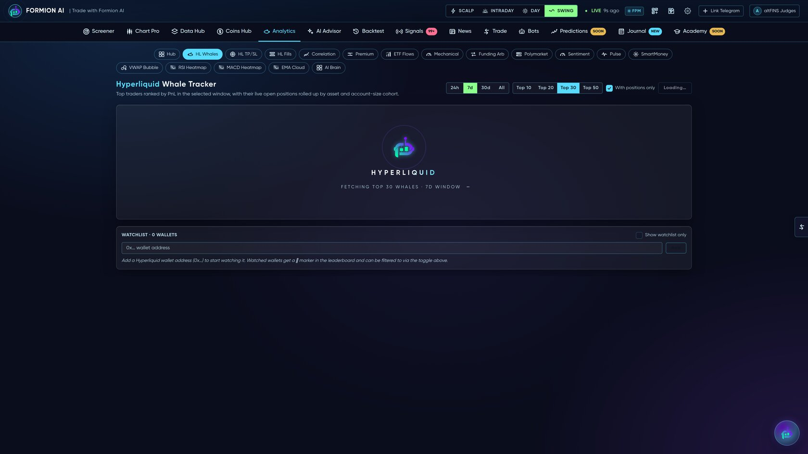
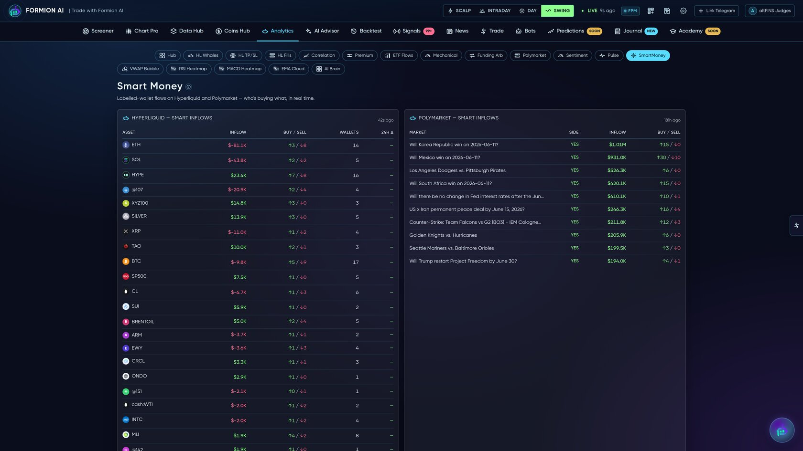

# 🤝 Copy Trading & Whale Tracking

<figure><figcaption></figcaption></figure>

Follow smart money instead of guessing. Formion tracks the biggest on-chain traders in real time, and you can attach selected Formion bots to your own connected account so their signals trade for you.

## Hyperliquid whale tracking

A live window into the largest Hyperliquid traders:

* **HL Whales** — whale leaderboard (sortable by PnL, ROI, account value, notional) with cohort and per-asset long/short breakdowns
* **HL Fills** — live fills tape
* **Wallet drill-down** — open positions, history and PnL per address
* **HL TP/SL** — heatmap of the top whales' take-profit and stop-loss trigger orders per coin
* **TP/SL Strats** — Formion's Hyperliquid strategy family (stop-hunt, TP-magnet fade and related plays), forward-tested on paper and tracked in **[Trade History](journal.md)**

<figure><figcaption></figcaption></figure>

## On-chain smart money

Beyond Hyperliquid, **Analytics → SmartMoney** shows a smart-money feed, whale trades and liquidations, and **Coins Hub → Smart Wallets** ranks on-chain wallets by P&L — so you can see where informed capital is rotating across DEX markets.

## Copy trading

| Today | Coming soon |
|---|---|
| **Attach a Formion bot** — in the **Bots** hub / Strategy Lab subscriptions, attach an attachable bot or marketplace strategy to your own connected account (cTrader, Bybit, Binance, Blofin, Bitget, DEX or Polymarket, depending on the bot). Demo attachments are free; live ones count toward your live-bot limit (Pro 5, Institutional unlimited). | **Copy trading** card on the formion.ai dashboard — copying other traders (Pro up to 5 copied traders, Institutional unlimited, not on the free plan). |


Attached bots trade on **your** account via your API keys / wallet — Formion never holds your funds. Copying a strategy also copies its losses and drawdowns, so check its full history and size accordingly.

