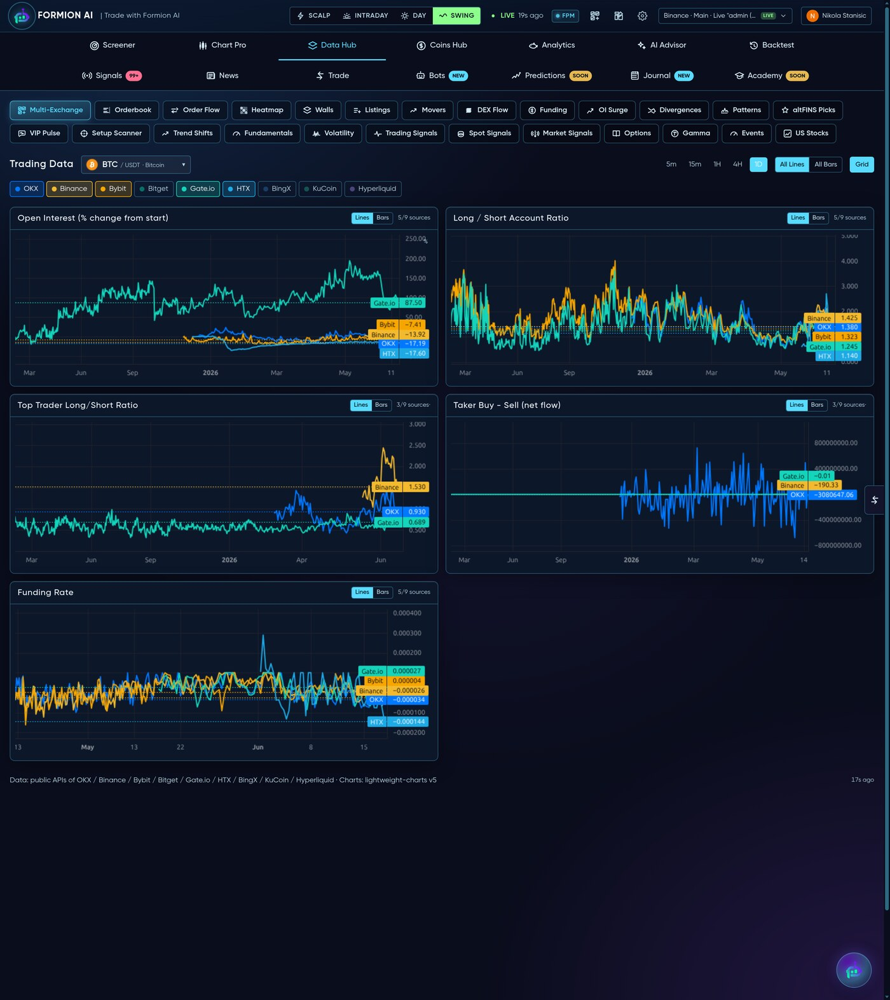
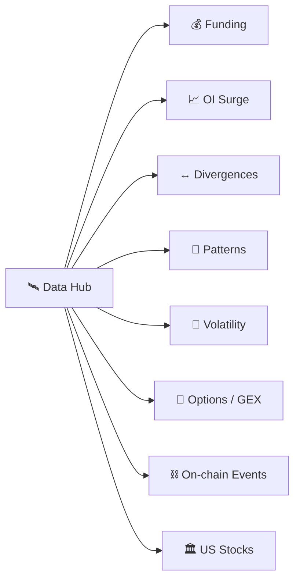

# 🛰️ Data Hub

<figure><figcaption>Real-time derivatives data and scanners across every major exchange.</figcaption></figure>

The **Data Hub** (app.formion.ai → Data Hub) is Formion's real-time **derivatives & flow** layer — the raw market structure the Screener scores are built on, exposed directly for power users.

## Live cross-exchange data

Aggregated in real time across **OKX, Binance, Bybit, Gate and HTX**:

* **Open Interest** + OI delta — where leverage is building or unwinding
* **Funding rate** — cost of carry and directional skew
* **Long/Short ratio** + **top-trader positioning** — what retail vs the big accounts are doing
* **Taker buy/sell delta** — aggressive order flow

## Built-in scanners

* **Funding** — extreme positive/negative funding across the board
* **OI Surge** — sudden open-interest spikes (positioning shifts before a move)
* **Divergences** — price vs RSI/OI/funding disagreements
* **Patterns** — geometric chart formations (triangles, wedges, H&S…)
* **Volatility** — squeeze and expansion candidates
* **Options / Gamma (GEX)** — Deribit options structure and dealer gamma
* **On-chain Events** — token unlocks, large transfers, contract events
* **US Stocks** — the same flow lens applied to equities


Use the Data Hub to answer *why* a Screener row is moving — and to catch shifts (an OI surge, a funding flip) **before** they show up in price.

