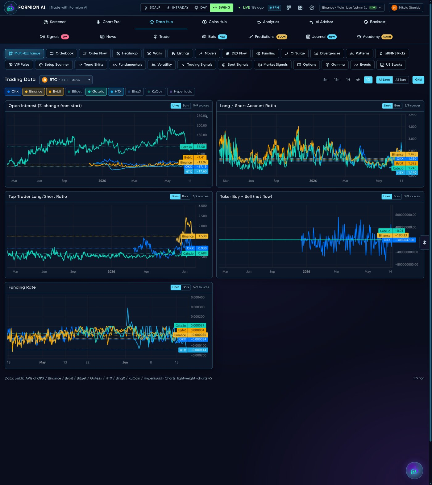
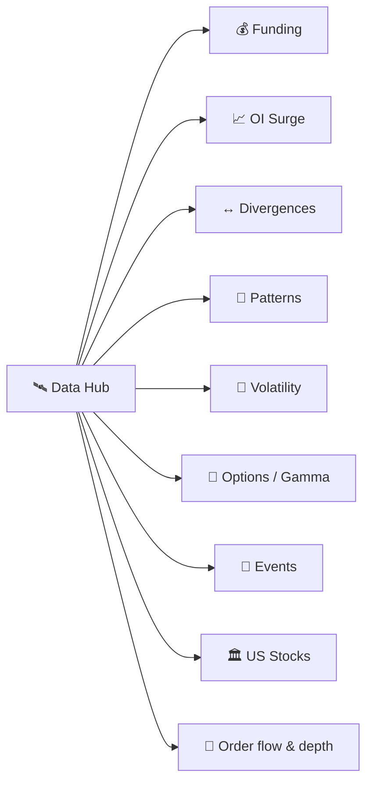

# 🛰️ Data Hub

<figure><figcaption>Real-time derivatives data and scanners across every major exchange.</figcaption></figure>

The **Data Hub** (app.formion.ai → Data Hub) is Formion's real-time **derivatives & flow** layer — the raw market structure the Screener scores are built on, exposed directly for power users.

## Live cross-exchange data

The **Multi-Exchange** view compares venues side by side — **OKX, Binance, Bybit, Gate and HTX** by default, with more venues selectable where they publish the data:

* **Open Interest** + OI delta — where leverage is building or unwinding
* **Funding rate** — cost of carry and directional skew
* **Long/Short ratio** + **top-trader positioning** — what retail vs the big accounts are doing
* **Taker buy/sell delta** — aggressive order flow

## Built-in scanners

```mermaid
flowchart LR
  D["🛰️ Data Hub"] --> F["💰 Funding"]
  D --> O["📈 OI Surge"]
  D --> DV["↔️ Divergences"]
  D --> P["📐 Patterns"]
  D --> V["🌋 Volatility"]
  D --> OP["🎲 Options / Gamma"]
  D --> E["📅 Events"]
  D --> US["🏛️ US Stocks"]
  D --> OF["🌊 Order flow & depth"]
```

* **Funding** — Binance USDT perps sorted by funding-rate magnitude (who is paying to hold the position)
* **OI Surge** — open-interest buildups and unwinds on Binance USDT perps
* **Divergences** — RSI-vs-price divergences on Binance USDT perps, with distance to the pivot
* **Patterns** — geometric chart formations (triangles, wedges, H&S…)
* **Volatility** — volatility-scanner signals with a forward-test ledger
* **Options / Gamma (GEX)** — BTC/ETH options analytics and dealer gamma on US indices, ETFs and large caps — see **[Options & GEX](options.md)**
* **Events** — per-candle up/down event series, recurring return patterns and an options-implied probability view for BTC, ETH and SOL
* **US Stocks** — daily US-equity narrative, market regime and macro indicators
* **Order flow & depth** — Orderbook, Order Flow, Heatmap, Agg Heatmap, DOM Pro, Liq Map and Walls — see **[Order Flow & Microstructure](order-flow.md)**
* **More** — Listings, Movers, DEX Flow, Trend Shifts, Fundamentals, Setup Scanner, Trading Signals, Lumina Picks, VIP Pulse and HL Perps (Hyperliquid perps, including gold, oil, FX and index perps)


Use the Data Hub to answer *why* a Screener row is moving — and to catch shifts (an OI surge, a funding flip) **before** they show up in price.

