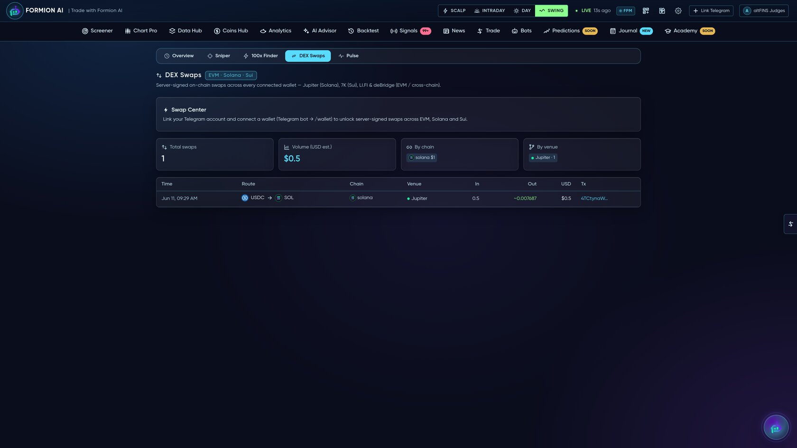

# 🔁 DEX & On-chain Trading

<figure><figcaption></figcaption></figure>

Trade on-chain without leaving Formion. Connect a wallet and **swap spot directly across multiple networks**, with aggregated best-price routing — and trade DEX perps on the venues Formion supports.


Funds stay in **your** wallet. Formion routes and signs swaps for your connected address — it never custodies your assets.


## Swap Center

One panel to swap spot across chains, with route aggregation under the hood:

| Network | Routing |
|---|---|
| **Solana** | Jupiter |
| **Sui** | 7K |
| **EVM** (Ethereum, Base, BSC, Arbitrum, Polygon, Optimism, Avalanche…) | LI.FI |
| **Cross-chain** | deBridge |

Every swap is recorded so you can review your on-chain activity (route, chain, venue, in/out, USD value, tx) right next to the rest of your trading.

## DEX perps

Formion connects to on-chain perp venues alongside your CEX accounts:

* **Hyperliquid**, **AsterDex**, **Bluefin**, **Extended**

Order entry, positions and fills sit in the same terminal as your centralized accounts — and Hyperliquid whale tracking + copy lives in **[Copy Trading & Whale Tracking](copy-trading.md)**.

## Wallets

Link **EVM, Solana, Sui and TON** wallets — read-only for tracking, or trade-ready for swaps. Wallet balances feed your unified portfolio view, and on-chain smart-money / token discovery lives in **Coins Hub** (see **[The App](the-app.md)**).


Tip: you can also trigger swaps and check on-chain flow conversationally through **[FORA](fora.md)**.

