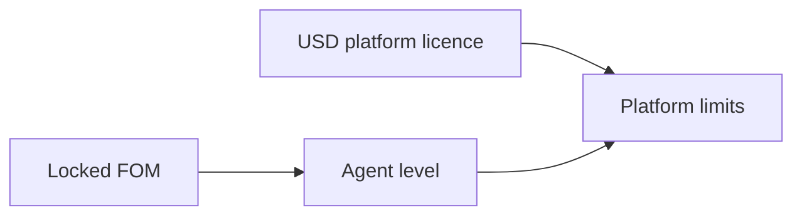

# 🪙 FOM token

<figure><figcaption>
Formion — 🪙 FOM token
</figcaption></figure>

**FOM is Formion’s token on Base (Ethereum L2)** — an ERC-20 with a fixed supply of **1,000,000,000 FOM**, minted once to a 2-of-3 Safe. The contract is OpenZeppelin v5.4 ERC-20 + Permit, with no owner, no mint function, no transfer tax, no pause and no blacklist, and it is not upgradeable. FOM grants no ownership, dividend, profit-share or claim on Formion. Full details: [formion.ai/fom](https://formion.ai/fom).

## Launch and liquidity

FOM launches on **Uniswap (Base) on Wednesday, 14 October 2026**. The launch pool is **Uniswap v3 FOM/WETH**: **40,000,000 FOM + 3 ETH**, with a 1% pool fee. The LP position is locked for **24 months on UNCX**, held by a **2-of-3 Safe**. The remaining 60,000,000 FOM in the liquidity allocation is reserved for liquidity ranges and reserves.

There is **no presale, no ICO, no launchpad and no public sale**. The **contract address is TBA at launch** and will be published on [formion.ai/fom](https://formion.ai/fom) — only trust the address from official Formion channels, and verify it before you swap.

The token is **audited by SolidProof** (0 critical · 0 high): [audit project](https://app.solidproof.io/projects/formion-ai). Token and vesting contracts have separate purposes; the token’s fixed supply does not remove vesting schedules.

## Allocation and vesting

| Allocation | FOM | Supply | Release schedule |
|---|---:|---:|---|
| Community | 300,000,000 | 30% | Published programmes |
| Treasury | 245,600,000 | 24.56% | Linear over 36 months |
| Team | 150,000,000 | 15% | 12-month cliff, linear through month 36 |
| Liquidity | 100,000,000 | 10% | Pool and reserves |
| Marketing | 100,000,000 | 10% | 6-month cliff, linear over 18 months |
| Private backer | 54,400,000 | 5.44% | 6 months locked, then 5% monthly; complete at month 25 |
| Advisors | 50,000,000 | 5% | 6-month cliff, linear over 18 months |

Each allocation sits on a public vesting contract. The private seed backer funded **4.08 ETH**: 3 ETH for initial liquidity and approximately 1.08 ETH for launch costs. This allocation is separate from the pool tokens.

## Platform licences and FORA Agent levels

Platform licences are priced in **USD** and govern platform limits. FOM does not replace or discount a licence. Planned FOM access levels unlock agent capabilities within those licence limits.

| Level | Locked FOM | Planned utility |
|---|---:|---|
| Holder | 100,000 | 30 extra FORA messages/day, realtime screener, 20% lower add-on prices when paid in FOM |
| FORA Agent | 1,000,000 | Browser agent for chart navigation, pages and research; frontier models |
| Agent Pro | 5,000,000 | Pine writing and testing, backtests, strategy search and paper-to-live workflows |
| FORA AGI | 10,000,000 | Autonomous workflows on the user’s own accounts and priority access |

FOM is planned for **add-ons, marketplace purchases and agent credits**, rather than platform licences. Agent levels and future capabilities roll out in phases; they are not all available at launch. See the [roadmap](roadmap.md). Access locks describe product eligibility, not a promised financial return.

