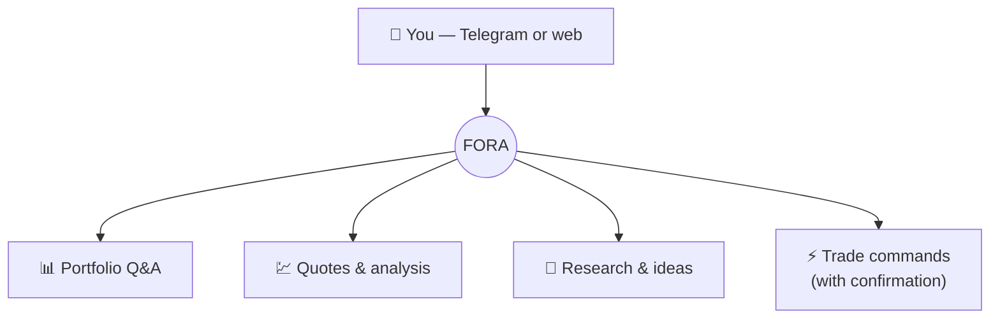

# 💬 FORA — your AI trading assistant

**FORA** is Formion's conversational AI. Talk to it in plain language on **Telegram (`@formiontradingbot`)** or on the web at **fora.formion.ai**, and it works across your whole account.

### What you can ask FORA

* **Portfolio Q&A** — *"how's my portfolio doing?"*, *"what are my open positions?"*, *"my biggest loser today?"*
* **Live quotes & analysis** — *"quote ETH"*, *"analyze SOL on the 4h"*, *"is BTC overbought?"*
* **Research & ideas** — pull a research report or trade idea right in the chat.
* **Scans** — run screeners and signal scans from a sentence.
* **Trade commands** — place, size and manage trades on your connected CEX / DEX / MT5 (with confirmation).
* **Wizards** — guided flows like the funding-rate arbitrage wizard.

### Smart model routing

FORA classifies each request and routes it to the right model tier — fast models for simple questions, stronger models (with extended thinking) for hard analysis — so you get good answers without burning your AI budget on trivial queries. Connect your own key (**BYOK**) for unlimited usage on any tier.

### Multi-AI Consensus

For decisions that matter, FORA can cross-check across multiple AI models — **Claude (Anthropic), GPT (OpenAI), Gemini (Google) and Kimi (Moonshot)** — and surface where they agree and disagree, so you're not trusting a single model's blind spot. (Pro and Institutional.)


FORA never withdraws funds and only trades on your connected accounts with your confirmation. Link your Telegram from **formion.ai → Profile → Connections**.

