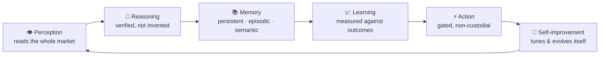
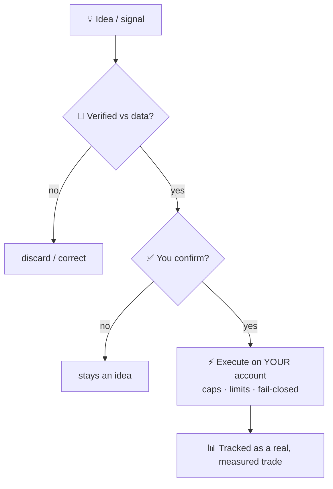

# 💬 FORA — the autonomous trading intelligence

<figure><figcaption></figcaption></figure>

**FORA** is Formion's trading intelligence. It began as a conversational assistant and has grown into something closer to a cognitive system: it perceives the whole market, reasons without inventing facts, remembers, learns from measured outcomes, trades autonomously to prove its own edge, and even evolves new strategies — all under strict, non-custodial safety.

Talk to it in plain language on **Telegram (`@formiontradingbot`)** or at **fora.formion.ai**. It works across your entire account, in your language, and every claim it makes is grounded in live data.

***

## I. Perception — it reads the whole market

Most "AI assistants" see a single chart. FORA ingests the full market state across **spot, perpetual futures, on-chain tokens, prediction markets, forex, metals and indices**, and reasons over dozens of dimensions at once:

* **Price & structure** — multi-timeframe trend and regime, support/resistance, value areas, market structure.
* **Derivatives** — open interest (rising/falling), funding, taker flow, long/short positioning.
* **Order flow & liquidity** — cumulative delta, footprint, depth imbalance, liquidation clusters.
* **On-chain & flow** — where informed capital is accumulating or distributing.
* **Sentiment & narrative** — crowd positioning, fear/greed, the news cycle.
* **Token intelligence** — for emerging tokens, an on-chain safety read (tradeable vs trap), lifecycle stage, and entry timing.

Crucially, FORA's awareness is **self-extending**. A discovery layer continuously catalogs every capability in the platform, so when Formion ships a new tool, FORA learns to use it automatically — no manual wiring, no retraining.

***

## II. Reasoning — verified, never invented

The defining property of FORA is **epistemic discipline**: it is engineered not to make things up.

* **Self-verification.** Before any answer leaves the system, a second pass fact-checks every number and directional claim against the live data that was actually fetched. Unsupported statements are corrected or removed.
* **Provenance.** Each answer shows *what it is based on* — the exact data behind it — so nothing is a black box.
* **Internal deliberation.** For decisions that matter, FORA convenes an internal panel — bullish, bearish, risk and quantitative perspectives — and synthesizes a verdict with the dissent made visible, rather than projecting false confidence.
* **Causal reasoning.** It thinks in cause-and-effect chains across markets (a stronger dollar pressuring metals, yields compressing growth) instead of loose correlation.
* **Theory of mind.** It models *other participants* — where the crowd is trapped, which liquidation cluster price is drawn toward, whose stops are likely to be hunted first — reasoning about reflexive moves before they happen.


**Measured, not marketed.** A claim without a source is not allowed; a signal without a tracked outcome is not counted. Everything FORA asserts is grounded either in live data or in its own recorded track record.


***

## III. Memory — it actually remembers

FORA carries context the way a human desk partner does:

* **Persistent memory** of who you are — the instruments you trade, your style, your recurring mistakes, your language — across every session.
* **Episodic market memory** — notable market events and how they actually resolved, so it can reason from precedent ("the last time conditions looked like this, here is what followed").
* **Semantic recall** over your whole history, retrieving the relevant past at the moment it matters.

***

## IV. Learning — it grades itself

Every concrete call FORA makes — a direction, a setup, an entry-timing read — is **logged and later measured against the real price**. From that it builds an honest, per-setup track record and **calibrates its own confidence**: if a certain kind of call has only paid 40% of the time, it says so and sizes its conviction accordingly. It also learns from aggregate, privacy-preserving base rates across the platform, so its judgment compounds with experience.

***

## V. Autonomy — it trades to prove itself

Talk is cheap, so FORA puts itself on the line. In a **simulated, risk-free account**, it autonomously selects the strongest setups, opens positions with predefined risk, and **measures its own accuracy in public** — win-rate, expectancy and equity curve, exactly like any other strategy in Formion.

When you want it to act on your real account, it does so **only through hard safety gates**: explicit per-action confirmation, position-size caps, concurrency limits, and a fail-closed default. FORA is **non-custodial** — it connects to your own exchange or broker, never holds or withdraws funds, and trades only on your instruction.

***

## VI. Self-improvement — toward a self-evolving edge

This is where FORA reaches beyond a conventional assistant.

* **Self-tuning.** It adjusts its *own* parameters from measured results — more selective when its accuracy slips, more aggressive when it is on form — within safe, reversible bounds. Larger structural changes are *proposed for human review*; it never rewrites itself unattended.
* **Evolutionary strategy discovery.** FORA runs a **genetic search** over the space of trading strategies: it breeds a population of complete strategy specifications, backtests each on out-of-sample data, keeps the fittest, and crosses and mutates them across generations. The genuinely new strategies that survive — those that beat passive holding out-of-sample — are saved and tracked. It is **discovering** edges, not selecting from a fixed menu.

***

## Using FORA day to day

* **Ask anything** — *"how's my portfolio?"*, *"analyze SOL on the 4h"*, *"is BTC overbought?"*, *"which tokens are trending?"*, *"who's trapped here?"*
* **Research & ideas, scans, and guided wizards** — all from a sentence.
* **Trade commands** on your connected exchange / broker — always with confirmation.
* **Smart model routing** — each request is matched to the right model tier, so simple questions are fast and hard analysis gets deeper thinking. Bring your own key (**BYOK**) for unlimited usage.
* **Multi-AI consensus** *(Pro & Institutional)* — for high-stakes calls, FORA cross-checks across leading models — **Claude (Anthropic), GPT (OpenAI), Gemini (Google), Kimi (Moonshot)** — and shows where they agree and disagree.

***

## What FORA is not

FORA does not custody funds, does not trade without your confirmation, and does not present an unverified number as fact. It is an instrument that **amplifies the trader's judgment** — relentlessly informed, honestly calibrated, and always measured — not a black box that asks for blind trust.


Link your Telegram from **formion.ai → Profile → Connections** to talk to FORA across your account. See the broader system in the **[Thesis](thesis.md)**, **[Vision](vision.md)** and **[Roadmap](roadmap.md)**.

