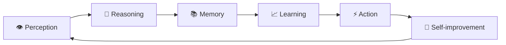
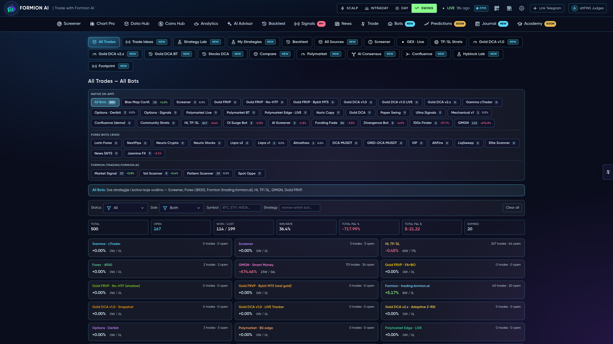
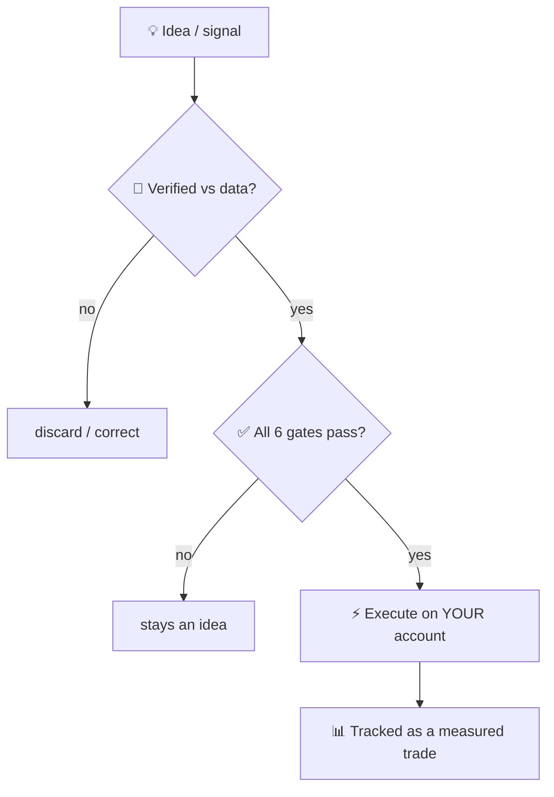
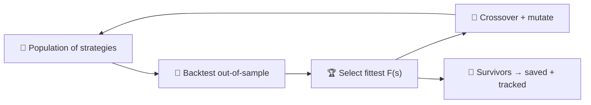
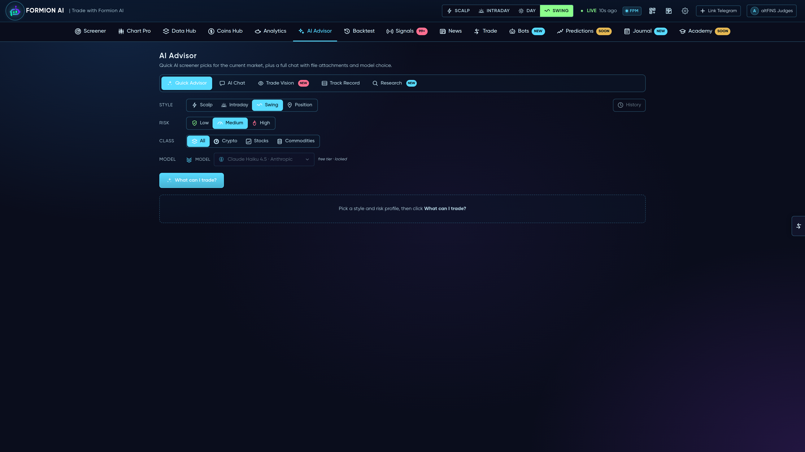

# 💬 FORA — the autonomous trading intelligence

<figure><figcaption>
FORA — Formion's autonomous trading intelligence
</figcaption></figure>

**FORA** began as a conversational assistant and has grown into something closer to a cognitive system. It perceives the whole market, reasons without inventing facts, remembers, learns from measured outcomes, trades autonomously to prove its own edge, and even *evolves* new strategies — all under strict, non-custodial safety.

Talk to it in plain language on **Telegram (`@formiontradingbot`)** or at **fora.formion.ai**. It works across your entire account, in your language, and every claim it makes is grounded in live data or in its own measured track record.

> **The cognitive loop.** Perceive → reason (verified) → remember → learn from outcomes → act (gated) → improve — then feed the result back into perception. Each pass makes the next one sharper.

***

## I. Perception — it reads the whole market

Most "AI assistants" see a single chart. FORA ingests the full market state across **spot, perpetual futures, on-chain tokens, prediction markets, forex, metals and indices**, reasoning over dozens of dimensions at once: multi-timeframe trend and regime, open interest, funding, taker flow, long/short positioning, cumulative delta, footprint, depth imbalance, liquidation clusters, capital flow, sentiment, narrative, and — for emerging tokens — an on-chain safety read, lifecycle stage and entry timing.

Its awareness is **self-extending**: a discovery layer continuously catalogs every capability in the platform, so when Formion ships a new tool, FORA learns to use it automatically — no manual wiring, no retraining.

<figure><figcaption>
One mind over the whole market — not a chatbot bolted onto a chart.
</figcaption></figure>

***

## II. Reasoning — verified, never invented

The defining property of FORA is **epistemic discipline**: it is engineered not to make things up.

* **Self-verification.** Before any answer leaves the system, a second pass fact-checks every number and directional claim against the live data that was actually fetched; unsupported statements are corrected or removed.
* **Provenance.** Each answer shows *what it is based on*.
* **Internal deliberation.** For decisions that matter, FORA convenes an internal panel — bullish, bearish, risk and quantitative perspectives — and synthesizes a verdict with the dissent made visible.
* **Causal reasoning.** It thinks in cause-and-effect chains across markets, not loose correlation.

**Theory of mind.** FORA models *other participants*. Price is drawn toward resting liquidity; FORA scores the pull of each liquidation/stop cluster $k$ at price $p_k$ with intensity $I_k$, relative to the current price $P$:

$$
\Pi(P) \;=\; \sum_{k} \frac{I_k}{\,\lvert P - p_k\rvert + \varepsilon\,}
\qquad\text{and crowd skew}\qquad
\lambda \;=\; \frac{L}{L+S}
$$

where $L,S$ are long/short positioning. The further $\lambda$ sits from $0.5$, the more one side is offside — the fuel for the squeeze that hunts *their* stops first.


**Measured, not marketed.** A claim without a source is not allowed; a signal without a tracked outcome is not counted.


***

## III. Memory — it actually remembers

FORA carries **persistent memory** of who you are (instruments, style, recurring mistakes, language), **episodic memory** of market events and how they resolved, and **semantic recall** over your whole history.

Recall is not keyword matching — it is a vector-space model. For query $q$ and a memory $d$, relevance is the term-frequency–inverse-document-frequency cosine, length-normalized so a long ramble can't outweigh a precise fact, with a gentle recency boost:

$$
\mathrm{sim}(q,d)=\frac{1}{\sqrt{\lvert d\rvert}}\;\rho(d)\sum_{t\,\in\,q} \mathrm{idf}(t)\,\mathbf{1}[\,t\in d\,]
,\qquad
\mathrm{idf}(t)=\ln\!\frac{N+1}{\mathrm{df}(t)+1}+1
,\qquad
\rho(d)=1+0.4\,e^{-\Delta t/30}
$$

Rare, informative terms ($\mathrm{idf}$) dominate; $N$ is the corpus size, $\mathrm{df}(t)$ how many memories contain $t$, and $\Delta t$ the memory's age in days.

***

## IV. Learning — it grades itself

Every concrete call FORA makes is **logged and later measured against the real price**. From that it builds a per-setup track record and **calibrates its own confidence** to the empirical hit-rate $\hat p = h/n$. To stay honest on small samples it never quotes raw $\hat p$ alone — it reasons with the **Wilson lower bound**, which shrinks confidence when evidence is thin:

$$
p_{\text{lo}}=\frac{\hat p+\dfrac{z^{2}}{2n}-z\sqrt{\dfrac{\hat p(1-\hat p)}{n}+\dfrac{z^{2}}{4n^{2}}}}{1+\dfrac{z^{2}}{n}}
$$

Edges are judged in the language of expectancy, risk-adjusted return and drawdown — the same metrics every strategy in Formion is held to:

$$
\mathbb{E}[R]=p\,\mu_{\text{win}}-(1-p)\,\mu_{\text{loss}}
,\qquad
\mathrm{Sharpe}=\frac{\mu_R}{\sigma_R}
,\qquad
\mathrm{MaxDD}=\max_{t}\frac{\text{peak}_t-\text{equity}_t}{\text{peak}_t}
$$

It also learns from aggregate, privacy-preserving base rates across the platform, so its judgment compounds with experience.

***

## V. Autonomy — it trades to prove itself

Talk is cheap, so FORA puts itself on the line. In a **simulated, risk-free account** it autonomously selects the strongest setups, opens positions with predefined risk, and **measures its own accuracy in public** — win-rate, expectancy and equity curve, exactly like any other strategy in Formion.

<figure><figcaption>
Every FORA decision is tracked as a real, measured trade — win-rate, expectancy, equity curve.
</figcaption></figure>

When you want it to act on your real account, it does so **only through hard safety gates**. An order $o$ executes if and only if every gate passes:

$$
\text{execute}(o)\iff \underbrace{A}_{\text{armed}}\,\wedge\,\underbrace{C}_{\text{you confirm}}\,\wedge\,\underbrace{E}_{\text{opted-in}}\,\wedge\,\underbrace{B}_{\text{your broker}}\,\wedge\,\bigl(\,\text{notional}(o)\le N_{\max}\,\bigr)\,\wedge\,\bigl(\,n_{\text{open}}<K_{\max}\,\bigr)
$$

FORA is **non-custodial** — it connects to your own exchange or broker, never holds or withdraws funds, and defaults to *fail-closed*: if anything is unset, nothing trades.

***

## VI. Self-improvement — toward a self-evolving edge

This is where FORA reaches beyond a conventional assistant.

**Self-tuning.** It adjusts its *own* parameters from measured results, within safe reversible bounds. With recent win-rate $\hat w$ and a target band $[\tau_{\text{lo}},\tau_{\text{hi}}]$, a threshold $\theta$ updates as

$$
\theta_{t+1}=\mathrm{clip}\!\Big(\theta_t+\delta\big(\mathbf{1}[\hat w<\tau_{\text{lo}}]-\mathbf{1}[\hat w>\tau_{\text{hi}}]\big),\;\theta_{\min},\,\theta_{\max}\Big)
$$

— stricter when it slips, bolder when it is on form. Larger structural changes are *proposed for human review*; it never rewrites itself unattended.

**Evolutionary strategy discovery.** FORA runs a **genetic search** over the space of complete strategy specifications $s=(\text{archetype},\text{entry},\text{stop},\text{targets},\text{trailing},\dots)$. A population is bred, each member backtested out-of-sample, the fittest selected, then crossed and mutated across generations. Fitness rewards only genuine, risk-adjusted, out-of-sample edge:

$$
F(s)=R_{\text{net}}(s)+4\,\mathrm{Sharpe}(s)+3\min\!\big(\mathrm{PF}(s),4\big)-0.3\,\lvert\mathrm{DD}(s)\rvert
\quad\text{s.t.}\quad \mathrm{beats\text{-}HODL}(s)\,\wedge\,n_{\text{trades}}(s)\ge 10
$$

Strategies that beat passive holding out-of-sample are saved and walk-forward tracked. FORA is **discovering** edges, not selecting from a fixed menu.

***

## Using FORA day to day

* **Ask anything** — *"how's my portfolio?"*, *"analyze SOL on the 4h"*, *"which tokens are trending?"*, *"who's trapped here?"*
* **Research, scans and guided wizards** — all from a sentence.
* **Trade commands** on your connected exchange / broker — always with confirmation.
* **Smart model routing** — each request is matched to the right model tier, so simple questions are fast and hard analysis gets deeper thinking. Bring your own key (**BYOK**) for unlimited usage.
* **Multi-AI consensus** *(Pro & Institutional)* — for high-stakes calls, FORA cross-checks across leading models — **Claude (Anthropic), GPT (OpenAI), Gemini (Google), Kimi (Moonshot)** — and shows where they agree and disagree.

<figure><figcaption>
Multi-model consensus — never trusting a single model's blind spot.
</figcaption></figure>

***

## What FORA is not

FORA does not custody funds, does not trade without your confirmation, and does not present an unverified number as fact. It is an instrument that **amplifies the trader's judgment** — relentlessly informed, honestly calibrated, and always measured — not a black box that asks for blind trust.


Link your Telegram from **formion.ai → Profile → Connections** to talk to FORA across your account. See the broader system in the **[Thesis](thesis.md)**, **[Vision](vision.md)** and **[Roadmap](roadmap.md)**.

