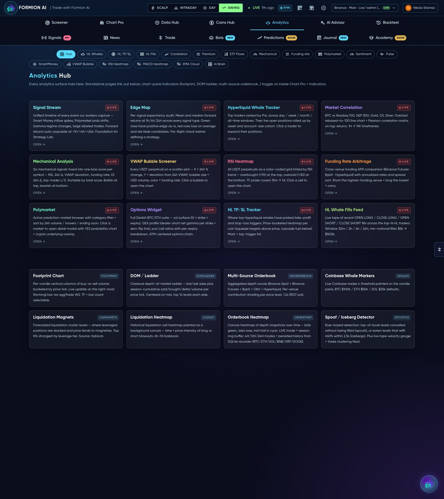
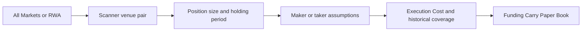

# ⚖️ Funding Carry

<figure><figcaption>
Formion — Funding Carry
</figcaption></figure>

**Funding Carry** researches the difference in perpetual funding between venues for the same asset. A pair combines a long on one venue and a short on another. Its value depends on funding collected over the holding period relative to the costs of entering and closing both legs.

## What you see

The hub contains the **Scanner**, **All Markets**, **Venues**, **Execution Cost**, **RWA** markets and the **Paper Book**. All Markets is a coverage view; the scanner is where pairs are compared for a potential trade. RWA instruments are separated from crypto because the same ticker can refer to different underlying assets.

Scanner rows include the venue pair, net annualised rate at the chosen holding period, historical 24-hour/7-day/30-day windows, carry per hour, round-trip cost, projected break-even time, historical cost coverage, adverse-funding periods, volume and open interest. A rate on one leg’s notional differs from a rate on the capital needed for both legs.

## Research a pair

1. Use All Markets or RWA to locate the asset and confirm that both venues refer to the same underlying instrument.
2. Open the Scanner and select venues, position size and holding period. Search by ticker and use the volume and venue filters to narrow the list.
3. Choose the execution assumption: **maker/maker**, **maker entry with taker exit**, or **taker/taker**. Maker fills are an assumption, not a certainty.
4. Compare net carry and round-trip cost. Review the historical windows and how often funding actually covered the cost, alongside projected break-even.
5. Open the pair detail and use Execution Cost to examine measured book costs at the relevant size. Check venue fees and the available samples.
6. Follow the **Funding Carry Paper Book** in [Trades History](trades-history.md) to inspect simulated positions and outcomes.

## Interpret the numbers

The current spread is a snapshot. Historical cost coverage and adverse periods help judge persistence; neither establishes future funding. Funding may reverse before break-even, and the two legs retain separate margin, liquidation, basis and venue risks.


The paper book is a simulation. It does not demonstrate that both legs filled live at the displayed prices. Recheck size, execution assumptions and the holding horizon before comparing pairs.


Related: [Data Hub](data-hub.md) · [Markets](markets.md) · [Bots](bots.md) · [Trades History](trades-history.md).

