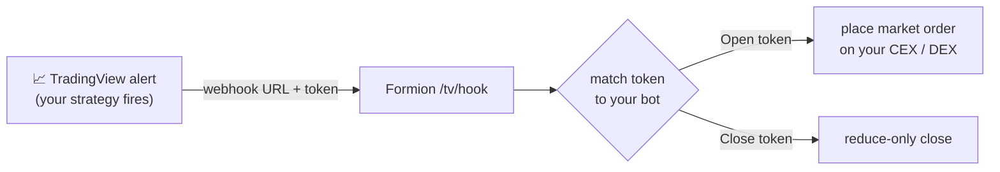

# 💡 How to Automate Your Trades with TradingView Alerts on Formion 📈🔔

Connect a TradingView alert to your own exchange and let Formion execute the trade for you — on **CEX and DEX**. You create a **TradingView Bot**, copy its webhook URL and alert messages, and paste them into a TradingView alert. When the alert fires, Formion places the order on your connected account.


🚧 **Rolling out.** Live execution is being enabled gradually. You can create and configure bots now; they stay **paused** until automation is switched on for your account.


#### 1. Connect your exchange 🔑

First connect the account you want to trade on (one-time):

* Go to **[formion.ai](https://formion.ai) → Profile → Connections**.
* Under **Exchanges** (CEX) or the DEX cards, link your account with API keys / signing key. See [How to Start — API Connection](how-to-start-api-connection.md).
* Supported today: **CEX** — Binance, Bybit, KuCoin, Gate, BingX, MEXC, Blofin, Bitget. **DEX** — Hyperliquid, Asterdex, Bluefin, Extended. (Venues are enabled for automation progressively.)

#### 2. Create a TradingView Bot 🤖

* In **Profile → Connections**, open the **TradingView Automation** card and click **New bot**.
* Fill in:
  * **Exchange** — any account you've connected (CEX or DEX).
  * **Market** — Futures or Spot.
  * **Symbol** — e.g. `BTCUSDT`.
  * **Direction** — Long or Short (the side this bot opens).
  * **Sizing** — Fixed USDT amount, or % of balance.
  * **Amount** / **Leverage** (futures) / optional **Label**.
* Click **Create bot**. The bot is created **paused** with two private tokens.

#### 3. Copy the webhook + alert messages 🔗

Each bot shows three things — copy them with the buttons:

* **Webhook URL** — `https://fora.formion.ai/tv/hook`
* **Open — alert message** — e.g. `{"token":"<your-open-token>"}`
* **Close — alert message** — e.g. `{"token":"<your-close-token>"}`

The token is the only secret; keep it private. Open opens the position, Close closes it (reduce-only).

#### 4. Set up the alert on TradingView 🔔

1. On [TradingView](https://www.tradingview.com/), open your chart/strategy and click **Create Alert**.
2. Set your condition (indicator cross, strategy order, price, etc.).
3. Open the **Notifications** tab → enable **Webhook URL** → paste the **Webhook URL** from step 3.
4. In the **Message** field, paste the **Open** alert message (to open) — or the **Close** message (for a separate close alert).
5. Save. Repeat with the **Close** message for a second alert if you want automated exits.


Tip: in a Pine **strategy**, you can also use `{{strategy.order.alert_message}}` and set the order's `alert_message` to your Open/Close token, so one alert handles entries and exits.


#### 5. Activate ⚙️

* Back in **TradingView Automation**, toggle the bot to **Active**.
* When automation is enabled for your account, the next matching TradingView alert will place the order on your connected exchange. Every fire is logged with status (filled / skipped / error).

#### Safety 🔒

* Tokens are random and per-bot; rotate by deleting and recreating a bot.
* A bot only ever trades the **one symbol and direction** you configured. **Close** orders are **reduce-only** (they can't open or flip a position).
* Duplicate alerts with the same id are ignored (no double-fills).
* You can pause or delete a bot at any time. Formion never withdraws funds — it only places trades on your connected account.

#### Emoji Recap 📌

* 🔑 Connect your exchange (CEX or DEX)
* 🤖 Create a TradingView Bot
* 🔗 Copy the webhook URL + Open/Close messages
* 🔔 Paste them into a TradingView alert
* ⚙️ Activate

Happy automating! 🚀
