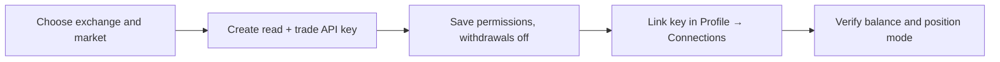

# 🔑 How to Start with Formion AI? API Connection?

<figure><figcaption></figcaption></figure>

Choose the account and market you intend to use. Keep enough available margin for the order size you configure; a successful connection check does not mean an order can be funded.

## For Binance:

For [Binance](https://binance.com) go to User icon 👤 and [API Managament](https://www.binance.com/en/my/settings/api-management)

<figure><figcaption></figcaption></figure>

Then click on **Create API** button and choose **System generated**, put any name you want and click **Next**

<figure><figcaption></figcaption></figure>

You will get **API keys**. Edit the restrictions: enable **Futures** and **Read Info**, and leave **Withdrawals** off. Save, then copy both the **API key** and the **Secret key** — Binance hides the Secret after this page.

<figure><figcaption></figcaption></figure>

Now open **Profile → Connections** on [formion.ai](https://formion.ai), click to link an exchange, choose **Binance**, paste the **API key** and **Secret**, and click **Link exchange**.


The Formion connection form asks only for the key and secret (plus a passphrase on KuCoin, Bitget and Blofin). It does not show an IP allowlist. Keep withdrawal permissions disabled. The screenshots illustrate the workflow; exchange labels may change.


**For a bot configured for hedge positions and cross margin, match those settings on Binance Futures before starting it. Verify the intended market and mode in the bot form.**\\

<figure><figcaption></figcaption></figure>

<figure><figcaption></figcaption></figure>

<figure><figcaption></figcaption></figure>

<figure><figcaption></figcaption></figure>

## For Bybit:

For Bybit the situation is the same but here if you want to use multiple bots our advice is to create each subaccount for each new bot! Each subaccount needs its own API key and uses one Formion subaccount slot (Pro 3, Institutional 6; Neural links main accounts only). Also make sure your account type is UTA ( Unified Trading Account )

<figure><figcaption></figcaption></figure>

Then go to [API ](https://www.bybit.com/app/user/api-management)Managament tab page and click on **Create New Key and enable Google 2FA if you are using it ( It's recommended!)**

<figure><figcaption></figcaption></figure>

Click on System-generated API Keys

<figure><figcaption></figcaption></figure>

Choose **System-generated → API Transaction**, set **Read-Write**, and enable **Derivatives** (Read + Trade).

<figure><figcaption></figcaption></figure>

Enable only the read and trading permissions required for your selected market. Leave withdrawals, Account Transfer and Subaccount Transfer disabled.

<figure><figcaption></figcaption></figure>

Now you will get the API key and API Secret. Copy both immediately — Bybit only shows the Secret on this confirmation screen. Then open **Profile → Connections** on [formion.ai](https://formion.ai), choose **Bybit**, paste them and click **Link exchange**.

<figure><figcaption></figcaption></figure>

\
For a hedge/cross bot, verify that the corresponding Bybit contract uses Hedge Mode and Cross Margin before running it.\\

<figure><figcaption></figcaption></figure>

<figure><figcaption></figcaption></figure>

<figure><figcaption></figcaption></figure>

<figure><figcaption></figcaption></figure>

Use Apply to all USDT pairs only if that is the mode you intend for every affected contract.\
\
To test that everything worked, check the **Exchanges** card in **Profile → Connections**: it shows the live balance and health of each linked account. It will look something like this for Binance\\

<figure><figcaption></figcaption></figure>

Or for Bybit

<figure><figcaption></figcaption></figure>

### If you are able to see your portfolio, congrats! You are now ready to use Formion Trading App!

## cTrader broker accounts

For forex and CFDs, open **Profile → Connections → cTrader** and use the broker authorisation flow. Select the intended demo or live account and verify that its balance and positions appear before trading. cTrader uses account authorisation rather than the exchange API-key steps above. Neural supports one broker account, Pro five, and Institutional unlimited; see [Brokers](brokers.md) and [Pricing](pricing.md).

## Troubleshoot before starting a bot

If balances do not appear, check the key, selected exchange, account type (live or demo), permissions and any IP restriction you set on the key. Verify that the API secret was copied when created; do not send it to support or put it into a chat. For a connected account with rejected orders, inspect the order's market, margin, size and position mode separately. See [Troubleshooting](troubleshooting.md).
