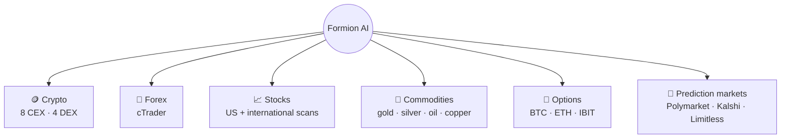

# 🌍 Markets

<figure><figcaption></figcaption></figure>

Formion is multi-asset by design — research and trading workflows span the markets below; coverage and execution vary by venue and tool.

## 🪙 Crypto

The core market. Connect your accounts and trade spot or perps with full data, signals and bots.

* **CEX:** Binance, Bybit, KuCoin, MEXC, Bitget, Gate.io, Blofin, BingX. OKX, Coinbase and Kraken are listed as coming soon.
* **DEX (perps):** Hyperliquid, AsterDex, Bluefin, Extended.
* **On-chain swaps:** **Coins Hub → DEX Swaps** swaps from the wallet you connect in the Telegram bot, routed via Jupiter (Solana), 7K (Sui) and LI.FI / deBridge (EVM and cross-chain).
* **Wallets:** MetaMask, Phantom, Trust Wallet, Sui Wallet and Tonkeeper (EVM, Solana, Sui, TON) — linked read-only by signature for portfolio tracking, or with an encrypted key for trading.
* Deep data: open interest, funding, long/short, liquidations, order-flow / footprint, on-chain smart-money (GMGN) and Hyperliquid whale tracking.

## 💱 Forex and CFDs

Connect your own **cTrader** broker account through OAuth for supported forex, indices, metals and CFDs.

* Major, minor and cross pairs depend on your broker’s instrument list.
* Authorise the intended demo or live account in **Profile → Connections**.
* Verify balances, positions and the symbol’s contract details before placing an order.
* Availability and account limits depend on the broker and your licence; see [Brokers](brokers.md) and [Pricing](pricing.md).
* **Lorin forex signals:** Lorin runs on **MT4** (an FP Trading account, monitored read-only). Formion does not offer MT5. Signals are information, not a promise of results.

## 📈 Stocks

* **US:** NYSE and NASDAQ stocks in the Screener, **Hunt** (US-equities setup funnel), **Data Hub → US Stocks** (regime + macro indicators) and dealer gamma on SPX, SPY, QQQ and large caps.
* **International:** Screener **Radar** preset scans for Canada (TSX), UK (LSE), Germany (XETRA), France (Euronext), Japan (TSE), Hong Kong (HKEX), India (NSE) and Australia (ASX).

## 🥇 Commodities

* **Gold (XAU)** — Gold DCA bots and backtests in the Backtest hub, plus tokenized gold (XAUT / PAXG) on crypto venues.
* **Silver (XAG)**, **Oil (WTI / Brent)**, **Copper (HG)** — where offered by your cTrader broker.

## 📐 Options

BTC and ETH options (Deribit-based), plus IBIT:

* **Regime** read — DVOL, ATM IV vs realized vol, term structure, and a vol phase (expansion, compression, coiling, consolidation).
* **Strategy scorer** rates structures (iron condor, strangles, bull/bear spreads, calendar, covered call, protective put, collar…) for the current regime.
* **Greeks** and payoff in the Strategy Builder, plus an **events heatmap** (3-day on Free → 21-day on Pro+). See [Options & GEX](options.md).

## 🎲 Prediction Markets

**Polymarket, Kalshi and Limitless** accounts can be connected in **Profile → Connections**:

* **Polymarket browser** (category filter, volume / movers / ending-soon sorting, probability charts) and a **top-trader leaderboard** in Analytics.
* **Polymarket bots** and backtests in the Bots and Backtest hubs — bots run **paper-first** before live capital.
* Live auto-execution of the PolyScalp, latency-arb and Kalshi cross-arb strategies is an **Institutional** feature. See [Prediction Markets](prediction-markets.md).

***


Market and feature access depends on your plan — see **[Pricing & Tiers](pricing.md)**. Connect your accounts from **formion.ai → Profile → Connections** ([guide](how-to-start-api-connection.md)).

