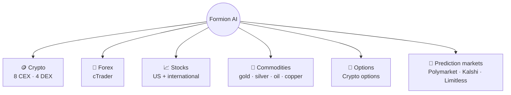

# 🌍 Markets

<figure><figcaption></figcaption></figure>

Formion is multi-asset by design — research and trading workflows span the markets below; coverage and execution vary by venue and tool.

## 🪙 Crypto

The core market. Connect your accounts and trade spot or perps with full data, signals and bots.

* **CEX:** Binance, Bybit, KuCoin, MEXC, OKX, Bitget, Coinbase, Bitfinex.
* **DEX (perps):** Hyperliquid, AsterDex, Bluefin, Extended.
* **On-chain swaps:** trade spot directly from your connected wallet across **EVM, Solana and Sui**, with aggregated best-price routing.
* **Wallets:** EVM, Solana, Sui, TON — read-only or full (encrypted).
* Deep data: open interest, funding, long/short, liquidations, order-flow / footprint, on-chain events and whale tracking.

## 💱 Forex and CFDs

Connect your own **cTrader** broker account through OAuth for supported forex, indices, metals and CFDs.

* Major, minor and cross pairs depend on your broker’s instrument list.
* Authorise the intended demo or live account in **Profile → Connections**.
* Verify balances, positions and the symbol’s contract details before placing an order.
* Availability and account limits depend on the broker and your licence; see [Brokers](brokers.md) and [Pricing](pricing.md).

## 📈 Stocks

Equities data and signals across regions:

* **US:** NASDAQ, NYSE, major indices (SPY, QQQ).
* **EMEA:** BIST (Turkey), EGX (Egypt).
* **Asia:** HKEX (Hong Kong), SSE / SZSE (China), Bursa Malaysia.

## 🥇 Commodities

* **Gold (XAU)** — dedicated scanner + Gold DCA bots + tokenized gold (XAUT / PAXG) cross-venue.
* **Silver (XAG)**, **Oil (WTI / Brent)**, **Copper (HG)** — where offered by your cTrader broker.

## 📐 Options

BTC / ETH / SOL options:

* **Regime detector** classifies the market (low-vol grind, breakout, panic, post-event compression).
* **Strategy scorer** rates structures (long call/put, short put, straddle, strangle, iron condor…) for the current regime.
* Full **Greeks** and expiry-chain views, plus an **events heatmap** (3-day on Free → 21-day on Pro+).

## 🎲 Prediction Markets

**Polymarket, Kalshi and Limitless**:

* **AI consensus predictions** (multi-model, Brier-scored leaderboard).
* **Whale tracker** for large positions.
* Arbitrage bots — order-book mispricing scalper, exchange-latency arb, and Kalshi cross-arb. **Pro** sees signals; **Institutional** can auto-execute.
* Every bot runs **paper-first** before live capital.

***


Market and feature access depends on your plan — see **[Pricing & Tiers](pricing.md)**. Connect your accounts from **formion.ai → Profile → Connections** ([guide](how-to-start-api-connection.md)).

