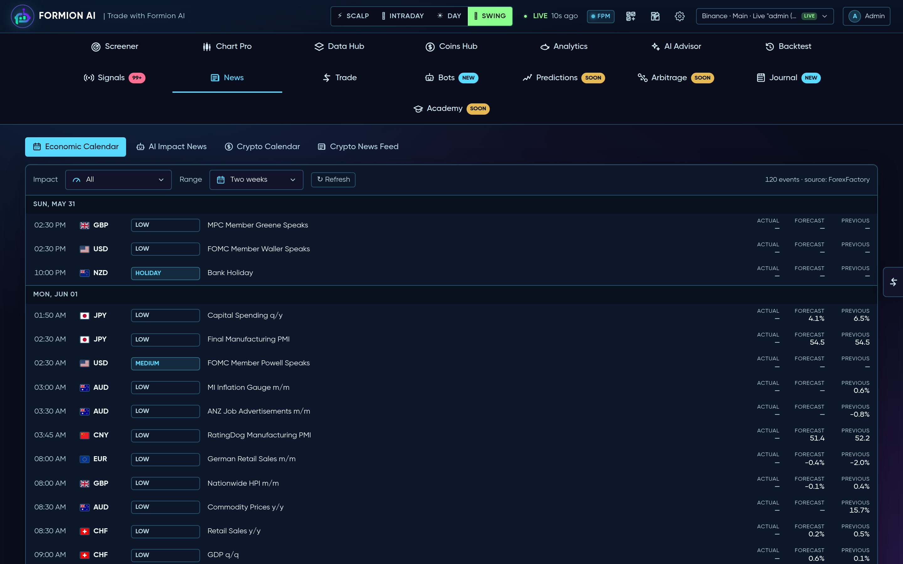
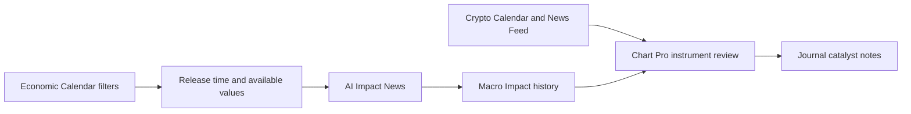

# News 24/7 & Macro

<figure><figcaption>
Formion — News 24/7 & Macro
</figcaption></figure>

The **News** hub combines scheduled economic releases, AI impact analysis, historical macro reactions and crypto events/headlines. Use it to identify what may affect the instrument you are researching and when that information became available.

## What you see

* **Economic Calendar** — economic events with day-range and impact filters, grouped by date.
* **AI Impact News** — news analysis for market context.
* **Macro Impact** — historical macro-event impact review.
* **Crypto Calendar** — coin events when this view is available; the tab is hidden when unavailable.
* **Crypto News Feed** — crypto headlines with freshness and availability information.

## Prepare for an event

1. Open Economic Calendar and select the day range and impact level relevant to your trading horizon.
2. Read the event time, country and available release values. Confirm the displayed timezone before planning around a release.
3. Use AI Impact News for interpretation and Macro Impact for available historical reaction context.
4. For a coin-specific catalyst, check Crypto Calendar when present, then read the related headlines in Crypto News Feed.
5. Inspect timestamps and any freshness or availability notice. Open the article for its full context where a link is provided.
6. Compare the event with the instrument in [Chart Pro](chart-pro.md) and [Data Hub](data-hub.md), then record the catalyst in your [Journal](journal.md).

## Practical tips

An empty calendar can reflect the chosen filters or available event coverage. Widen the impact filter or date range before treating it as “nothing scheduled”. If a pane reports unavailable or older data, use that state when judging the freshness of the analysis.

Distinguish a scheduled release from a headline discussing an earlier event. AI impact is an interpretation; price reaction also depends on expectations and the wider market regime.


Use event time and headline publication time together. A fresh article about an old release can have different trading relevance from a new announcement.


Related: [Markets](markets.md) · [Pulse](pulse.md) · [AI Advisor](smart-trading.md).

