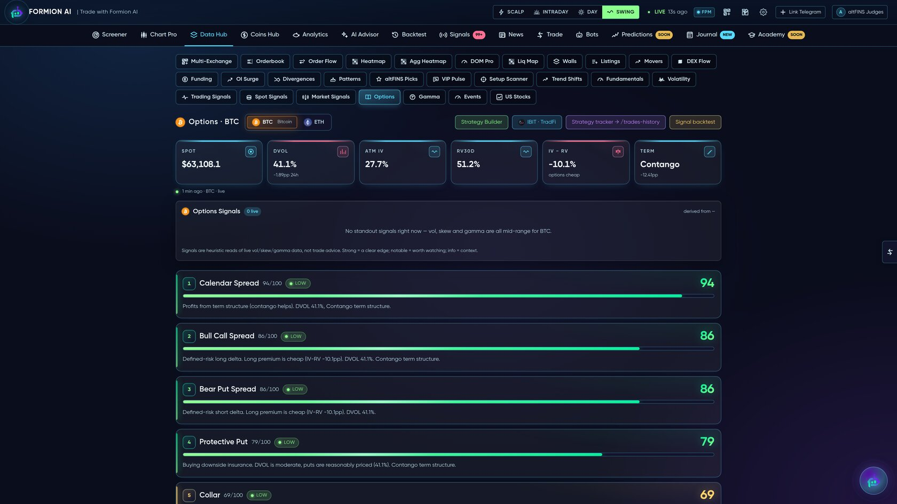

# 📐 Options & GEX

<figure><figcaption></figcaption></figure>

A full options analytics desk for crypto (Deribit) and equities — implied volatility, the vol surface, Greeks, dealer gamma, and ready-to-trade option structures scored to the current regime.


Options analytics are a **Pro / Institutional** feature.


## What's inside

### Volatility & surface
* **IV smile** and full **volatility surface** (SVI-fit) per expiry
* **IV rank / IV percentile**, **realized-vol cone**, **IV–RV spread**
* **Term structure** (contango / backwardation) and DVOL

### Flow & positioning
* Deribit **options flow** and large prints
* **Put/Call** ratios, open interest by strike
* **Greeks** (delta / gamma / vega / theta) views

### Scored structures (OptionBuilder)
Formion scores classic structures — **iron condor, strangle, straddle, calendar, vertical spreads, protective put, collar** — against current IV, term structure and the IV–RV spread, so you see *which structure fits this regime* (e.g. "Calendar Spread 94, Bull Call Spread 86"). Build, score and compare in one panel. Equity-options coverage includes **IBIT** and major US names.

## ⚡ GEX — Dealer Gamma Exposure

<figure><figcaption></figcaption></figure>

Formion runs an **in-house, CBOE-fed gamma engine** (it replaced a $250/mo external feed) covering ~25 tickers:

* **Gamma exposure** by strike, **flip level**, call/put walls
* Live **GEX signals** (pin risk, squeeze / unclench regimes)
* Per-ticker dealer-positioning table + strike profile

Gamma tells you where dealers are forced to hedge — i.e. where price gets pinned or where a move accelerates. It's one of the most-used desks in Formion for index and large-cap timing.
