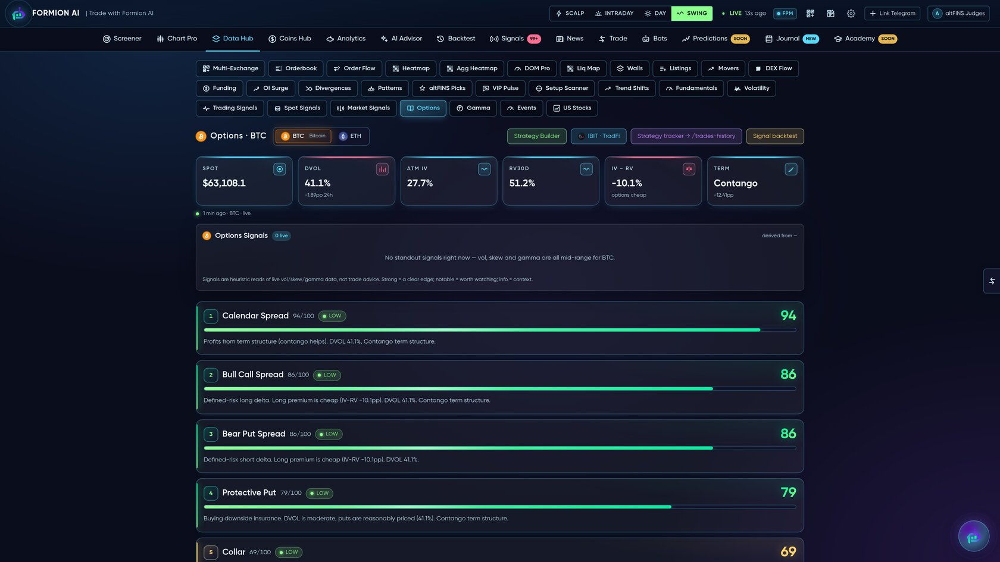
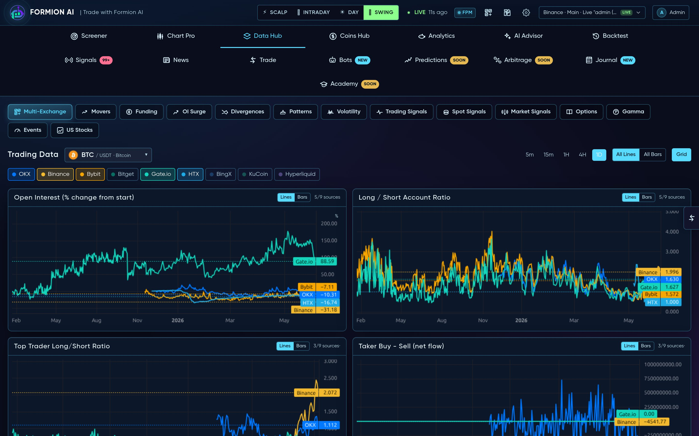

# 📐 Options & GEX

<figure><figcaption></figcaption></figure>

An options analytics desk for crypto (**BTC and ETH**, built on Deribit with a multi-source view across Deribit, OKX, Bybit and Binance) and equities (**IBIT** plus dealer gamma on US indices and large caps) — implied volatility, the vol surface, Greeks, dealer gamma, and option structures scored to the current regime. Find it at **Data Hub → Options** and **Data Hub → Gamma**.


On the free **Neural** tier options analytics cover BTC with a basic scorer. **Pro** and **Institutional** add ETH and the full scorer (strategies, regime, IV) — see **[Pricing & Tiers](pricing.md)**.


## What's inside

### Volatility & surface
* **IV smile** and full **volatility surface** (SVI-fit) per expiry
* **IV rank / IV percentile**, **realized-vol cone**, **IV–RV spread**
* **Term structure** (contango / backwardation) and DVOL
* **Vol phase** — expansion, compression, coiling or consolidation, from IV percentile, DVOL velocity and term slope

### Flow & positioning
* Crypto **options flow** and block trades
* **Put/Call** ratios, open interest by strike
* **Greeks** (delta / gamma / vega / theta) for your position in the **Strategy Builder**

### Scored option structures
Formion scores classic structures — **iron condor, short and long strangle, volatility risk premium, bull call and bear put spreads, calendar, covered call, protective put, collar** — against current IV, term structure and the IV–RV spread, so you see *which structure fits this regime*. Build a position and see its payoff and Greeks in the **Strategy Builder**. Equity-options coverage includes a dedicated **IBIT** page.

## ⚡ GEX — Dealer Gamma Exposure

<figure><figcaption></figcaption></figure>

Formion runs an **in-house gamma engine** (computed from public option chains, refreshed every minute) covering US indices and ETFs (SPX, SPY, QQQ, IWM, DIA, VIX…) and large caps (NVDA, TSLA, AAPL, MSFT, COIN, MSTR…):

* **Gamma exposure** by strike, **flip level**, call/put walls
* Live **GEX regimes** — **pinned** (dealers long gamma dampen moves), **trending** (dealers short gamma amplify moves) and **cascade risk** (flip level near spot)
* Per-ticker dealer-positioning table + strike profile

Gamma tells you where dealers are forced to hedge — i.e. where price gets pinned or where a move accelerates.
