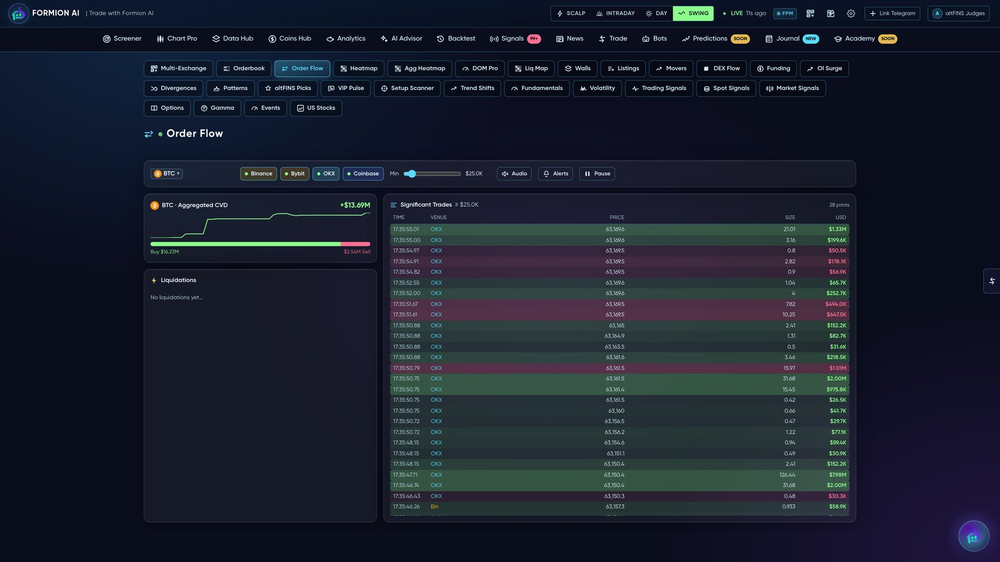
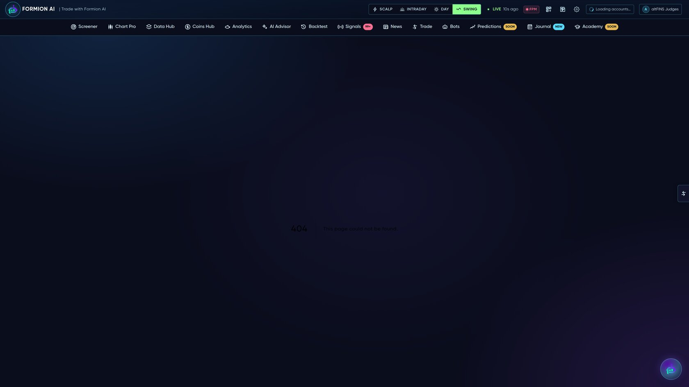

# 🌊 Order Flow & Microstructure

<figure><figcaption></figcaption></figure>

See **what's happening inside the candle**. Formion ships a full market-microstructure suite — the order-book, the tape, large trades, liquidations and where the big resting orders sit — across multiple exchanges.


The microstructure tools live both as dedicated pages and as panels inside **Chart Pro → Workspace**. Full-depth tools are a **Pro / Institutional** feature.


## The tools

| Tool | What it shows |
|---|---|
| **Order Flow** | Aggregated buy/sell flow + a live **Significant Trades** tape (large prints, colored by side) + a liquidations strip |
| **Quantum Tape** (Time & Sales) | Every print in real time, with large-trade highlighting |
| **DOM Pro** | A professional depth-of-market ladder with size heat |
| **Order-Book Heatmap** | Resting liquidity over time — see walls build and pull |
| **Footprint** | Bid/ask volume **inside** each candle (delta, imbalance, absorption) |
| **Walls** | Large resting bids/asks across books |
| **Liquidation Map** | Where leveraged positions get liquidated — magnet levels |
| **Spoof / Iceberg detector** | Flags pulled and hidden orders |

<figure><figcaption></figcaption></figure>

## Why it matters

Indicators lag; order flow is the cause, not the effect. Spotting absorption at a level, a wall that won't break, or a liquidation cluster acting as a magnet is the difference between guessing and reading the book. Formion puts that read in one place — and feeds the same data into its **[Bots & Strategies](bots.md)** (e.g. the footprint and liquidation-cluster engines).
