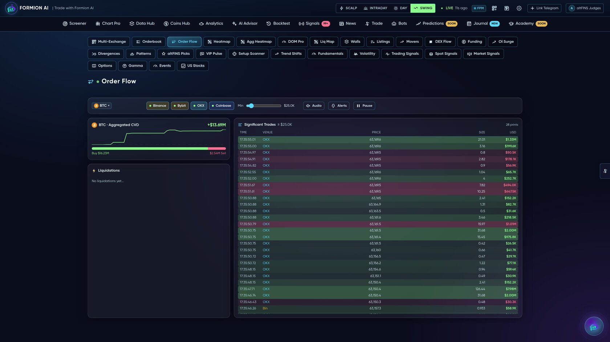
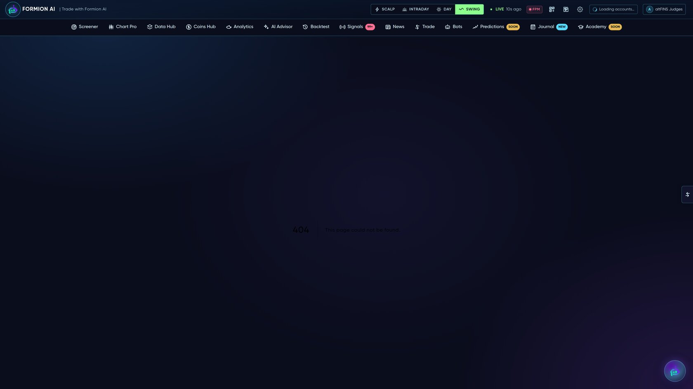

# 🌊 Order Flow & Microstructure

<figure><figcaption></figcaption></figure>

See **what's happening inside the candle**. Formion ships a full market-microstructure suite — the order-book, the tape, large trades, liquidations and where the big resting orders sit — across multiple exchanges.


The microstructure tools live both as dedicated pages under **Data Hub** and as panels inside **Chart Pro → Constructor**.


## The tools

| Tool | What it shows |
|---|---|
| **Order Flow** | Trades and liquidations streamed from Binance, Bybit, OKX and Coinbase, with an aggregated CVD and a **Significant Trades** feed |
| **Tape Feed** (Time & Sales) | Every print in real time (Constructor panel) |
| **DOM Pro** | A depth-of-market ladder with a size heatmap, a trade heatmap and VWAP / POC / VAH / VAL levels |
| **Order-Book Heatmap** / **Agg Heatmap** | Resting liquidity over time — for the Binance book, or summed across exchanges |
| **Footprint** | Bid/ask volume **inside** each candle by price tick (Constructor panel) |
| **Walls** | Live wall detector plus a history of confirmed, broken and pulled walls |
| **Liquidation Map** | Clustered liquidation levels over time — magnet levels, with a leverage filter |
| **Spoof / Iceberg detector** | Flags levels cancelled without being filled and levels that refill after being eaten (Constructor panel) |

<figure><figcaption></figcaption></figure>

## Why it matters

Indicators lag; order flow is the cause, not the effect. Spotting absorption at a level, a wall that won't break, or a liquidation cluster acting as a magnet is the difference between guessing and reading the book. Formion puts that read in one place.
