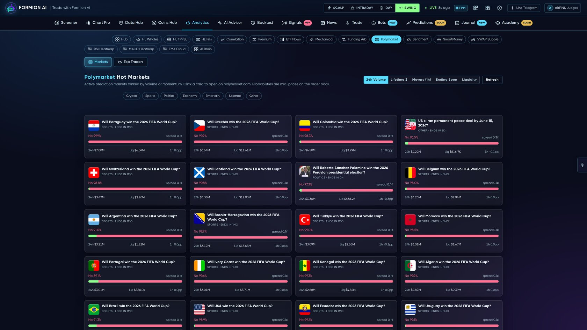

# 🎲 Prediction Markets

<figure><figcaption></figcaption></figure>

Formion brings prediction markets — led by **Polymarket** — into the same terminal as your charts and bots: browse markets, track the whales, read the analytics, connect a wallet and trade, and let Formion's engines hunt mispricings.


Browsing and analytics are open to everyone. **Live execution** of prediction-market strategies is an **Institutional** feature.


## Browse & analyze (Polymarket hub)
* **Sort & rank** markets by **24h volume**, **movers (1h)**, **ending soon**, **liquidity** or **lifetime $**
* **Filter by category** — Crypto · Sports · Politics · Economy · Entertainment · Science · Other
* Each market shows **YES probability**, volume and liquidity; open a market for a **detail page** (price history, order book, your position)
* **Leaderboard** and **whale ledger** — who's positioned where, and how they've done
* **Prediction analytics** — odds movement and mispricing vs fair value

## Connect & trade
On the **Predictions** desk you can connect a wallet, read the live **order book**, place positions and track your **open bets** alongside the rest of your portfolio.

## In-house engines
Formion runs its own prediction-market engines (tracked in **[Trade History](journal.md)**):

| Engine | What it does |
|---|---|
| **Polymarket Edge** | Black-Scholes / IV fair-value vs market YES price — trades the mispricing (**live, real funds**) |
| **Hourly crypto arb** | BTC hourly markets across Polymarket / Kalshi, oracle-band tuned |
| **PolyScalp / Latency / Kalshi cross-arb** | Order-book mispricing, exchange-latency and cross-venue event arbitrage |

These are the same verified, auditable engines documented in **[Bots & Automation](bots.md)** — prediction markets are a first-class market in Formion, not an afterthought.
