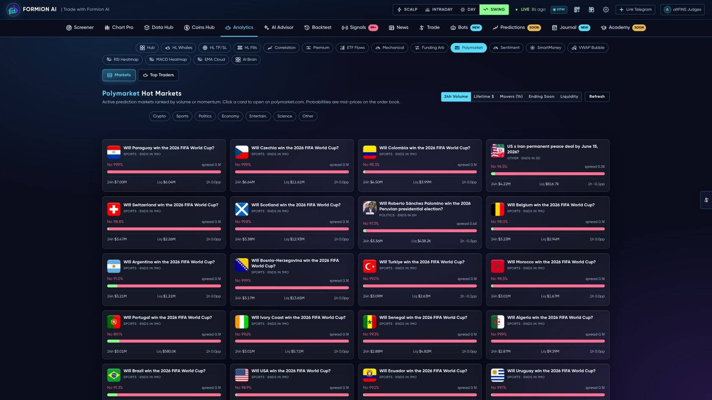

# 🎲 Prediction Markets

<figure><figcaption></figcaption></figure>

Formion brings prediction markets — led by **Polymarket** — into the same terminal as your charts and bots: browse markets, see the top traders, read the price history, link your own account and place bets, and follow Formion's prediction-market bots.


Browsing and analytics are included on every plan, and so are manual bets from your own linked account. **Live auto-execution** of the PolyScalp, latency-arb and Kalshi cross-arb engines is an **Institutional** feature.


## Browse & analyze (Polymarket hub)
* **Sort & rank** markets by **24h volume**, **movers (1h)**, **ending soon**, **liquidity** or **lifetime $**
* **Filter by category** — Crypto · Sports · Politics · Economy · Entertainment · Science · Other
* Each market shows **YES/NO probability**, 24h volume, 1h/24h price change, time to resolution and liquidity, with a **price history** chart
* Open a market for its **detail page**: YES/NO order book, recent trades tape, top holders per outcome, and a preview form that opens the trade on polymarket.com
* **Top Traders** — the Polymarket leaderboard by profit or volume (1 day, 1 week, 1 month, all time)

## Connect & trade
On **formion.ai → Profile → Connections** (or the dashboard), the **Prediction markets** card links your **Polymarket**, **Kalshi** or **Limitless** account. From there you can search markets, place a bet in USD, and review your open positions and resting orders (with cancel).


The **Predictions** tab in app.formion.ai is marked **Soon**. It is planned as an AI price-projection panel, not a betting desk.


## In-house engines
Formion runs its own prediction-market bots (tracked in **[Trade History](journal.md)**):

| Bot | Pool | What it does |
|---|---|---|
| **Polymarket Edge** | live | Black-Scholes fair value (from Deribit IV) vs the market YES price on BTC/ETH/SOL close and touch markets; buys the mispriced side |
| **BTC Hourly Arb** | paper + live | Hourly BTC/ETH/SOL up-or-down markets across Polymarket and Kalshi; buys both opposite legs when their combined cost is under $1 |
| **PolyScalp v1** | paper + live | Up/down scalper on Polymarket crypto minute markets |
| **Poly Solo Directional** | live | Bets the Polymarket leg of low-risk arb-scanner signals; you can attach it to your own linked Polymarket wallet (counts as a live bot) |
| **PolyTracker — Whale Copy** | paper | Paper copy of selected Polymarket whales |

The same bots appear in **[Bots & Automation](bots.md)**, with their pool shown on each card.
