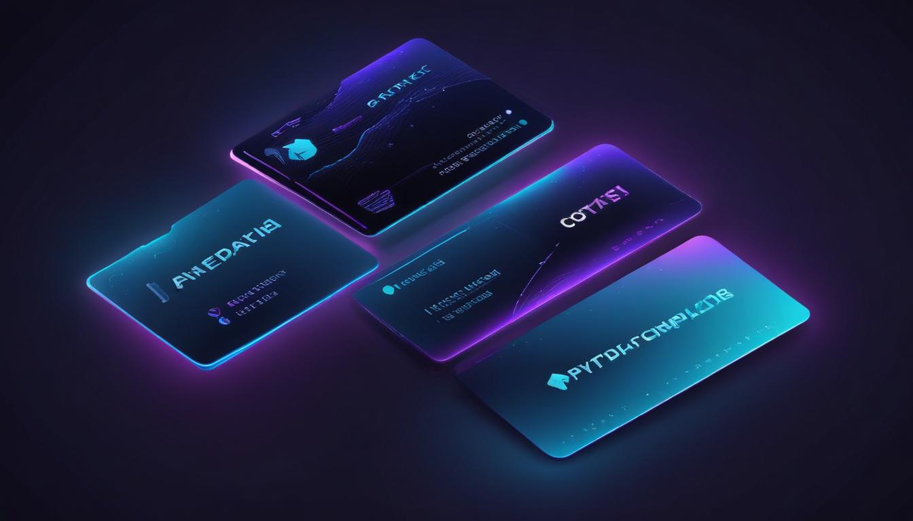

# 💳 Pricing & Tiers

<figure><figcaption></figcaption></figure>

Formion has three plans. Every new signup gets **14 days of Pro free — no card required**; if you don't upgrade, you auto-downgrade to the free **Neural** tier (which stays free forever).


You can pay with **card** or **crypto** (40+ assets). Paying in crypto gets a **−3% bonus**, and annual (12-month) billing is **−20%**. Bring-Your-Own-Key (BYOK) for AI is available on **every** tier.


## Plans at a glance

| | 🆓 Neural (Free) | 💎 Pro | 🏛️ Institutional |
|---|---|---|---|
| **Price** | $0 forever | **$89 / mo** | **$499 / mo** |
| **AI budget** | ~$2 / month | $5 / day | $30 / day (priority queue) |
| **Exchanges (CEX)** | 2 | Unlimited | Unlimited |
| **Wallets** | 2 | Unlimited | Unlimited |
| **DEX** | 1 | All 4 | All 4 |
| **Sub-account slots** | 0 | 3 | 6 |
| **Live bots** | 0 (paper only) | 5 | Unlimited |
| **Paper bots** | Unlimited | Unlimited | Unlimited |
| **Watchlist symbols** | 25 | Unlimited | Unlimited |
| **Chart** | 5 symbols · 4 TFs · 2 indicators | All symbols/TFs/indicators · SMC · replay | Same as Pro |
| **Screener** | crypto, delayed | real-time, all markets | real-time, all markets |
| **AI signals stack** | — | Full (RAG, Trade Vision, RF, Signals) | Full + priority |
| **Backtesting + Strategy Lab** | — | ✅ | ✅ |
| **Trading Journal** | 30 days, manual | Unlimited + AI auto-tag + auto-import + tax export | + team journal |
| **Alerts** | 3 | Unlimited | Unlimited |
| **TradingView automation** | — | ✅ | ✅ |
| **Polymarket / Kalshi live execution** | — | signals only | ✅ live execution |
| **MT5 master replication** | — | — | ✅ |
| **White-label API / SDK** | — | — | ✅ |
| **Team seats** | 1 | 1 | 5 (+$50 each) |
| **Uptime SLA** | — | — | 99.9% |

## 🆓 Neural — Free forever

Try Formion with no commitment: link 2 exchanges, run unlimited **paper** bots, talk to the AI within a small monthly budget, and use the core screener and charts. Best path for unlimited AI on the free tier is **BYOK** (connect your own Anthropic/OpenAI/Gemini key).

## 💎 Pro — $89/mo

Full retail trading: unlimited exchanges & wallets with direct execution on all 4 DEX, **5 live bots**, the complete AI stack (Advisor, Trade Vision, Research RAG, Multi-AI Consensus), backtesting + Strategy Lab, full charting (all indicators, SMC, replay), unlimited journal with AI auto-tag, and **TradingView webhook automation**.

## 🏛️ Institutional — $499/mo

Everything in Pro, plus **unlimited** bots, **live execution** of prediction-market bots (Polymarket scalp, latency arb, Kalshi cross-arb), **MT5 master replication**, white-label REST/WebSocket API, 5 team seats with role-based access, priority AI queue, and a 99.9% uptime SLA.

## 🔑 BYOK — Bring Your Own Key

On any tier you can connect your own AI provider keys (Anthropic, OpenAI, OpenRouter, Google Gemini). Keys are **AES-256-GCM encrypted at rest**, and when connected your AI usage is effectively unlimited (billed by your own provider, not Formion).

## 💸 Payment methods

When you upgrade (from the **[Pricing](https://app.formion.ai/pricing)** page or **Profile → License**), pick how you want to pay:

* **💎 Telegram (Crypto Pay) — 0% fee.** Pay in seconds straight from your Telegram wallet in **USDT / TON / BTC** via [@CryptoBot](https://t.me/CryptoBot). Your license **activates instantly**. You can start it from the checkout page (**Pay with Telegram**) or directly inside **[@formiontradingbot](https://t.me/formiontradingbot)** with `/license`. Your Telegram just needs to be linked to your Formion account (**Profile → Connections → Connect Telegram**); if it isn't, the bot links it first.
* **💳 Card or crypto (40+ assets).** The standard checkout accepts card and 40+ cryptocurrencies. Paying in crypto gets a **−3% bonus**.

Both methods activate the **same** license — Pro or Institutional, instantly on confirmation — and longer billing periods are cheaper (3-mo −5%, 6-mo −10%, 12-mo −20%).

## 🪙 Paying with FOM

A discounted **FOM-token** payment path (and staking-for-access) is part of the token roadmap — **🚧 coming soon**, see **[FOM token](fom-token.md)**.
