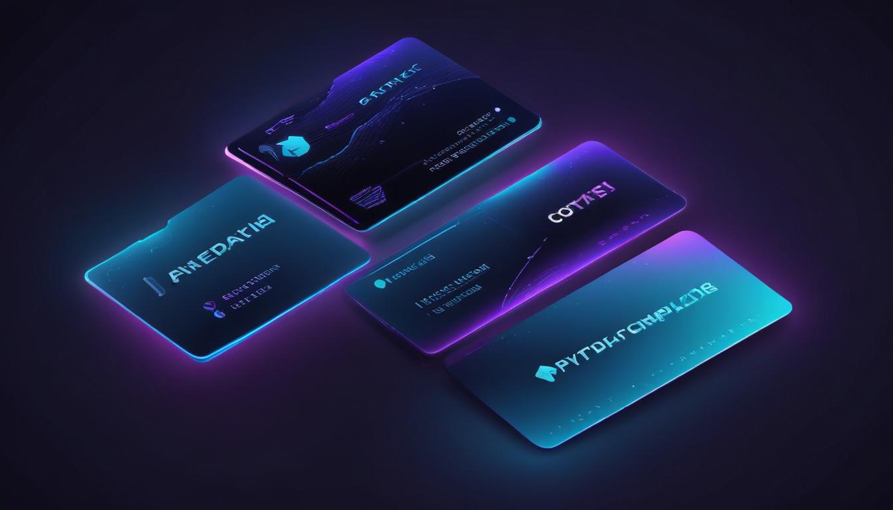

# 💳 Pricing & Tiers

<figure><figcaption></figcaption></figure>

Formion has three plans. New accounts get **7 days of Pro free — no card required** — once the email address is confirmed (see [7-day Pro trial](#7-day-pro-trial)); if you don't upgrade, you auto-downgrade to the free **Neural** tier (which stays free forever).


Pay at the **formion.ai checkout** in crypto — **USDT or USDC** on Ethereum, Base, Arbitrum, Optimism, Polygon, BSC or Solana, **USDT on Tron (TRC20)**, or **BTC** / **SOL** / **LTC** — or with **PayPal** on the same checkout page. You can also pay through **Telegram Crypto Pay** with `/license` in [@formiontradingbot](https://t.me/formiontradingbot), which gets an **extra 3% discount** (Crypto Pay only). Card payments are not available. Longer billing is cheaper (3-mo −5%, 6-mo −10%, 12-mo −20%). Bring-Your-Own-Key (BYOK) for AI is available on **every** tier.


## Plans at a glance

| | 🆓 Neural (Free) | 💎 Pro | 🏛️ Institutional |
|---|---|---|---|
| **Price** | $0 forever | **$89 / mo** ($71.20/mo billed yearly) | **$499 / mo** ($399/mo billed yearly) |
| **AI budget** | ~$2 / month | $5 / day | $30 / day (priority queue) |
| **Exchanges (CEX)** | 2 | Unlimited | Unlimited |
| **Wallets** | 2 | Unlimited | Unlimited |
| **DEX accounts** | 1 | Unlimited | Unlimited |
| **cTrader broker accounts** | 1 | 5 | Unlimited |
| **Annual total (USD)** | $0 | $853 | $4,790 |
| **Sub-account slots** | 0 | 3 | 6 |
| **Live bots** | 0 (demo/paper unlimited) | 5 (auto-execute) | Unlimited |
| **Paper bots** | Unlimited | Unlimited | Unlimited |
| **Watchlist symbols** | 25 | Unlimited | Unlimited |
| **Chart** | 5 symbols · 4 TFs · 2 indicators | All symbols/TFs/indicators · SMC · replay | Same as Pro |
| **Screener** | real-time, crypto, top 50 | real-time: all markets (crypto, stocks, commodities, forex) | Same as Pro |
| **AI signals stack** | Trade Vision + RAG Research within daily limits | Full (RAG, Trade Vision, RF, Multi-AI Consensus, all signals) | Same as Pro, priority AI queue |
| **FORA realtime voice** | ✅ (mini model) | ✅ (mini model) | ✅ (full model) |
| **Backtesting + Strategy Lab** | Builder + 3 backtests/day | ✅ (50 backtests/day) | ✅ (unlimited) |
| **Trading Journal** | 30 days, 10 image uploads | Unlimited history + uploads + exchange auto-import | Same as Pro |
| **Custom alerts (active)** | 3 | 100 + email alerts | Unlimited + email alerts |
| **Prediction-market bots live execution** (PolyScalp, latency arb, Kalshi cross-arb) | — | — | ✅ |
| **White-label REST + WebSocket SDK** | — | — | ✅ |
| **Team seats** | 1 | 1 | 5 |
| **Uptime SLA** | — | — | 99.9% |

## 📊 Daily limits

Usage limits are counted **per UTC day** and reset at **00:00 UTC**. The app shows how much you have used (for example *"used 2/3 today"*) with an upgrade option when you reach a limit.

| | 🆓 Neural (Free) | 💎 Pro | 🏛️ Institutional |
|---|---|---|---|
| **Trade Vision analyses** | 3 / day | 30 / day | 200 / day |
| **RAG Research reports** | 1 / day | 10 / day | 50 / day |
| **Strategy Lab backtests** | 3 / day (+ Builder) | 50 / day | Unlimited |
| **Custom alerts (active)** | 3 | 100 | Unlimited |
| **Live bots** | 0 (demo/paper unlimited) | 5 | Unlimited |
| **Screener** | Real-time, crypto, top 50 | All markets, real-time | All markets, real-time |
| **FORA realtime voice** | 3 sessions/day × 3 min (gpt-realtime-2.1-mini) | 25 sessions/day × 15 min (gpt-realtime-2.1-mini) | 80 sessions/day × 30 min (full gpt-realtime-2.1) |
| **FORA text chat (AI budget)** | $2 / month | $5 / day | $30 / day |
| **Coins Hub (public cards)** | ✅ | ✅ | ✅ |

With your own AI key (**BYOK**), FORA text chat runs on your provider without the platform AI budget cap.

## 🎁 7-day Pro trial

* **7 days of Pro, no card required.**
* The trial starts only **after your email address is confirmed**. Google sign-ups are confirmed automatically; if you signed up with Telegram, add and confirm an email in your profile to receive it.
* **One trial per person and device.**
* Sign-ups from datacenter or VPN networks are not eligible for the trial.
* When the 7 days end, the account returns to the free **Neural** tier unless you upgrade.

## 🆓 Neural — Free forever

Try Formion with no commitment: link 2 exchanges, 2 wallets, 1 DEX and 1 cTrader broker account, use Binance and Bybit demo (testnet) accounts, run unlimited **paper** bots, talk to the AI within a $2/month budget, use FORA realtime voice (3 sessions a day, 3 minutes each), Trade Vision (3 a day), one RAG Research report a day, the Strategy Lab builder with 3 backtests a day, the real-time crypto screener (top 50) and core charts. The path to unlimited AI on the free tier is **BYOK** (connect your own AI provider key or your ChatGPT account).

## 💎 Pro — $89/mo

Full retail trading: unlimited exchanges, wallets and DEX accounts, 5 cTrader broker accounts, 3 sub-account slots, **5 live bots** with auto-execute, the complete AI stack (Trade Vision 30/day, Research RAG 10/day, RF predictor, Multi-AI Consensus) with a $5/day AI budget, FORA realtime voice (25 sessions a day, 15 minutes each), 100 active custom alerts, all signal feeds, real-time screener on every market, backtesting + Strategy Lab (50 backtests a day), and full charting (all symbols, timeframes and indicators, SMC zones, replay).

## 🏛️ Institutional — $499/mo

Everything in Pro, plus **unlimited** live bots and broker accounts, 6 sub-account slots, **live execution** of prediction-market bots (PolyScalp, latency arb, Kalshi cross-arb), a $30/day AI budget with a priority queue and team-shared BYOK, FORA realtime voice on the full model (80 sessions a day, 30 minutes each), Trade Vision 200/day and Research RAG 50/day, white-label REST/WebSocket SDK, 5 team seats, dedicated support and a 99.9% uptime SLA.

## 🔑 BYOK — Bring Your Own Key

On any tier you can connect your own AI provider key — Anthropic, OpenAI, Google Gemini, xAI (Grok), DeepSeek, Moonshot (Kimi), Zhipu (GLM), MiniMax or OpenRouter — in **Profile → License → AI keys**, or connect your ChatGPT subscription. Keys are tested before saving and **AES-256-GCM encrypted at rest**; your AI usage is then billed by your own provider and subject to its limits.

## 💸 Payment methods

When you upgrade (from the **[Pricing](https://formion.ai/pricing)** page or **Profile → License**), pick how you want to pay:

* **Crypto checkout on formion.ai.** Choose **USDT or USDC** on **Ethereum, Base, Arbitrum, Optimism, Polygon, BSC or Solana**, **USDT on Tron (TRC20)**, or pay in **BTC**, **SOL** or **LTC**, straight to Formion's wallet. Send the exact amount on the exact network shown; the licence activates automatically once the payment is confirmed on-chain.
* **PayPal** — on the same formion.ai checkout page.
* **Telegram Crypto Pay.** Use `/license` in [@formiontradingbot](https://t.me/formiontradingbot) (link Telegram in **Profile → Connections** first). Crypto Pay gets an **extra 3% discount**. Follow the asset and amount shown in that invoice.

Card payments are not available.

Payments are one-time for the period you choose (1, 3, 6 or 12 months) — nothing renews automatically. Every method activates the **same** licence (Pro or Institutional) as soon as the payment is confirmed, and longer periods are cheaper (3-mo −5%, 6-mo −10%, 12-mo −20%). A promo code and a referral discount don't stack — the larger one applies. When you upgrade, the unused paid part of your current plan is credited.

## ↩️ Refunds

A licence (Pro or Institutional) is refunded within **7 days** of the payment if the paid features did not work for you because of a problem on our side, or if you were charged by mistake (renewals and upgrades: within 72 hours). Duplicate payments and overpaid amounts are always refunded; trading results are never a reason for a refund. Full rules: [formion.ai/refunds](https://formion.ai/refunds).

Request a refund at [formion.ai/refunds](https://formion.ai/refunds) or support@formion.ai (payments older than 30 days are not refunded); a decision follows within 5 business days. Crypto refunds are sent in **USDC or USDT** to the wallet you give us (on the same network you paid on), minus the network fee. **PayPal payments are refunded through PayPal.** When a refund is approved, access to the purchase ends immediately.

## 🪙 Paying with FOM

Platform licences remain priced in **USD**; FOM does not replace a licence. **FOM** is Formion's ERC-20 token on **Base**, launching on Uniswap (Base) on **Wed 14 Oct 2026**. It is used for FORA Agent levels (locked, not spent), agent credits, add-ons and, later, marketplace items. These roll out in phases; see **[FOM token](fom-token.md)** and [formion.ai/fom](https://formion.ai/fom).
