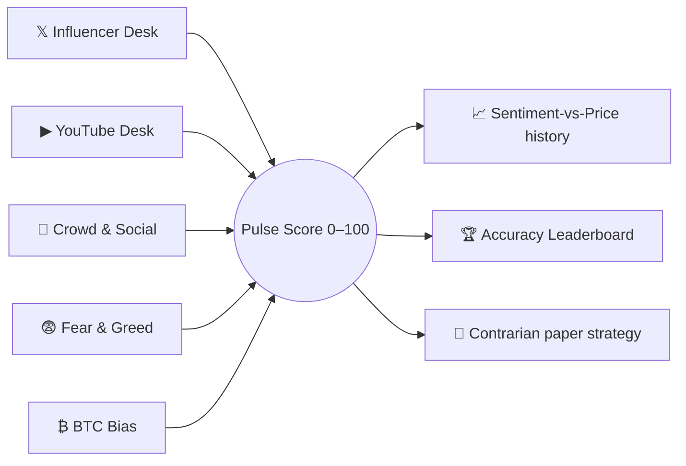

# 📡 Formion Pulse — Market Narrative

Formion Pulse answers one question other tools ignore: **what are the big voices and the crowd actually *saying* right now?**

It is deliberately different from a Fear & Greed gauge or a long/short ratio (those measure *positioning*). Pulse reads the **narrative** — crypto X (Twitter) traders, YouTube influencers, social chatter and headlines — and blends it with price into a single **Pulse Score (0–100)**, where 50 = balanced, higher = more bullish narrative.

Find it at **app.formion.ai → Coins Hub → Pulse** (also linked from the Analytics strip).

## What it watches

* **𝕏 Influencer Desk** — recent posts from a curated roster of crypto traders, each classified **bull / bear / neutral** with a one-line thesis and the coin it refers to. When an influencer posts a bare **chart screenshot**, a vision model *reads the chart itself* — drawn levels, arrows, long/short annotations — and labels it (**"CHART READ"** badge).
* **▶ YouTube Desk** — the latest videos from top crypto channels, each scored bull / bear / neutral by title + description.
* **📣 Crowd & Social** — recent market headlines and social chatter, synthesised into a short read with a bull/bear split and a mood (fearful → euphoric).
* **😨 Fear & Greed** and **₿ BTC Bias** — global mood plus BTC price and multi-horizon momentum (24h / 7d / vs trend).

## Accuracy Leaderboard — *who actually calls it right*

Every directional **bull/bear call** an influencer makes is recorded with the price at that moment, then automatically checked against the real price at **+24h / +72h / +7d**:

* ✓ hit (direction was right) · ✗ miss · ≈ flat (price barely moved, excluded)
* Per-influencer **hit-rate** on all three horizons, plus an **average edge** (how much following them would have returned).

So the loudest account isn't the most credible — the **leaderboard** is. The crowd calling for a crash while price quietly recovers shows up as misses you can see.

## Your watchlist & filtering

* **My Watchlist** — add **your own** X handles (`@name`) and YouTube channels (paste a `@name`, link or channel ID). They get the same AI scoring, on a personal desk, separate from Formion's default roster.
* **Source filter** — mute or un-mute any account or channel. The **Pulse Score, desks and leaderboard recompute instantly for you** — so you can see the market through only the voices *you* trust. Your selection is remembered on your device.
* **Auto-discovery** — Pulse continuously surfaces new candidate accounts (from mentions in tracked timelines and a periodic, AI-vetted X-search sweep 🔍). You decide who to **+ Track**.

## Contrarian strategy

Pulse runs a transparent **paper strategy** that fades crowd extremes — e.g. *extreme fear in the narrative while price holds → long*. Its trades and full analytics appear in **[Trade History](journal.md)** under **Pulse Contrarian**, so you can judge whether sentiment actually has an edge over time.


Pulse reads what people *say*. It is a sentiment and research tool, not a signal to act on blindly — pair it with your own analysis and the Accuracy Leaderboard before trusting any voice.

