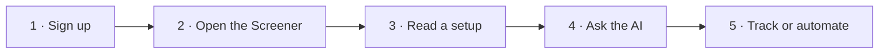

# 🚀 Quick Start (5 minutes)

New to Formion? This is the fastest path from sign-up to your first real signal. No card needed — the free **Neural** tier is genuinely useful.

## 1 · Sign up

Go to **[app.formion.ai](https://app.formion.ai)** and create an account (email or Google). You land in the **Quantum Terminal**. Nothing to connect yet — data is live out of the box.

## 2 · Open the Screener

The home view is the **[Screener](screener.md)** — every market ranked by Formion's native score. Sort by **Score**, filter to your market (crypto / stocks), and pick a timeframe. The top rows are where momentum, volume and positioning line up *right now*.

## 3 · Read a setup

Click any pair to open **[Chart Pro](chart-pro.md)** with the full order-flow workspace, or hover the row to see *why* it scored — the signals driving it (RSI, VWAP, funding, OI, long/short). Check the **[Bias Map](screener.md)** to see if the whole market agrees with that direction.

## 4 · Ask the AI

Open the **[AI Advisor](smart-trading.md)**, pick a style / risk / asset class, and get a ranked list of tradeable ideas with rationales — or paste a chart screenshot into **[Trade Vision](trade-vision.md)** for a structured entry / stop / take-profit plan. Want the crowd's read? Check **[Formion Pulse](pulse.md)** for what influencers and the market are saying.

## 5 · Track or automate

* **Watch it:** add the symbol to your **Watchlist** and set a **[Signal alert](smart-trading.md)** (browser, sound or Telegram).
* **Log it:** record the trade in the **[Trading Journal](journal.md)** for full performance analytics.
* **Automate it:** build a rule in the **[Strategy Lab](strategy-lab.md)** and run it as a **[bot](bots.md)** on your connected account.


That's the loop: **screen → read → confirm with AI → act → track**. Everything else in Formion makes one of those five steps sharper.


***

**Next:** [Connect a broker or exchange](brokers.md) · [Pricing & tiers](pricing.md) · [Use cases](usecase-find-a-setup.md)
