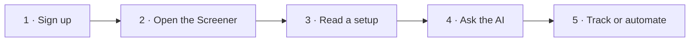

# 🚀 Quick Start (5 minutes)

New to Formion? This is the fastest path from sign-up to your first real signal. No card needed — the free **Neural** tier is genuinely useful.

```mermaid
flowchart LR
  A["1 · Sign up"] --> B["2 · Open the Screener"]
  B --> C["3 · Read a setup"]
  C --> D["4 · Ask the AI"]
  D --> E["5 · Track or automate"]
```

## 1 · Sign up

Go to **[app.formion.ai](https://app.formion.ai)** — it sends you to formion.ai to sign in or create an account (email, Google or Telegram), then back to the **Quantum Terminal**. Nothing to connect yet — data is live out of the box.

## 2 · Open the Screener

The home view is the **[Screener](screener.md)** — every market ranked by Formion's native score. Sort by **Score**, filter to your market (crypto / stocks), and pick a timeframe. The top rows are where momentum, volume and positioning line up *right now*.

## 3 · Read a setup

Click any pair to open **[Chart Pro](chart-pro.md)** with the full order-flow workspace, or read the row's strongest signals to see *why* it scored. Check the **[Bias Map](screener.md)** (Screener → Bias Map) to see if the whole market agrees with that direction.

## 4 · Ask the AI

Open the **[AI Advisor](smart-trading.md)**, pick a style / risk / asset class, and get a ranked list of tradeable ideas with rationales — or paste a chart screenshot into **[Trade Vision](trade-vision.md)** for a structured entry / stop / take-profit plan. Want the crowd's read? Check **[Formion Pulse](pulse.md)** for what influencers and the market are saying.

## 5 · Track or automate

* **Watch it:** add the symbol to your **Watchlist** and set an **[alert](alerts.md)** (browser, sound or Telegram).
* **Log it:** record the trade in the **[Trading Journal](journal.md)** for full performance analytics.
* **Automate it:** build a rule in the **[Strategy Lab](strategy-lab.md)** (Pro) and forward-test it as a paper **[bot](bots.md)** before attaching anything to your connected account.


That's the loop: **screen → read → confirm with AI → act → track**. Everything else in Formion makes one of those five steps sharper.


***

**Next:** [Connect a broker or exchange](brokers.md) · [Pricing & tiers](pricing.md) · [Use cases](usecase-find-a-setup.md)

## Continue from Command Center

On the formion.ai dashboard, use [Command Center](command-center.md) to ask FORA, attach a chart or document, or start with a suggested research command. For forex/CFDs, connect a cTrader demo account before moving to live trading. Review tracked outcomes in [Trades History](trades-history.md) and upcoming catalysts in [News](news.md).


The 7-day Pro trial (no card required) returns to Neural unless you upgrade. Paid licences are paid in crypto or with PayPal at the formion.ai checkout, or with Telegram Crypto Pay (no card payments); [FOM on Base](fom-token.md) provides a separate phased agent utility model.

