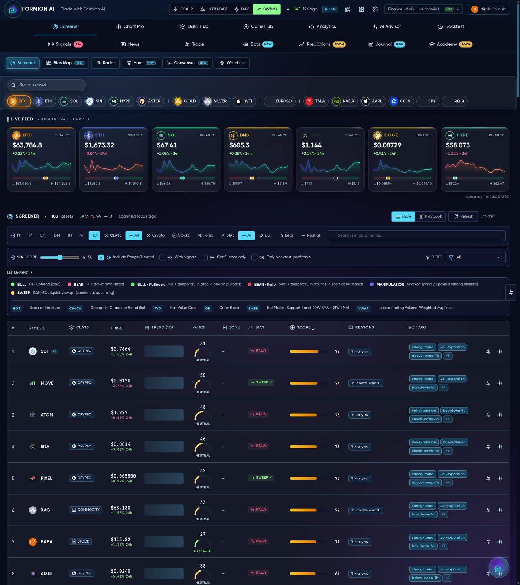
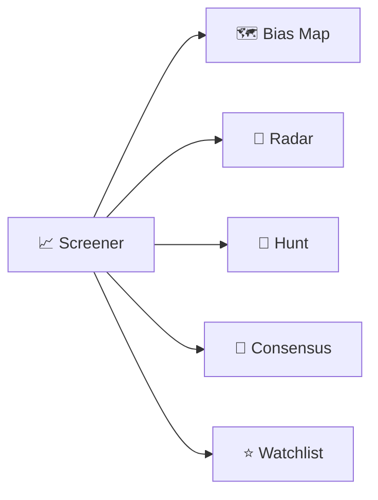

# 📈 Screener

<figure><figcaption>The Screener — every market, ranked by Formion's native scoring.</figcaption></figure>

The **Screener** is Formion's home view and the engine the rest of the app is built on: a ranked, sortable table of crypto and stock markets, each scored by **native signals** rather than a single indicator.

Open it at **[app.formion.ai](https://app.formion.ai)** — it's the first thing you see.

## How scoring works

Every pair gets a composite score blended from real, live inputs:

* **Momentum & trend** — RSI, MACD, EMA structure across multiple timeframes
* **Volume & flow** — VWAP position, volume surges, taker buy/sell delta
* **Derivatives** — funding rate, open-interest delta, top-trader long/short ratio
* **Confluence** — how many timeframes agree on direction

The table is sortable by any column and filterable by market, timeframe and score, so you can jump straight to "what's set up *right now*".

## Sub-tools

* **🗺️ Bias Map** — a market-wide **confluence heatmap** across 5 timeframes (5m → 1d) with an anchor score. Green = long bias, red = short, yellow = neutral. Multiple views (mosaic, matrix, grid, treemap, sector, sunburst) and a Min-Score slider let you read the whole market's lean at a glance.
* **📡 Radar** — curated TradingView preset feeds (breakouts, oversold bounces, volume spikes…) rendered as filterable cards.
* **🎯 Hunt** — advanced multi-filter screening: stack precise conditions (e.g. RSI < 30 *and* funding negative *and* above VWAP) to surface exactly the setup you want.
* **🤝 Consensus** — multi-timeframe agreement screening: only pairs where several timeframes confirm the same direction.
* **⭐ Watchlist** — pin the symbols you care about for a focused, always-on view.

## Logos & live data everywhere

Every symbol carries its asset logo, and rows update live. Click any pair to open it in **Chart Pro** with the full order-flow workspace, or send it to the **AI Advisor** for a read.


The Screener is fully usable on the free **Neural** tier. Heavier scanners (Hunt, deep Bias Map views) and higher refresh rates unlock on **Pro** — see **[Pricing & Tiers](pricing.md)**.

