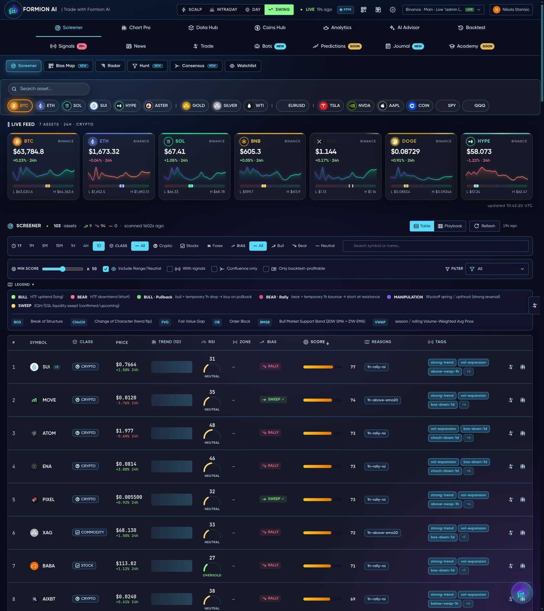
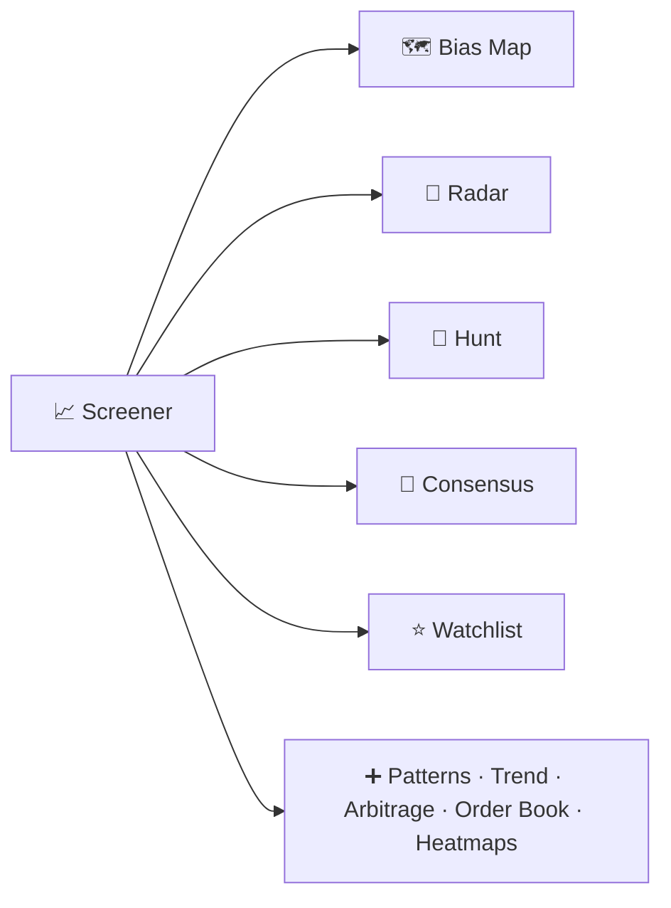

# 📈 Screener

<figure><figcaption>The Screener — every market, ranked by Formion's native scoring.</figcaption></figure>

The **Screener** is Formion's home view and the engine the rest of the app is built on: a ranked, sortable table of crypto, stock and forex markets, each scored by **native signals** rather than a single indicator.

Open it at **[app.formion.ai](https://app.formion.ai)** — it's the first thing you see.

## How scoring works

Every symbol gets one composite score:

* **Trend, momentum, volume and volatility** — live prices are scored on all four, then deduplicated across timeframes into **one number per symbol**
* **Signal tags** — structure and flow events such as FVG / order-block entries, VWAP reclaims and rejections, break of structure / CHoCH, regime changes, Wyckoff springs and Adaptive-RSI turns
* **Bias** — each row is classed bull, bear or neutral

The table shows score, price, 24h change, the strongest signals and a mini sparkline per row. Sort by any column and filter by asset class (crypto, stocks, forex), bias and signal, so you can jump straight to "what's set up *right now*".

## Sub-tools

```mermaid
flowchart LR
  SC["📈 Screener"] --> BM["🗺️ Bias Map"]
  SC --> RD["📡 Radar"]
  SC --> HU["🎯 Hunt"]
  SC --> CO["🤝 Consensus"]
  SC --> WL["⭐ Watchlist"]
  SC --> MO["➕ Patterns · Trend · Arbitrage · Order Book · Heatmaps"]
```

* **🗺️ Bias Map** — a market-wide **directional bias heatmap** across 5 timeframes (5m → 1d) with a selectable anchor timeframe. Green = long bias, red = short, yellow = neutral. Twelve views (Mosaic, Matrix, Grid, Quadrant, 3D, Strength, Confluence, Treemap, Sector, Sunburst, History, Quality) and a Min-Score slider let you read the whole market's lean at a glance.
* **📡 Radar** — 30+ TradingView preset scans (movers, breakouts, trend shifts, volume…) rendered as signal cards, across crypto, forex, indices/CFDs and stock markets (US, Canada, UK, Germany, France, Japan, Hong Kong, India, Australia). Subscribe to a preset to be alerted on fresh matches.
* **🎯 Hunt** — a top-down **US-equities** setup funnel (long-only): market regime (SPY/QQQ vs their 21/50 EMAs) → strongest sectors → strongest industries → ignition-and-flag and 8/21-EMA pullback setups, each with entry, stop and a 2R target.
* **🤝 Consensus** — multi-signal confluence: symbols ranked by how many of Formion's engines and indicators agree on the same direction.
* **⭐ Watchlist** and **WL Builder** — your saved symbols with live scores and signals, plus a workspace to curate the list against a live multi-timeframe bias matrix.
* **More lenses** — **Patterns** (chart-formation detector), **Trend** (single-timeframe trend-strength scan), **Arbitrage** (cross-exchange price spreads and funding carry), **Order Book** (depth, walls and imbalance), **VWAP Bubble**, **RSI Heat**, **MACD Heat** and **EMA Cloud**.

## Logos & live data everywhere

Every symbol carries its asset logo, and rows update live. Click any row to open its full chart and analysis in **Chart Pro**.


On the free **Neural** tier the Screener is **real-time** for crypto, covering the top 50 symbols. **Pro** and **Institutional** get the real-time screener on all markets — crypto, stocks, commodities and forex — see **[Pricing & Tiers](pricing.md)**.

