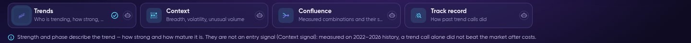
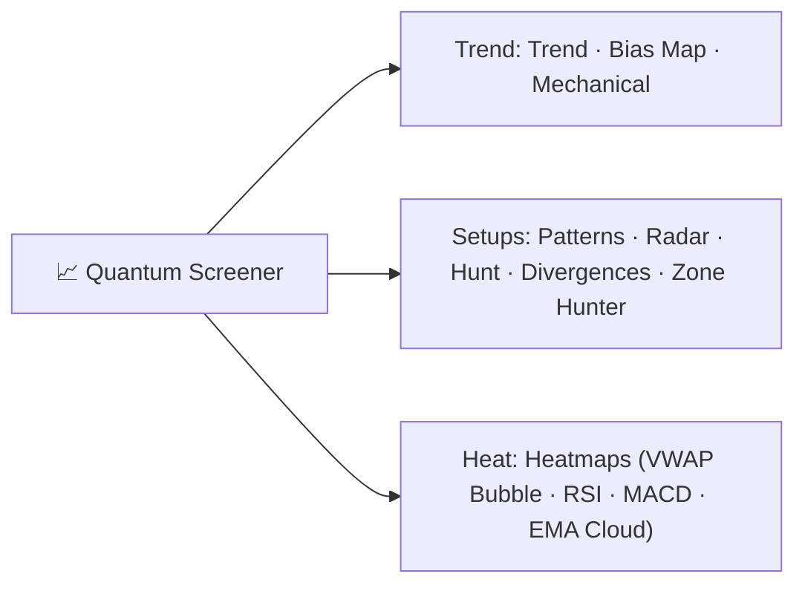
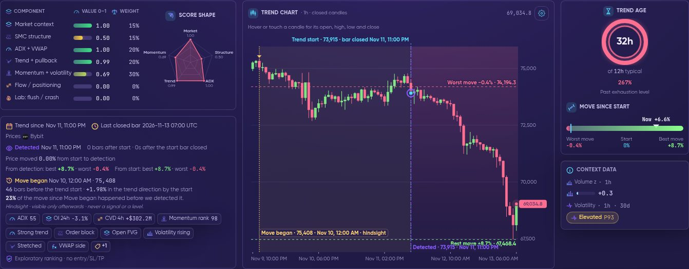
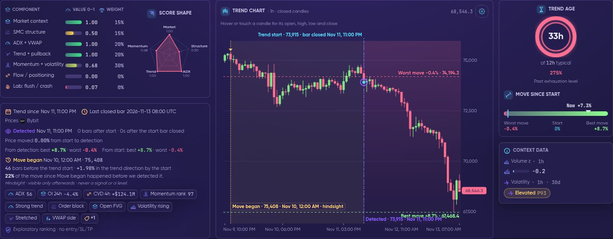
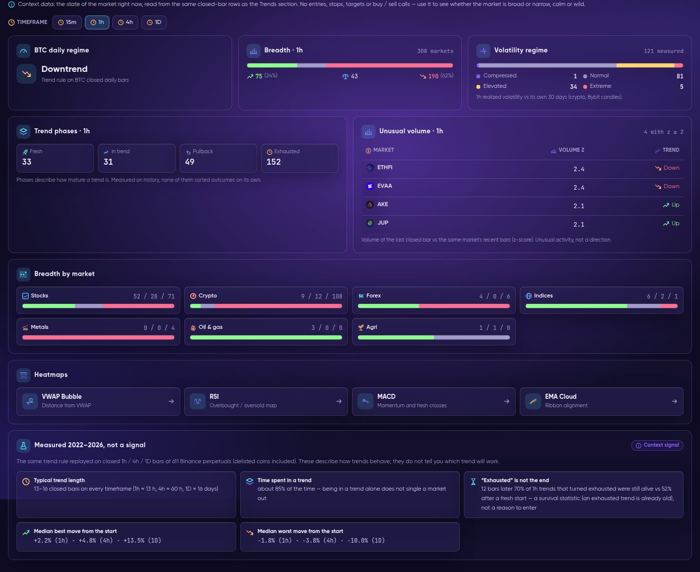
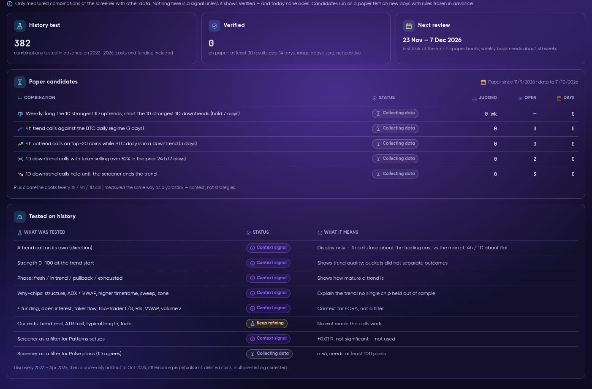
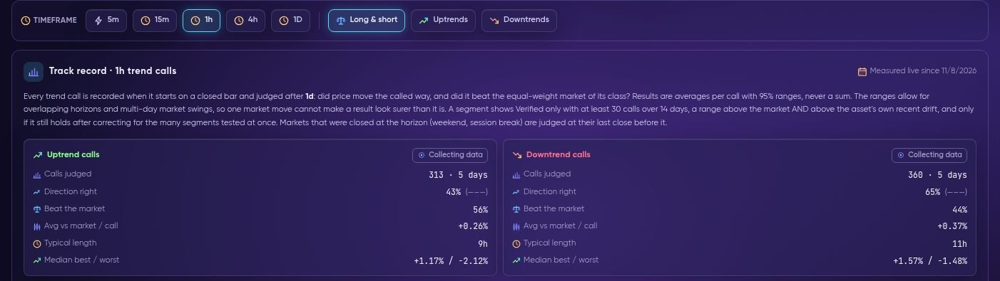
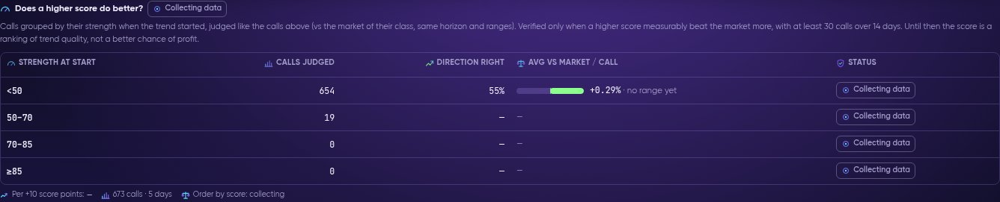
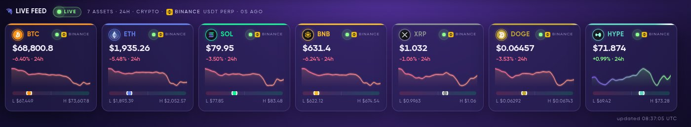

# 📈 Quantum Screener

<figure><figcaption>
The four section cards at the top of the Quantum Screener, with the Trends filters below.
</figcaption></figure>

<figure><video src=".gitbook/assets/rec-screener-quantum.mp4" title="Live recording: the Quantum Screener — switching sections, opening a row's Details (trend chart, age ring, score shape) and the Track record."></video><figcaption>
Live recording: the Quantum Screener — switching sections, opening a row's Details (trend chart, age ring, score shape) and the Track record.
</figcaption></figure>

The **Quantum Screener** is Formion's home view: it shows **which markets are trending, how strong and how mature each trend is**, across crypto, stocks & ETFs, metals, oil & gas, indices, forex and agriculture. Open it at **[app.formion.ai](https://app.formion.ai/?utm_source=docs&utm_medium=referral&utm_campaign=docs)** — it is the first thing you see (menu: **Find → Quantum Screener**).

The page has four sections. Click a card to switch; the section is kept in the address (for example `app.formion.ai/?view=context`), so you can bookmark or share it.

| Section | What it shows |
|---|---|
| 📈 **Trends** | The ranked table: who is trending, how strong, which phase — with **Details** for every row |
| 🧭 **Context** | The state of the market right now: BTC daily regime, breadth, volatility regime, trend phases and unusual volume. Facts, not signals |
| 🔗 **Confluence** | Combinations of the screener with other data that were tested on history, and the candidates now measured on paper |
| 📊 **Track record** | How the screener's past trend calls did, measured live, and **Does a higher score do better?** |


**Strength and phase describe the trend — how strong and how mature it is. They are not an entry signal (Context signal).** On 2022–2026 history a trend call alone did not beat the market after costs. See **What the screener is and isn't** below.


## 📈 Trends — the table

Pick a **timeframe** (5m · scalp, 15m, 1h, 4h, 1D), a side (**Long & short**, **Uptrends**, **Downtrends**), a market class and a phase (**Fresh**, **In trend**, **Pullback**, **Exhausted**); each chip shows how many markets it holds. **More filters · context data** adds the Volume z and Volatility filters (see below). Every row is read on **closed bars only**.

| Column | How to read it |
|---|---|
| **Symbol** | Asset logo, symbol and the venue its prices come from (for example Bybit, Binance USD-M, FP Markets (cTrader)), with the age of the last update |
| **Class** | Crypto, Stocks, Metals, Forex, Indices… |
| **Price · 24h** | Last price and 24h change |
| **Trend** | A mini chart of the selected timeframe |
| **RSI** · **Zone** | RSI on that timeframe and where price sits (for example discount or premium zone) |
| **Bias · phase** | **Uptrend** or **Downtrend** and the phase of the trend |
| **Since · typical** | How long the trend has lasted and how long a trend typically lasts on this timeframe |
| **MFE** · **MAE** | The best and the worst move since the trend start (see **MFE / MAE** below) |
| **Strength** | 0–100: how strong the trend is now, built from weighted components (shown in Details) |
| **Reasons** · **Tags** | Short "why" chips, for example momentum rank, ADX + VWAP, strong trend, lower highs + lows |

The line above the table counts the markets and how many are in an uptrend and a downtrend, and shows the BTC daily regime. Markets with no price history at the source right now are counted in a note instead of shown with an empty row.

## More tools in the Quantum Screener hub

The second row of the Quantum Screener holds the other trend and setup tools, in three groups:

```mermaid
flowchart LR
  QS["📈 Quantum Screener"] --> T["Trend: Trend · Bias Map · Mechanical"]
  QS --> S["Setups: Patterns · Radar · Hunt · Divergences · Zone Hunter"]
  QS --> H["Heat: Heatmaps (VWAP Bubble · RSI · MACD · EMA Cloud)"]
```

**Moved out of the Screener (Nov 2026):**

| Tool | Where it is now |
|---|---|
| **Order Book** (Imbalance and Walls) | **Data Hub → Order Book** — views Book · DOM · Imbalance · Walls. See **[Order Flow & Microstructure](order-flow.md)** |
| **Watchlist** | Your account menu (top right) → **Watchlist** and **Watchlist Builder**. See **[Trading Terminal — The App](the-app.md)** |
| **Consensus** | **Signals → Consensus** (described below) |
| **Arbitrage** | **Data Hub → Funding & Arb → Spreads** |

The **Mechanical** board is described in **[Analytics](analytics.md)**.

### 🗺️ Bias Map

<figure><figcaption>
Bias Map: green = long bias, red = short, by timeframe.
</figcaption></figure>

A market-wide **directional bias heatmap** across 5 timeframes (5m → 1d) with a selectable anchor timeframe. Green = long bias, red = short, yellow = neutral. Twelve views (Mosaic, Matrix, Grid, Quadrant, 3D, Strength, Confluence, Treemap, Sector, Sunburst, History, Quality) and a Min-Score slider let you read the whole market's lean at a glance.

**How to read the Bias Map**

* **Neutral vs no current read** — a **neutral** cell is a real read without a direction (no score). **No current read** means the read is stale or missing; it is not counted and is not treated as neutral.
* **Fast lane for 5m and 15m** — the short timeframes have their own priority lane: a closed candle is read starting about 10 seconds after it closes (closed candles only), and the cell usually updates within a minute.
* **Averages use current reads only** — Strength, Sector and Sunburst average only the current reads and show their **coverage** (how many markets have a current read).
* **Weekends** — forex, CFD and stock instruments (48 session instruments) are scored again on Monday; the weekend is not counted for them.
* **Accuracy: Collecting data** — measurement restarted on **2 Nov 2026** (a new measurement period), so the measured accuracy reads **Collecting data** until enough new data exists.
* **Segments** view — pre-registered segments (for example short bias on 4h, strong flips with a score of 60+, timeframes agreeing) are measured forward only from 9 Nov 2026; each reads **Collecting data** until it has at least 30 events over 14 days. The whole map stays a **Context signal**.
* **Context signal only** — no bot or filter built on the Bias Map has been proven. FORA reads it as market context and never gives an entry, stop or target from it.
* **History** — the Bias Map grid keeps the last 7 days for everyone (see **[Pricing & Tiers](pricing.md)**).

### 📡 Radar

<figure><figcaption>
Radar: preset scans rendered as signal cards.
</figcaption></figure>

30+ TradingView preset scans (movers, breakouts, trend shifts, volume…) rendered as signal cards, across crypto, forex, indices/CFDs and stock markets (US, Canada, UK, Germany, France, Japan, Hong Kong, India, Australia). Subscribe to a preset to be alerted on fresh matches.

### 🎯 Hunt

<figure><figcaption>
Hunt: market regime → top sectors → top industries → setup candidates.
</figcaption></figure>

A top-down **US-equities** setup funnel (long-only): market regime (SPY/QQQ vs their 21/50 EMAs) → strongest sectors → strongest industries → ignition-and-flag and 8/21-EMA pullback setups, each with entry, stop and a 2R target.

### 🤝 Consensus

<figure><figcaption>
Consensus: symbols ranked by how many engines agree on the same direction.
</figcaption></figure>

Now under **Signals → Consensus**. Multi-signal confluence: symbols ranked by how many of Formion's engine **families** agree on the same direction.

* **Status: Context signal · Collecting data.** Engines agreeing is context next to your own levels and trend — our study has not shown that agreement alone trades better, so Consensus is not a buy/sell signal.
* **Counted by family, not by variant.** Several variants of one engine count as one vote, so one engine with many versions cannot inflate the score. The rows still list every variant.
<figure><figcaption>
The status note on the Consensus page: Context signal · Collecting data, votes counted per engine family, Talos counted once.
</figcaption></figure>

* **Talos is counted once.** The Talos copy trades used to reach Consensus through two readers; they are now one family and one trade.

### ⭐ Watchlist

The Watchlist is no longer part of the Screener: open it from your **account menu → Watchlist** (and **Watchlist Builder**). See **[Trading Terminal — The App](the-app.md)**.

### ➕ More lenses

**Patterns** (chart-formation detector; **Live chart** on a card opens the Formion chart with the pattern's own levels, see below), **Trend** (trend-strength scan, see below), **Divergences**, **Zone Hunter** (rule screener measured on a paper book, see below) and **Heatmaps** with the views **VWAP Bubble**, **RSI**, **MACD** and **EMA Cloud**.

<figure><figcaption>
RSI Heatmap — every symbol coloured by RSI.
</figcaption></figure>

<figure><figcaption>
Patterns: detected formations, regime radar and a forward-tested track record by pattern.
</figcaption></figure>

### 📈 Trend

<figure><figcaption>
Trend: regime decision plus a trend board across crypto, commodities and US stocks.
</figcaption></figure>

<figure><figcaption>
Trend scanner: one card per coin with its score and bias, on closed candles only.
</figcaption></figure>

The Trend scanner gives every coin (Binance USD-M perpetuals, top by 24h volume) a **trend score from −100 to +100** on the timeframe you pick (5m → 1d):

* **Score** — built from three parts, all in % of price: EMA9 vs EMA21 (up to ±50), how much EMA9 moved over the last 18 bars (up to ±30) and price vs EMA21 (up to ±20).
* **Bias** — **Long** from +25, **Short** from −25, **Neutral** in between. It describes the recent trend; it says nothing proven about what comes next.
* **Closed candles only** — the score, bias and change % move only when a candle closes, so a signal never repaints. The last candle on the chart and the price are live, but they do not count until that candle closes.
* **How far to compare** — because the score is in % of price, the same number is not comparable across timeframes or between a calm and a wild coin.
* **Renamed or dead symbols show no score** — a symbol whose market stopped trading or was renamed (for example **TON → GRAM**, MATIC → POL) shows no score and a "Renamed to …" note, never a fake "neutral 0".

**Trend backtesting (paper book).** The **Backtesting** sub-tab measures a paper book that takes trades from the trend score on 1h. Entries, stops and targets are **Formion's own rules** (ATR-based), not anyone's signal. How the book is measured:

* A signal fires only on a **just-closed** 1h candle.
* Entry is the real executable price at that moment (ask for long, bid for short).
* Exits are taken at the **real exchange price**: a stop fills at the first real trade after it is triggered, a target fills only when price trades **through** it, and a time expiry closes at the last real trade price.
* Results are shown after costs (editable) and include the funding actually charged.
* **Measurement restarted on 2 Nov 2026.** Old rows whose recorded outcome was contradicted by exchange data were removed, so the default view starts from the restart.
* Free users see the last 7 days, Pro and up the whole book. Until there are at least 30 trades over at least 14 days the status reads **Collecting data**.

### ⚖️ Order Book → moved to Data Hub

Order book imbalance, walls and the Walls Bot paper book now live in **Data Hub → Order Book** (views **Imbalance** and **Walls**). The old addresses still open the same pages. See **[Order Flow & Microstructure](order-flow.md)**.

### 📍 Zone Hunter

**Zone Hunter** (Screener → Zone Hunter, beta) is a rule screener that is measured on a paper book — not a signal service. Every rule is frozen before measuring, uses **closed candles only**, and every number on the page comes from its paper book.

<figure><figcaption>
Zone Hunter → Buy the dip: each row shows the zone on its chart, the plan from the rule, the 1D regime and the backtest status; the paper book is below the list.
</figcaption></figure>

| Section | What it shows |
|---|---|
| **Buy the dip** | 1D uptrend, then a 4H pullback into a zone where two of Fib 0.382–0.618, the EMA20–50 band and a prior resistance turned support overlap. Limit at the zone top. |
| **Sell the top** | Range-top rejection and trend exhaustion — research only, no proven advantage yet. Never shorted within 3% of the all-time or 52-week high. |
| **S/R Flip (1D)** | Crypto daily level break, limit back at the level. Paper forward test. |
| **Trend Shift** | An established trend flips and a close breaks its last swing (CHoCH), on 1H / 4H / 1D. Side and time only — the bias is measured forward on every row. |
| **Adaptive brain** | Which strategies the selector switches on this week and why, per market regime. Shadow only — nothing trades from it. |

* **Status** — every setup and paper book reads **Collecting data** until it has enough trades and days; the page never shows a profit promise.
* **Chart** — the **Chart** button opens the Formion chart with the asset logo and the exchange logo in the title (Bybit for crypto, FP Markets for forex, gold, oil and indices), the **Chart settings** gear, a yellow **ENTRY** circle on the candle where the limit filled and a square on the exit candle. The zone, limit, stop and targets are only the row's own levels.
* **"New signal · not filled"** — every row in the **Trades** table is its own setup (own signal candle and zone). A row marked **New signal · not filled** is a newer signal recorded after an earlier trade of the same asset closed; its limit was never reached before the deadline, so no trade was opened. It is not the same trade twice — it counts in the fill rate, not in R.

#### 🧠 Adaptive brain — weekly decision vs Market now

The Adaptive brain (Pro and up) shows two different things, kept apart on purpose:

* **Weekly decision** — the frozen decision of the selector for the week, with its exact decision date and time (for example *decision 2026-11-09*), the date of the last weekly run and whether it was **OK** or **Failed**. The ON lists and regimes below it belong to that decision.
* **Market now — last closed daily candle** — the same regime rule recomputed on the newest closed daily candle, for BTC, Altcoins, Crypto (all), forex, gold and indices. It is context only: the selector keeps its frozen decision and never reads these labels. Each row carries a pill:
  * **Same as decision** — the current label matches the weekly decision
  * **Changed since decision** — the market has moved to another regime since the decision (the weekly label is shown next to it)
  * **Data old** — the newest daily candle is too old to trust
  * **No current data** — the candles are missing; no label is shown instead of a guess
* **Data not current** — a red banner appears when the weekly decision is **older than 8 days** or the **latest weekly run failed**. The regimes and ON lists then stay on the page only as history, marked "Not current", until the next weekly run succeeds.

Regime labels use closed daily candles only: **Uptrend** when the close is above the 50-day EMA and the 90-day return is positive, **Downtrend** when both are negative, otherwise **Range** (also when ADX is under 18).

**Crypto is measured three ways**, because BTC and the altcoins often move differently:

| Row | What it measures |
|---|---|
| **BTC** | The BTC regime |
| **Altcoins** | An equal-weight basket of **49 altcoins** (no BTC), plus the share of altcoins trading above their EMA50 |
| **Crypto (all)** | The whole crypto class, shown for context |

* **Spec versions:** the selector's crypto specs show **v1 Retired** (the old specs that read the BTC regime for every crypto market; kept in the history) and **v2 Starts next week**. From **16 Nov 2026**, v2 judges **BTC setups in the BTC regime** and **altcoin setups in the Altcoins regime**. Its rules were written down before any result; it counts forward only.
* **The detectors never read the brain.** Buy the dip, Sell the top and S/R Flip read only the coin's **own candles** — never BTC, never the Altcoins basket and never the Adaptive brain. The brain only decides which strategies it would switch on; it trades nothing (shadow only).

#### 🔻 Sell the top — why it is often 0

An empty Sell the top list is usually **not a fault: the rule is strict**, and the empty state on the page says why. Over 30 days, 62 markets and about 10,500 4H candles:

* **Range path** — candles in a low-ADX range → at the range top → a rejection bar → **at least 2 touches of both the top and the bottom of the range**. That last step left **0**.
* **Exhaustion path** — above the 1D EMA50 → stretched at least 2.5 ATR → a red trigger bar → **a new 20-bar high**. That last step left **0**.

Historically the same rule fired about **10 times in ~166 days**; the last signal was on **28 Sep 2026**. Shorts are also never taken within 3 % of the all-time or 52-week high.

#### 🔄 Trend Shift

**Trend Shift** looks for a trend reversal on **1H, 4H and 1D**, on **49 Bybit crypto markets** and **13 FP Markets (cTrader)** markets (forex, gold, silver, oil, indices).

* **Rule:** a trend (measured by the same trend rule as the Quantum Screener, on closed bars) that lasted **at least 20 bars** flips side — directly or after **at most 12 bars without a trend** — and **within 6 bars** a close breaks the old trend's last swing (a change of character, **CHoCH**).
* **Detection** = that first breaking close. It is computed only from closed bars ending on that bar, so a detection **never repaints**.
* **No entry, stop or target.** A Trend Shift row gives side and time only. What is measured is the **move after detection minus the market's own drift** — over **24 h on 1H, 2 days on 4H, 7 days on 1D** — plus the best and worst move (**MFE / MAE**).
* **Test rule TR1** is **our** time exit (enter at the next open, exit at the close of that horizon, after costs). It is Formion's own test rule, not part of the signal.
* **Status:** every segment reads **Collecting data** until it has **30 rows over 14 days**; the forward book started on the day Trend Shift went live. The history before that was in-sample and **proved nothing** for any timeframe or side, so it is not used for the status.
* Each row has a chart of the detection with the CHoCH level; click it for a large zoomable chart.

#### Reading the rows and the paper book

* **Long / Short pill** — the side of a setup is always shown with the same pill and an icon (one shared pill across the app), never as bare text.
* **FP Markets (cTrader)** — forex, gold, silver, oil and index rows name their venue **FP Markets (cTrader)** with the FP Markets logo; crypto rows show Bybit.
* **No fill labels** — when a limit was never reached, the row reads **No fill · expired** (the deadline passed) or **No fill · cancelled** (a cancel rule hit, e.g. price closed above the impulse high before filling). An expired order is never labelled cancelled.
* **Below Pro** the paper book shows **Closed** and **Status**, and a lock teaser (unlock with Pro, the 7-day trial or FOM Lock) instead of Win rate, Avg R and Sum R. Locked numbers are never sent to your browser and never shown as fake zeros; on Pro and up a missing value shows as "—".

**What each plan sees**

| | Markets | Full rows per section | Sections | Paper book |
|---|---|---|---|---|
| 🆓 **Free** | Crypto | 3 | Buy the dip, Sell the top | Status + last 7 days of trades |
| 🪙 **Free + FOM Hold** | Crypto | 5 | + S/R Flip | Last 14 days |
| 🔒 **Free + FOM Lock** | Crypto | All crypto rows | + Trend Shift | Last 30 days |
| 💎 **Pro** | All (crypto, forex, gold, silver, oil, indices) | All | + Adaptive brain | Full (win rate, average R, CI, sum R) |
| 💎 **Pro + FOM Lock** | All | All | All | Full + per-trade MFE / MAE |
| 🏛️ **Institutional** | All | All | All | Full + CSV export |

The chart opens for every row your plan shows. Rows your plan does not include appear as blurred locked rows with the unlock options; their content is never sent to your browser. See **[Pricing & Tiers](pricing.md)** and **[FOM Hold vs Lock](fom-hold-vs-lock.md)**.

## 🔎 Details — trend chart and the three moments

Click a row in the table, a card, or a phone row to open **Details** right below it. Chart Pro opens only from the chart button, so a click never takes you away from the list.

<figure><figcaption>
Details for BTC on 1h: Move began (amber, hindsight), Trend start (dashed line), Detected (violet), Best / Worst move since the start, and the Trend age ring (32h of 12h typical).
</figcaption></figure>

* **Trend chart** — a real candle chart on the row's timeframe, closed candles only: price on the Y axis, time on the X axis. The time axis shows the candle's **open** time (like TradingView); the labels say "bar closed …" where the close time matters. Hover (mouse) or touch a candle to see its open, high, low and close. The dashed **Best move** and **Worst move** lines show the best and worst price move since the trend start, with % and price (the row's MFE / MAE).
* **Score components** — each part of the strength score with its value and weight, and the score shape next to it.

### The three moments

| Moment | What it is | How to read it |
|---|---|---|
| **Move began** | The last swing extreme in the trend-start bar and the **48 closed bars before it**: the highest high before a downtrend, the lowest low before an uptrend | **Hindsight** — it can only be seen afterwards. It is never a signal, an entry, a stop or a level |
| **Trend start** | The bar where our trend rule (closed bars only) first calls the trend. Example: a downtrend starts when the close is below **EMA50 − 0.25 × ATR** and **EMA20 is below EMA50** | The structural start of the trend on this timeframe |
| **Detected** | The moment our screener **live** first recorded the trend (violet marker) | Recorded at that time and never changed, never back-filled or estimated. If it was not recorded, Details says **Detection time not recorded**. It is usually within about 5 minutes of the trend-start bar's close |

Short fact lines in the box under the score components put numbers on the three moments, for example:

* **"N bars before the trend start · x % in the trend direction"** — how far Move began lies before the trend start, and how much price had already moved in the trend direction by then.
* **"x % of the move … before we detected it"** (or "before the trend start") — the share of the move from Move began to the last close that was already done at that moment.
* **Best / worst from detection** next to best / worst from the start, so you can see what was still left after the screener caught the trend.

### Trend age ring

The ring shows how old the trend is (for example **3d** in the centre). Below it: the **typical** trend duration on this timeframe (for example "of 18h typical"), the age as % of typical and a status. Age is counted in closed bars of trading time, not wall-clock time.

* **Venue** — the price source is named in Details and on the row; forex, metals, oil and index rows read **FP Markets (cTrader)** with the real FP Markets logo.
* **Not a forecast** — Details shows measured facts about a trend. It never gives an entry, stop or target.

### Move since start and Score shape

<figure><figcaption>
Details: Score shape next to the components, the Trend age ring and the Move since start bar on the right.
</figcaption></figure>

* **Move since start** — a bar from **Worst** (left) through **Start** (0 %) to **Best** (right), with a **Now** marker where price is today. It is the same best and worst move as the MFE / MAE columns, drawn on one line.
* **Score shape** — a radar of the strength components (market context, structure, ADX, trend, momentum) next to the component bars, so you see at a glance whether a high strength comes from one part or from all of them.
* **Trend age ring** colours — calm while the trend is younger than typical, warmer above **100 %** and **150 %** of the typical length. Weekends and closed sessions do not age a trend, because age counts closed bars.

### MFE / MAE — what Best and Worst move mean

* **Measured from the trend start** — the close of the **first closed bar of the trend**, on the timeframe you picked.
* **Closed bars only** — the live, unfinished bar is not counted.
* **Direction** — for an **uptrend** it is the long view (MFE = highest move up, MAE = deepest move down); for a **downtrend** it is the short view (MFE = deepest move down, MAE = highest move up).
* **They describe the move, they are not an entry, a stop or a target.** Nobody could have entered exactly at the trend start, and the numbers never tell you where to place an order.

## Context data — Volume z and Volatility regime

Two extra readings sit next to the strength of every crypto row. They are **context data**: they describe the state of the market right now. They are **not buy or sell signals** and they are **not part of the strength score** — the ranking, phases and counts are exactly the same with or without them.

| Reading | What it is | How it is measured |
|---|---|---|
| **Volume z** | How unusual the volume of the last closed bar is | (volume of the last closed bar − average of the **previous 20 closed bars**) ÷ their standard deviation, on the screener timeframe you picked. **+2** means about two standard deviations above normal; **−1** means quieter than usual |
| **Volatility regime** | How wild the coin is now compared with **its own** recent past | 24 h realized volatility (1 h bars, annualised) as a **percentile of the coin's own last 30 days**: **Compressed** below P20 · **Normal** P20–P80 · **Elevated** above P80 · **Extreme** above P95. Hover the P number for the realized and Parkinson volatility |

<figure><figcaption>
Details on a phone: the Context data block with Volume z on the screener timeframe (here −0.2 on 1h) and the Volatility regime (here Normal, P75 of the last 30 days).
</figcaption></figure>

### Where you see them

* **Details** — open a row (desktop) or tap **Details** on a card or a phone row. The **Context data** block shows both readings with their timeframe, for example `Volume z · 1h` and `Volatility · 1h · 30d`.
* **Columns** — the **Columns** button adds **Volume z** and **Volatility** as optional table columns. They are **off by default**; your choice is remembered in this browser, like the view and the number of rows.
* **More filters · context data** — in the filter panel (closed by default). Filter by **Volume z ≥ 2**, **Volume z ≥ 3** or **Volume z ≤ −1**, and by regime: **Compressed**, **Normal**, **Elevated**, **Extreme** or **Elevated + Extreme**. Rows without a fresh value are left out while a filter is on, and the up/down counters follow the filter.

<figure><figcaption>
Columns: the two optional context columns, off until you switch them on.
</figcaption></figure>

<figure><figcaption>
More filters · context data: Volume z and Volatility regime filters.
</figcaption></figure>

### Good to know

* **Coverage:** both readings are measured on **Bybit perpetual candles**, so they exist for about 88 % of crypto rows. A market without them (for example a coin listed only on Binance) shows **—** with an explanation. A new coin needs at least 7 days of hourly history before it gets a regime (**Collecting**).
* **No stale numbers:** a Volume z older than 3 bars or a regime older than 3 hours is not shown.
* **Information only:** we measured whether the volatility regime makes signals better when used as a filter — it **does not**. Use it to understand the market you are looking at (a quiet coin vs a coin in an extreme move), not as a reason to enter or skip a trade.

## 🧭 Context — the state of the market

<figure><figcaption>
Context on 1h: BTC daily regime, breadth (uptrend / no trend / downtrend), volatility regime, trend phases, unusual volume, breadth by market and the measured trend facts.
</figcaption></figure>

**Context** reads the same closed-bar rows as the Trends section and shows only facts — no entries, stops, targets or buy / sell calls. Use it to see whether the market is broad or narrow, calm or wild. Pick the timeframe (15m, 1h, 4h, 1D) at the top.

* **BTC daily regime** — the trend rule on BTC's closed daily bars (Uptrend, Downtrend or No trend).
* **Breadth** — how many markets are in an uptrend, in no trend and in a downtrend, and the same **by market** (crypto, stocks, forex, indices, metals, oil & gas, agriculture).
* **Volatility regime** — how many crypto markets are Compressed, Normal, Elevated or Extreme against their own last 30 days.
* **Trend phases** — how many trends are Fresh, In trend, in a Pullback or Exhausted. Phases describe maturity; on history none of them sorted outcomes on its own.
* **Unusual volume** — markets whose last closed bar has a **volume z of 2 or more**: unusual activity, not a direction.
* **Heatmaps** — shortcuts to VWAP Bubble, RSI, MACD and EMA Cloud.
* **Measured 2022–2026, not a signal** — the facts in the next section.

## 🔗 Confluence — measured combinations

<figure><figcaption>
Confluence: 382 combinations tested on history, 0 Verified, five paper candidates (Collecting data) and what each tested use means.
</figcaption></figure>

**Confluence** shows only measured combinations of the screener with other data. **Nothing here is a signal unless it shows Verified — and today none does.**

* **History test** — **382** combinations were written down in advance and tested on **2022–2026** history (611 Binance perpetuals incl. delisted coins, costs and funding included; discovery 2022 – Apr 2025, then a once-only holdout to Oct 2026, corrected for testing many combinations). **0** were Verified.
* **Paper candidates** — five combinations are now measured on **new days** with frozen rules (weekly long the 10 strongest 1D uptrends / short the 10 strongest 1D downtrends, 4h calls against the BTC daily regime, 4h uptrends on top-20 coins while BTC is in a daily downtrend, 1D downtrends with taker selling, 1D downtrends held until the screener ends the trend). Each reads **Collecting data**; it can become **Verified** only with at least **30 results over 14 days**, a range above zero and a net positive result. The first look is planned for **23 Nov – 7 Dec 2026**; the weekly book needs about 30 weeks.
* **Tested on history** — what each use of the screener showed:

| What was tested | Status |
|---|---|
| A trend call on its own (direction) | Context signal |
| Strength 0–100 at the trend start | Context signal |
| Phase (fresh / in trend / pullback / exhausted) | Context signal |
| Why-chips (structure, ADX + VWAP, higher timeframe, sweep, zone) | Context signal |
| + funding, open interest, taker flow, top-trader L/S, RSI, VWAP, volume z | Context signal |
| Our exits (trend end, ATR trail, typical length, fade) | Keep refining |
| Screener as a filter for Patterns setups | Context signal |
| Screener as a filter for Pulse plans (1D agrees) | Collecting data (needs at least 100 plans) |

## 📊 Track record — how past calls did

<figure><figcaption>
Track record for 1h calls: uptrend and downtrend calls measured live since 8 Nov 2026, each card reading Collecting data.
</figcaption></figure>

Every trend call is recorded when it starts on a closed bar and judged after a fixed horizon (for example **1 day** for 1h calls): did price move the called way, and did it **beat the equal-weight market of its class**? Pick the timeframe and side at the top.

* **Cards per side** — **Calls judged**, **Direction right**, **Beat the market**, **Avg vs market / call**, **Typical length** and **Median best / worst**. Results are averages per call with 95 % ranges, never a sum.
* **By trend phase** and **By side, BTC regime and coin group** — the same measurement split into segments.
* **Status** — a segment shows **Verified** only with at least **30 calls over 14 days**, a range above the market **and** above the asset's own recent drift, and only if it still holds after correcting for the many segments tested. Until then it reads **Collecting data**. The live measurement started on **8 Nov 2026**.
* Markets that were closed at the horizon (weekend, session break) are judged at their last close before it.

### Does a higher score do better?

<figure><figcaption>
Calibration: calls grouped by their strength at the trend start, all Collecting data so far.
</figcaption></figure>

This table groups calls by their **strength at the trend start** (**<50**, **50–70**, **70–85**, **≥85**) and by phase, judged exactly like the calls above, plus the change **per +10 score points**. A higher score counts as better only when it measurably beats the market more, with at least 30 calls over 14 days. **Today it reads Collecting data**: most trends start with a strength below 50. Until it is proven, the score is a **ranking of trend quality, not a better chance of profit**.

## 🧾 What the screener is and isn't

**It is** a clear, live map of which markets trend, how strongly and for how long — measured context you can read in seconds. **It isn't** an entry signal: a trend call, its strength and its phase are a **Context signal**.

Measured on 2022–2026 history (the same trend rule replayed on closed 1h / 4h / 1D bars of 611 Binance perpetuals, delisted coins included):

* **Typical trend length** — **13–16 closed bars on every timeframe** (1h ≈ 13 h, 4h ≈ 60 h, 1D ≈ 16 days).
* **Time spent in a trend** — about **85 %** of the time. Being in a trend alone does not single a market out; strength, age and phase matter more.
* **"Exhausted" is not the end** — 12 bars later, **70 %** of 1h trends that turned exhausted were still alive, vs **52 %** after a fresh start. That is a survival statistic (an exhausted trend is already an old trend that survived), **not a reason to enter** and not a "stronger trend".
* **Median best move from the start** — +2.2 % (1h) · +4.8 % (4h) · +13.5 % (1D). **Median worst move** — −1.8 % (1h) · −3.8 % (4h) · −10.0 % (1D).

## 🟢 Live Feed — the LIVE dot and your exchange

<figure><figcaption>
The Live Feed strip with the green LIVE pill and a live dot on every card.
</figcaption></figure>

The **Live Feed** strip on the home page (and above the chart in Chart Pro) streams price, 24h change, the 24h low / high and a 24h hourly sparkline.

| Dot / pill | Meaning |
|---|---|
| 🟢 **Live** (glowing, pulsing ring) | The last tick arrived less than **10 s** ago |
| 🟡 **Delayed** | **10–60 s** without a tick |
| ⚪ **Offline** | More than **60 s** without a tick, or the connection dropped. When the network is back it turns **Live** again at once |

With reduced motion switched on, the dot glows without pulsing. The header shows the exchange and market (for example **Binance · USDT perp**). Choose the exchange in **Settings → Live Feed exchange** (see **[Trading Terminal — The App](the-app.md)**): Binance (default), Bybit, OKX, Bitget or Hyperliquid. Every number on a card comes from the chosen exchange only — a coin it does not list shows **Not listed on <exchange>**, never another exchange's price.

## Logos & live data everywhere

Every symbol carries its asset logo, and rows update live. Click a row to open **Details** below it; the **Chart** button opens the full chart in **Chart Pro**.


On the free **Neural** tier the Quantum Screener covers **crypto (top 50)** with **3 full rows**; the other rows appear as locked rows with the unlock options. **Pro** and **Institutional** get the full real-time screener on **all markets** — crypto, stocks & ETFs, metals, oil & gas, indices, forex and agriculture — see **[Pricing & Tiers](pricing.md)**.


## One Formion chart behind every table

When a table or card opens a chart — **Patterns → Live chart**, **Signals → Signal Desk → Live chart**, **Zone Hunter → Chart** and **Multi-Chart** — you get the **same Formion chart** with our own candles (crypto from Binance, Bybit or OKX; forex, gold, oil and indices from FP Markets cTrader), not an embedded TradingView widget.

<figure><figcaption>
Patterns → Live chart: asset and exchange logo in the title, Chart settings, the pattern's own Stop and Entry ref, and a circle on the breakout candle.
</figcaption></figure>

* **Title** — the asset logo, the symbol and the exchange logo, so you always know which market and which venue's candles you are looking at.
* **Chart settings** — the gear button, the same one as in Chart Pro: candles, wicks, grid and background. A change applies to **all charts** in the app by default; pick **This chart** to change only the chart in front of you.
* **Entry marker** — a yellow circle sits on the candle where the signal triggered, at that price (the breakout candle on Patterns, the alert candle on Signal Desk).
* **Levels only from the signal** — the zone, limit, stop and targets drawn on the chart are exactly the ones the row or card states (only those the signal has). The chart never adds levels of its own.
* **No candles for a symbol?** If our feed has no candles for that market, the chart falls back to TradingView and says so in a visible note — you never get an empty chart.


The **Radar** scans and **Strategy Lab** still show TradingView charts.

