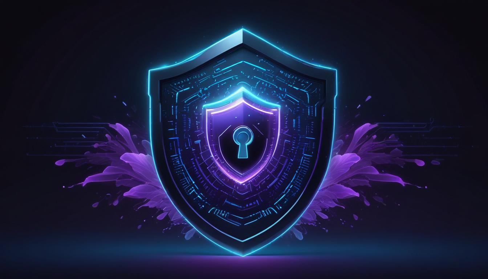

# 🔐 Security

<figure><figcaption></figcaption></figure>

Trading means connecting real money, so security is foundational to how Formion is built.

## Your funds never leave your exchange

Formion is **non-custodial**. It connects to your exchange through **API keys** and only places trades on your behalf. With withdrawals disabled on the key, nobody — Formion included — can move funds off the exchange. Your funds stay on your own exchange or in your own wallet at all times.

* Use **trade-only** API keys (enable trading; leave withdrawals **disabled**).
* When connecting, add the Formion **IP whitelist** to your key — see **[How to Start — API Connection](how-to-start-api-connection.md)**.

## Encryption

* All API keys, secrets and sensitive credentials are **AES-256-GCM encrypted at rest**.
* Traffic is encrypted in transit (TLS).
* Wallet sign-in through the browser is **view-only** and never asks for your key. A private key is needed only if you want Formion to sign DEX trades for you; it is AES-256-GCM encrypted and never shown again. Use a dedicated trading wallet with limited funds.

## Account protection

All of these live in **Profile → Security** on [formion.ai](https://formion.ai):

* **Bot protection** — Cloudflare Turnstile checks every sign-in and sign-up path to keep automated sign-ups out.
* **Two-factor authentication (2FA)** — authenticator-app codes, required on every sign-in (password, Google or Telegram) once enabled, with one-time backup codes.
* **Active sessions** — review every signed-in device; revoke one or sign out all others.
* **Trading password** — a second password that confirms manual orders and unlocks FORA autotrade; optionally required at login too.
* **Security alerts** — optional emails for every new sign-in and for access from a new location.
* **Recovery email** — a verified backup address. Your account activity is listed under **Profile → Activity**.

## Bring Your Own Key (BYOK)

When you connect your own AI provider keys, they're stored encrypted at rest with AES-256-GCM and used only for your AI requests (on Institutional, optionally shared with your team).

## Good practices

* Keep API-key **withdrawal permission OFF**.
* Use a **sub-account** per bot where your exchange supports it.
* Enable 2FA and a strong, unique password.
* Revoke a key on your exchange at any time — Formion can no longer trade with it.


Found a security issue? Email **support@formion.ai**.

