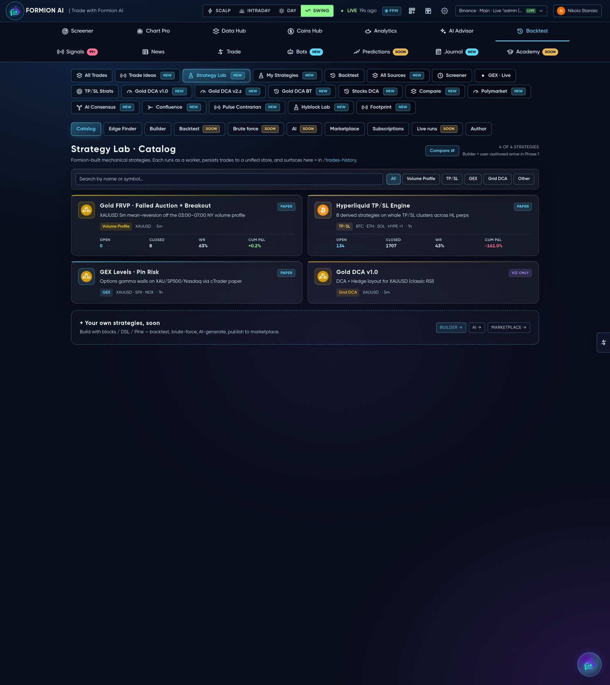
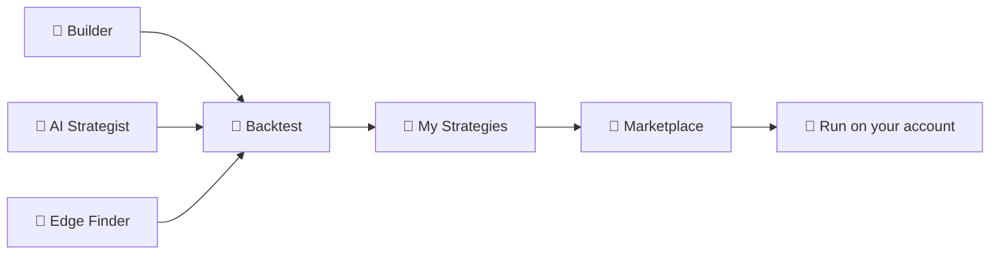

# 🧪 Strategy Lab & Marketplace

<figure><figcaption>Build a strategy with no code, let AI find an edge, then publish it and earn.</figcaption></figure>

The **Strategy Lab** (app.formion.ai → Backtest → Strategy Lab) is where you turn an idea into a tested, runnable strategy — without writing code — and optionally **publish it to earn**.

## Three ways to build

* **🧱 No-code Builder** — compose entry/exit rules from indicator blocks (RSI, EMA, MACD, ADX, VWAP, ATR stops, DCA, breakout, volume…), set risk/TP/SL, and test instantly. No Pine, no scripting.
* **🧠 AI Strategist** — describe what you want in plain language ("mean-reversion on gold during London session") and the AI drafts a strategy you can refine and backtest.
* **🤖 Edge Finder** — AutoML: enter **just a symbol** and Formion searches strategy families (DCA / grid / SL-TP / mean-reversion) and parameters to find what historically had an edge on that asset, per market regime.

## Test before you trust

Every strategy runs through the same **Backtester** the native engines use — equity curve, profit factor, win-rate, max drawdown, expectancy, by-session/by-hour breakdowns. The **Sweep** tool grid-searches parameters, and **Compare** puts candidates side by side. Results are honest: net of fees, with **vs-HODL** and drawdown shown, never a cherry-picked curve.

## Run it & My Strategies

Validated strategies live under **📂 My Strategies**. From there you can run a strategy live on **your own connected account** as a bot (see **[Bots & Automation](bots.md)**) or keep forward-testing it on paper — every paper signal flows into **[Trade History](journal.md)** with full analytics.

## 🛒 Marketplace — publish & earn

Confident in a strategy? **Publish it** to the Strategy Marketplace:

* Other users **subscribe** to your strategy (paid or free); you earn from subscriptions.
* Performance is tracked transparently — subscribers see the real forward record, not a backtest screenshot.
* Payouts settle on-chain; KYC and payout rails are built in.

So the Lab closes the full loop: **build → prove → run → publish → earn**.


A strong backtest is a starting point, not a guarantee. Forward-test on paper and size responsibly before running real capital — and judge marketplace strategies by their **live** record.

