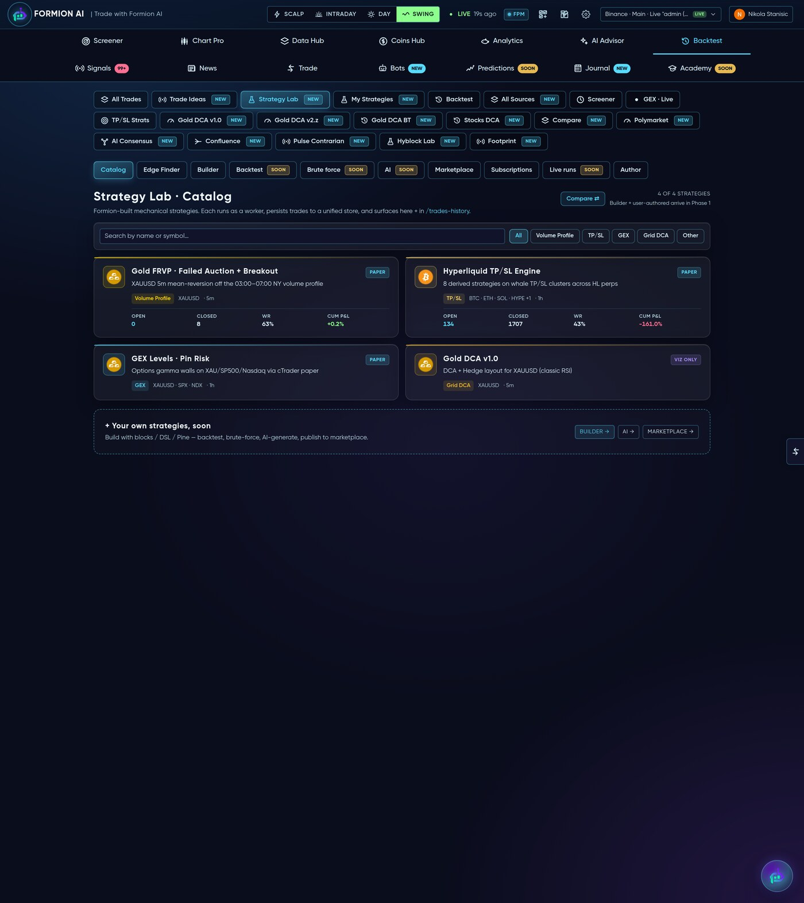
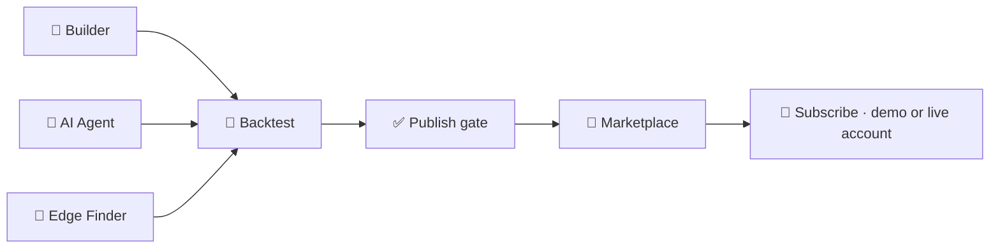

# 🧪 Strategy Lab & Marketplace

<figure><figcaption>Build a strategy with no code, test it honestly, then publish it to the marketplace.</figcaption></figure>

The **Strategy Lab** (app.formion.ai → Backtest → Strategy Lab) is where you turn an idea into a tested strategy — without writing code — and optionally **publish it to the marketplace**. Strategy Lab is part of the **Pro** and **Institutional** plans.

```mermaid
flowchart LR
  B["🧱 Builder"] --> BT["🧪 Backtest"]
  AI["🧠 AI Agent"] --> BT
  EF["🤖 Edge Finder"] --> BT
  BT --> PUB["✅ Publish gate"]
  PUB --> MK["🛒 Marketplace"]
  MK --> SUB["🔗 Subscribe · demo or live account"]
```

## Three ways to build

* **🧱 No-code Builder** — compose entry rules from indicator blocks (price, RSI, EMA, SMA, MACD, ATR, Bollinger Bands, volume), pick exits (TP/SL %, ATR multiples, time stop, opposite signal), fill the risk block and fees, and backtest on the server. Drafts are saved to your account. No Pine, no scripting.
* **🧠 AI Agent** — describe what you want in plain language (e.g. "an RSI strategy on BTC 4h") and the agent maps it to a built-in template, backtests it on live candles, charts the BUY/SELL markers with win rate and gives you the equivalent Pine Script. You can send the result to a paper agent or export it to TradingView.
* **🤖 Edge Finder** — enter **just a symbol** (crypto from Binance/Bybit, or forex, metals and indices from cTrader). It scans regimes, Wyckoff phases and sessions, then brute-forces a strategy grid (RSI, Z-RSI, EMA cross, Bollinger touch, breakout entries × stop and R:R variants) with a locked holdout and a walk-forward check — net of fees and funding, compared with HODL.

## Test before you trust

Backtests report win rate, profit factor, expectancy, max drawdown and an equity curve, with your fee setting applied. **Compare** puts catalog strategies side by side. The separate Strategy Lab **Backtest** report and **Brute force** sweep tabs are marked **Soon**. Keep the optimisation window separate from validation and forward-test the selected candidate.

## Publish, subscribe & run

Builder strategies pass a **publish gate** before they reach the marketplace: a fresh 365-day backtest plus an in-sample / out-of-sample check (at least 30 trades, drawdown ≤ 30%, positive expectancy, profit factor ≥ 1.1, positive out-of-sample expectancy). Once published, the signal worker runs the strategy on fresh candles and its forward record is tracked in **[Trades History](trades-history.md)**.

In the **🛒 Marketplace** you browse Formion catalog strategies, bots and community strategies with live KPIs and **subscribe** by attaching one to a connected demo or live exchange account. Subscriptions are managed in the **Subscriptions** tab; live attachments are capped by your plan's live-bot limit (see **[Bots & Automation](bots.md)**).

* Listings can be **free** or **paid**. Paid listings need an approved **Partner** application (KYC) on the **Author** page.
* Subscribers pay Formion; authors receive their share after a 25% platform fee and a 14-day hold, paid out monthly in USDC/USDT on Base or BSC (minimum $20). The Author page shows your subscribers, balance and payout history.
* Check each listing's subscription and checkout terms before subscribing.


A strong backtest is a starting point, not a guarantee. Forward-test on paper and size responsibly before running real capital — and judge marketplace strategies by their **forward** record.

