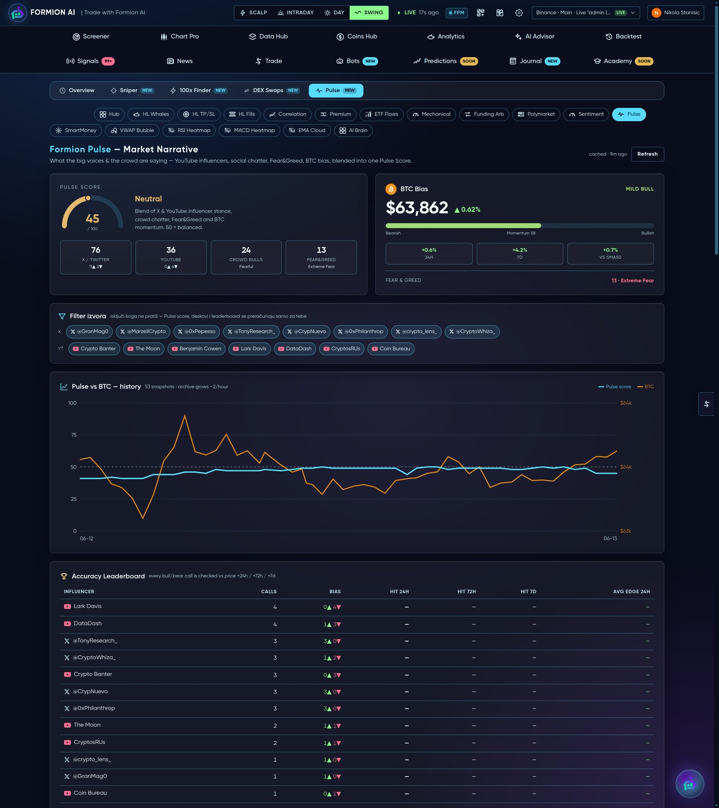
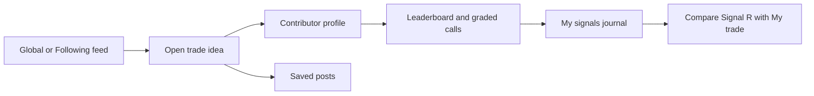

# 🐝 Formion Swarm

<figure><figcaption>
Formion — Formion Swarm
</figcaption></figure>

**Formion Swarm** is the trader social hub: a feed of ideas and calls, contributor profiles, signal review and creator analytics. It connects the discussion around a setup with tools for reviewing its tracked outcome.

## What you see

Feed tabs include **Following**, **Global**, **Trending**, **Saved**, **Copied** and **Lists**. Header shortcuts lead to Profile, Chat, Rooms, Explore, Bookmarks, **My signals**, **Studio** and **Leaderboard**, alongside **Get verified** and settings controls. Cashtag and topic views help focus on an instrument or theme.

## Research a contributor or call

1. Start in Global or Trending to discover posts, or Following for contributors you already follow.
2. Open the post and read its context. Check the instrument, side, entry, stop and target where supplied.
3. Inspect the contributor’s profile and available graded calls; use Leaderboard to compare contributors rather than judging a single highlighted trade.
4. Save a useful post for later review and return through Saved/Bookmarks. Use instrument or topic views to compare related ideas.
5. Open **My signals** to review the signal journal, cumulative R, symbol breakdown and long-versus-short breakdown where available.
6. Keep the **Signal R** and **My trade** columns distinct: a graded call and your execution can have different outcomes.

## Participate and review your work

Use **Post an idea** to compose a contribution. **Creator Studio** (Pro and Institutional) provides engagement views including followers, views, likes, comments, reposts, follower growth, top posts and performance by symbol; Institutional adds who viewed your profile, recent followers and reach. On Neural the Studio shows an upgrade prompt.


A social call is a starting point for research. Review its context and graded sample, then compare your own execution in the journal. A contributor’s ranking does not determine the next call’s result.


Related: [Pulse](pulse.md) · [Chart Pro](chart-pro.md) · [Journal](journal.md) · [Trades History](trades-history.md).

