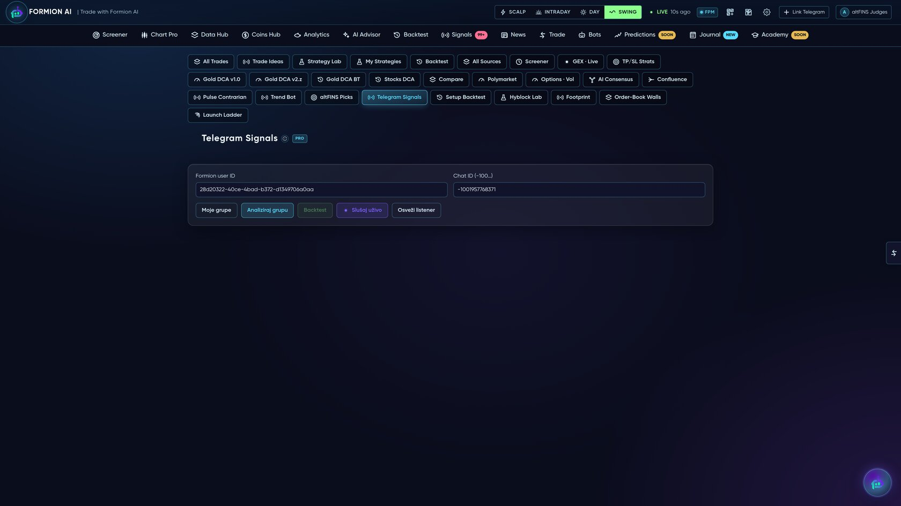
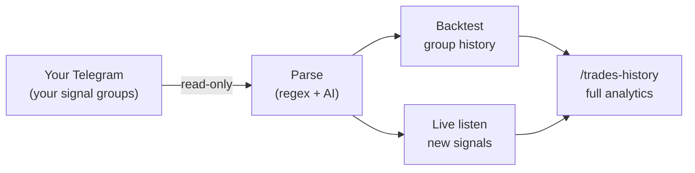

# 📡 Telegram Signals — Connect Your Own Channels

<figure><figcaption></figcaption></figure>

Follow a paid signal channel? **Connect your own Telegram account, point Formion at the groups you're already in, and Formion turns their messages into tracked, backtested trades** — so you finally know whether a channel is actually worth your money.


This is a **Pro / Institutional** feature, and it's **per-user and private** — you connect *your* Telegram, and only *you* see the results. Formion reads messages (read-only); it never posts or trades on your behalf.


## How it works

### 1. Connect your Telegram
Link your own account with the standard phone → code → 2FA login. Your session is encrypted at rest; you can unlink and revoke access any time.

### 2. Pick a group
Formion lists the groups, channels and chats you're a member of. Choose the signal channel you want to evaluate.

### 3. Preview the parsing
Formion pulls recent messages and shows you, side by side, the **raw message → the parsed signal** (side, symbol, entry, stop-loss, take-profits, confidence). The parser is **regex-first** for clean formats and falls back to **AI** for free-form messages ("buy gold on the breakout above 2040, stop 2030, targets 2060/2080") — so it handles almost any channel's style.

### 4. Backtest the whole history *(the killer feature)*
Before you risk a cent, Formion simulates **every historical signal** in the group against real price data and shows you the truth:

* **Win rate**, **profit factor**, **expectancy**, **max drawdown**, total P&L
* **Equity curve** of the channel's real performance
* Breakdown by **symbol** and by **side** (long vs short)

Now you can answer the only question that matters: *is this channel actually profitable?*

### 5. Live-track new signals
Subscribe and Formion listens in real time — every new signal is parsed, de-duplicated and tracked from entry to outcome (won / lost), flowing straight into your unified **[Trade History](journal.md)** with the full analytics suite (equity curve, per-symbol, per-side, session and hour breakdowns).

## Do it from chat, too

You can drive all of this from the **[FORA](fora.md)** assistant in plain language — *"Follow the XAU VIP channel"*, *"Backtest the last 6 months of that group"*, *"Is this channel still winning?"* — and FORA runs the connect / backtest / track flow for you.

## Why it matters

Most signal channels show you wins and hide losses. Formion measures **every** call on **real prices** and keeps the score — the same honest, cost-aware methodology Formion uses for its own engines. Connect a channel, see the equity curve, decide with data.
