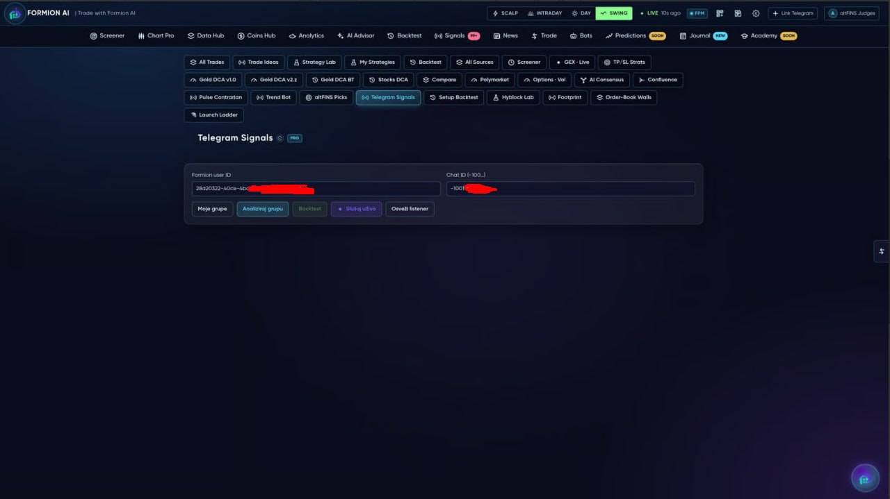
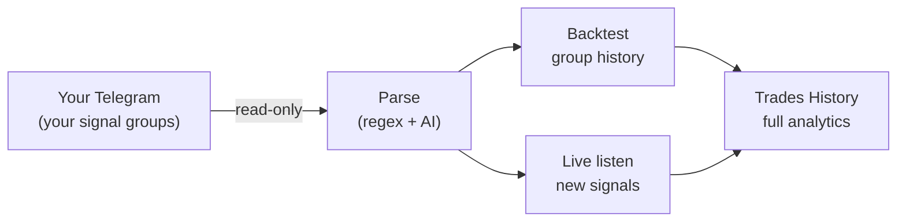

# 📡 Telegram Signals — Connect Your Own Channels

<figure><figcaption></figcaption></figure>

Follow a paid signal channel? **Connect your own Telegram account, point Formion at the groups you're already in, and Formion turns their messages into tracked, backtested trades** — so you finally know whether a channel is actually worth your money.


This is a **Pro / Institutional** feature, and it's **per-user and private** — you connect *your* Telegram, and only *you* see the results. Formion reads messages (read-only) and never sends anything from your account. It does not trade unless you switch on **Auto-execute** for a group (see below).


```mermaid
flowchart LR
  TG["Your Telegram<br/>(your signal groups)"] -->|"read-only"| P["Parse<br/>(regex + AI)"]
  P --> B["Backtest<br/>group history"]
  P --> L["Live listen<br/>new signals"]
  B --> TH["Trades History<br/>full analytics"]
  L --> TH
```

## How it works

### 1. Connect your Telegram
Link your own account with the standard phone → code → 2FA login. Your session is encrypted at rest; you can unlink and revoke access any time.

### 2. Pick a group
Formion lists the groups, channels and chats you're a member of. Choose the signal channel you want to evaluate.

### 3. Preview the parsing
Formion pulls the group's recent history (the last 400 messages, with at most 120 parsed by AI) and shows you, side by side, the **raw message → the parsed signal** (side, symbol, entry, stop-loss, take-profits, confidence). The parser is **regex-first** for clean formats and falls back to **AI** for free-form messages ("buy gold on the breakout above 2040, stop 2030, targets 2060/2080") — so free-form formats can be reviewed alongside structured messages.

### 4. Backtest the available history
Before you risk a cent, run the available **10-day backtest window** and inspect which parsed signals have price coverage:

* **Win rate**, **profit factor**, **expectancy**, **max drawdown**, total P&L
* **Equity curve** of the simulated channel signals
* Breakdown by **symbol** and by **side** (long vs short)

Now you can answer the only question that matters: *is this channel actually profitable?*

### 5. Live-track new signals
Subscribe and Formion listens in real time — every new signal is parsed, de-duplicated and tracked from entry to outcome (won / lost), flowing straight into your unified **[Trades History](trades-history.md)** with the full analytics suite (equity curve, per-symbol, per-side, session and hour breakdowns).

## Manage tracking

Subscribed groups appear in your tracked list. Review recent signal statuses and unsubscribe to stop monitoring.

**Auto-execute (optional):** in **formion.ai → Profile → Connections → Telegram Signals**, each subscribed group has an **Auto-execute** switch that turns its signals into trades on your connected **cTrader** or **Bybit** account, with a lot size you set. It is **demo only for now**; live execution is gated for safety. A simulation is not the channel's brokerage record, and tracking does not establish a live fill on your account. Compare raw messages with symbol interpretation, especially for forex and metals.

Use [FORA](fora.md) to discuss your findings and [Alerts](alerts.md) for notification workflows.

## Why it matters

Most signal channels show you wins and hide losses. Formion evaluates supported parsed calls against available price data and keeps the score — the same honest, cost-aware methodology Formion uses for its own engines. Connect a channel, see the equity curve, decide with data.
