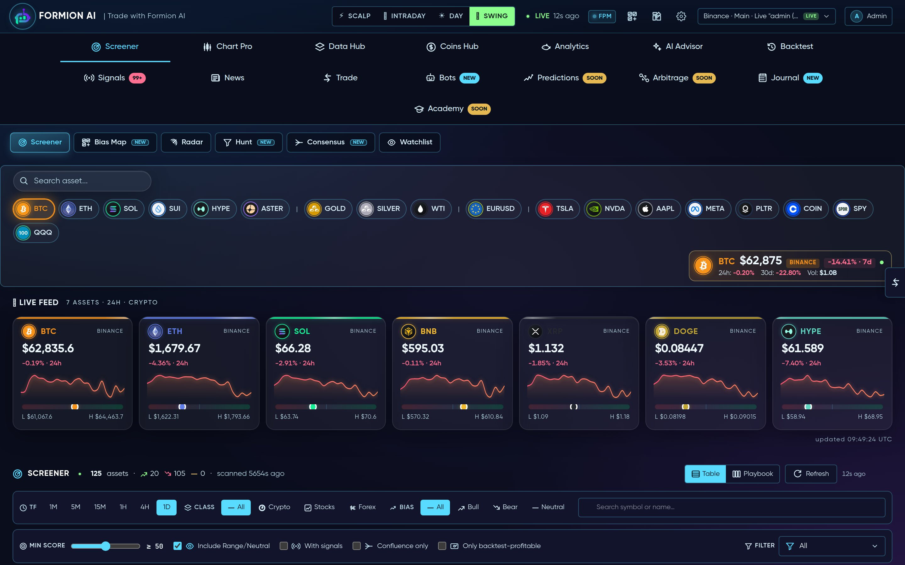
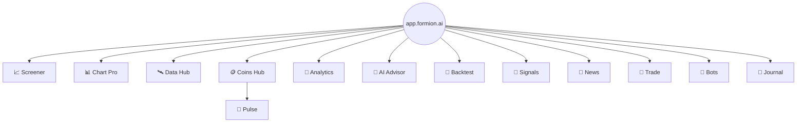
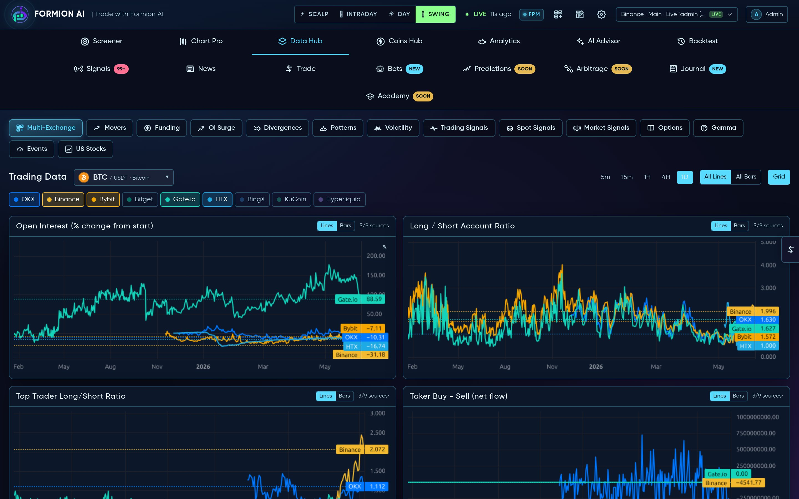
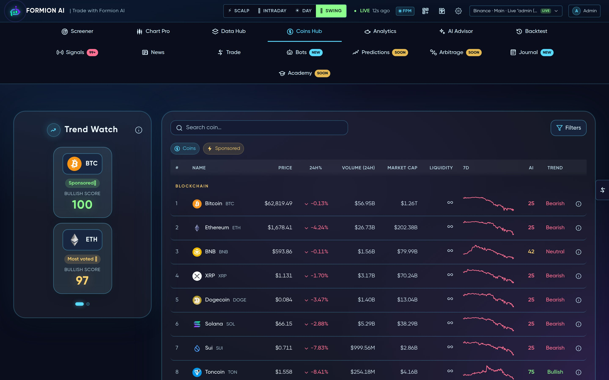
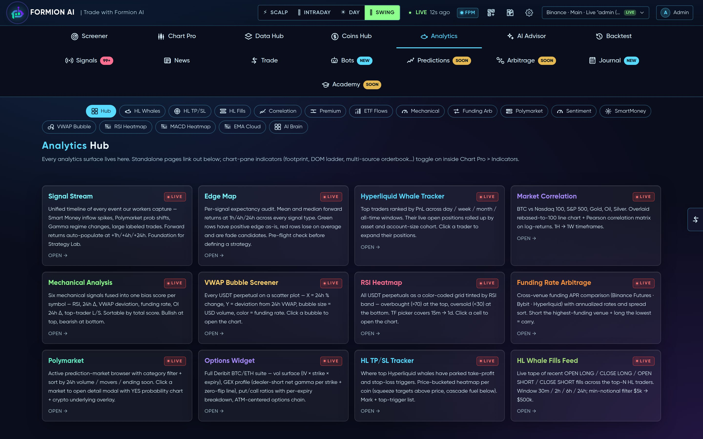
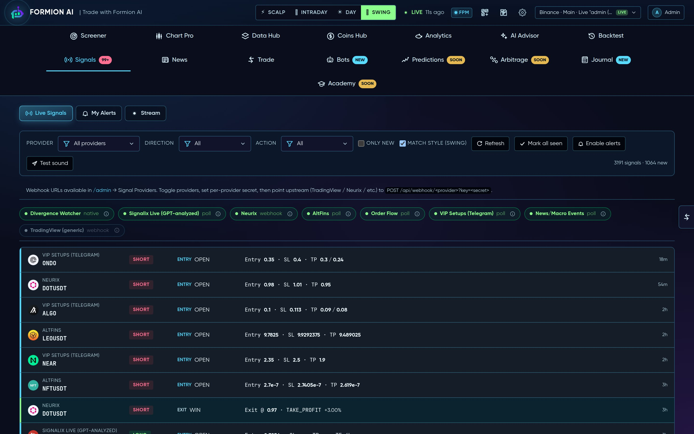
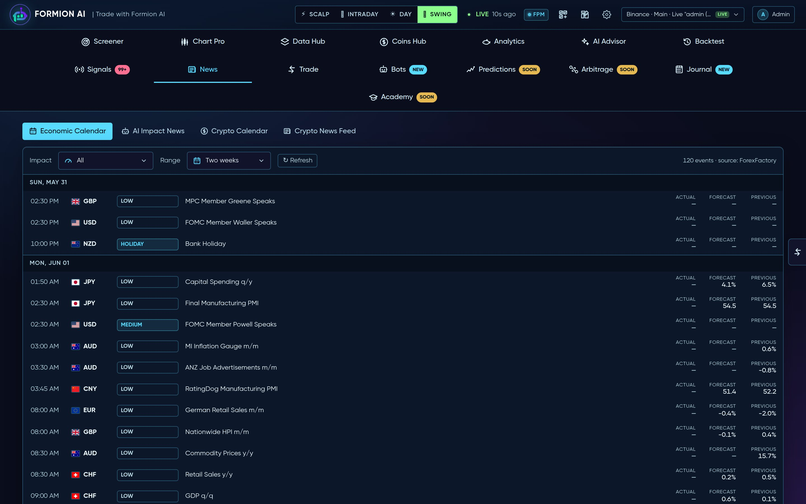

# 🖥️ The App

<figure><figcaption></figcaption></figure>

[app.formion.ai](https://app.formion.ai) is the **Quantum Terminal** — Formion's full trading workspace. This page tours every area of the top navigation so you know where each tool lives.


Feature access depends on your plan — see **[Pricing & Tiers](pricing.md)**. The free **Neural** tier is genuinely useful; **Pro** unlocks the full stack.


### 📈 Screener

<figure><figcaption></figcaption></figure>

The home view: a ranked, sortable table of crypto and stock pairs scored by native signals (RSI, VWAP, funding, OI delta, top-trader long/short). Sub-tools:

* **Bias Map** — confluence heatmap across 5 timeframes (5m → 1d) with an anchor score.
* **Radar** — TradingView preset feeds as filterable cards.
* **Hunt / Consensus** — advanced multi-filter and multi-timeframe consensus screening.

### 📊 Chart Pro (Quantum Terminal)

<figure><figcaption></figcaption></figure>

A professional chart: live OHLCV, 12 timeframes (1m → 1W), 100+ indicators (incl. the proprietary **FormionTSI**), custom Pine scripts via the **User Indicator Studio**, drawing tools, **replay mode**, multi-chart split view, saved layouts, and an order-flow **Workspace** (volume profile, footprint, DOM ladder, orderbook heatmap, large trades, spoofing/iceberg detection).

### 🛰️ Data Hub

<figure><figcaption></figcaption></figure>

Real-time multi-exchange market data: open interest, long/short ratio, top-trader positioning, taker buy/sell delta and funding across OKX, Binance, Bybit, Gate and HTX. Plus scanners — **Funding**, **OI Surge**, **Divergences**, **Patterns**, **Volatility**, **Options (Deribit)**, **Gamma/GEX**, on-chain **Events** and **US Stocks**.

### 🪙 Coins Hub

<figure><figcaption></figcaption></figure>

Trend watch (top gainers/losers by timeframe), a full coin listing with detail cards, and a **GMGN smart-money** inflow panel. Plus **[📡 Formion Pulse](pulse.md)** — a market-narrative hub that reads X & YouTube influencers, social chatter and BTC bias into one Pulse Score, with an accuracy leaderboard that scores each voice against real price moves.

### 🧠 Analytics

<figure><figcaption></figcaption></figure>

A hub of 12+ standalone tools: **Signal Stream** & **Edge Map** (per-signal expectancy), **HL Whale Tracker** / **HL TP-SL** / **HL Fills**, **Correlation** (BTC vs Nasdaq/S&P/Gold/Oil), **Mechanical Analysis**, **VWAP Bubble**, **RSI Heatmap**, **Funding Arb**, and **Polymarket** browser + leaderboard.

### 🤖 AI Advisor

<figure><figcaption></figcaption></figure>

Pick a style/risk/asset class and the AI ranks tradeable ideas from a live screener snapshot. Includes free-form **AI Chat** (file attachments, model picker, thinking toggle), **Trade Vision** (screenshot → analysis) and a **Track Record** of the advisor's historical accuracy.

### 🧪 Backtest

A hub with many sub-tabs: the **Backtester**, **All Trades** ([trades-history](#)) unified across every engine, **[Strategy Lab](strategy-lab.md)** (no-code builder + **Edge Finder** AutoML + **Marketplace** to publish your strategy and earn), **My Strategies** (your Pine), **All Sources**, plus dedicated trackers for **GEX**, **TP/SL strategies**, **Gold DCA**, **Stocks DCA**, **Polymarket**, **AI Consensus**, **Confluence**, **Liqra** (liquidations) and **Footprint**.

### 🔔 Signals

<figure><figcaption></figcaption></figure>

A dense live stream of signals from every provider (webhooks + polling), with win/loss coloring, audio + browser notifications, and a **My Alerts** builder for custom price/RSI/SMC/liquidation rules delivered to browser, sound or Telegram.

### 📰 News

<figure><figcaption></figcaption></figure>

Economic calendar (impact-colored), AI-scored impact news (bullish/bearish/neutral), crypto event calendar and a headline feed.

### 💱 Trade

A live order-entry dock: symbol search, size calculator, entry/stop/TP brackets, real-time P&L and position management.

### 🦾 Bots

<figure><figcaption></figcaption></figure>

The catalog of 35+ live and paper bots (crypto perps, gold, forex, options, prediction markets…) plus your own user-built bots. See **[Bots & Automation](bots.md)**.

### 📓 Journal

Per-trade journaling with notes, charts and full performance review — with AI auto-tagging and auto-import on Pro. See **[Trading Journal](journal.md)**.

### 🔜 Coming soon

**Predictions**, **Arbitrage** and **Academy** tabs are in progress.
