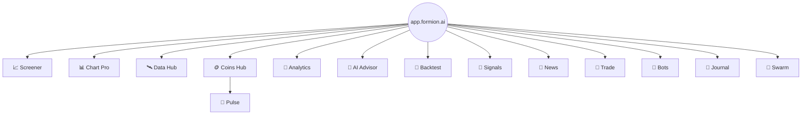
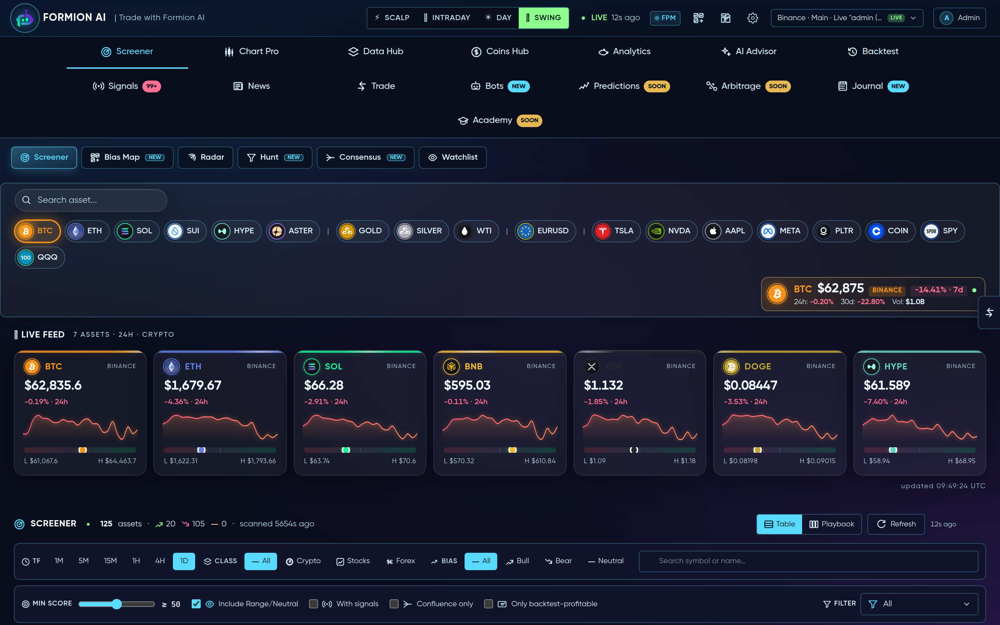
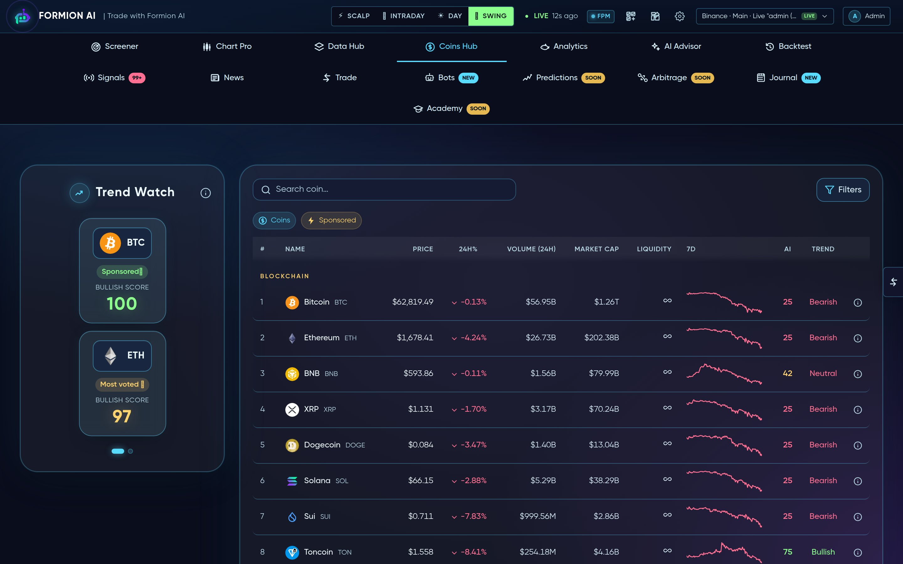
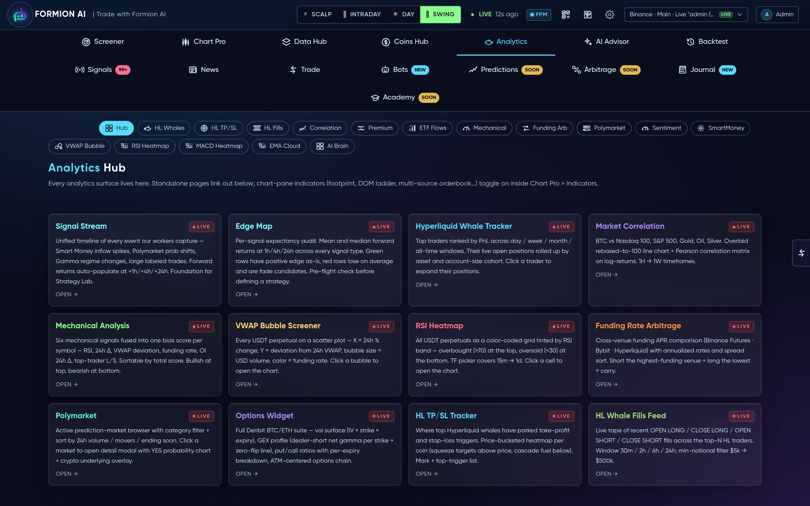
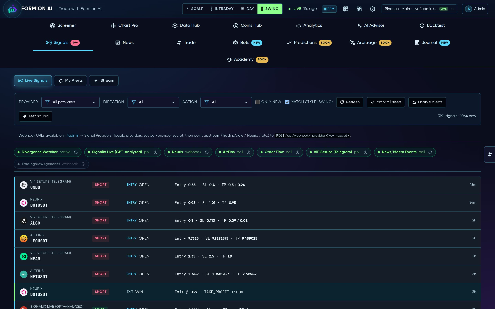

# 🖥️ The App

<figure><figcaption></figcaption></figure>

[app.formion.ai](https://app.formion.ai) is the **Quantum Terminal** — Formion's full trading workspace. This page tours every area of the top navigation so you know where each tool lives.


Feature access depends on your plan — see **[Pricing & Tiers](pricing.md)**. The free **Neural** tier is genuinely useful; **Pro** unlocks the full stack.


```mermaid
flowchart TD
  APP(("app.formion.ai")) --> S["📈 Screener"]
  APP --> C["📊 Chart Pro"]
  APP --> D["🛰️ Data Hub"]
  APP --> CH["🪙 Coins Hub"]
  CH --> PU["📡 Pulse"]
  APP --> AN["🧠 Analytics"]
  APP --> AI["🤖 AI Advisor"]
  APP --> BT["🧪 Backtest"]
  APP --> SG["🔔 Signals"]
  APP --> NW["📰 News"]
  APP --> TR["💱 Trade"]
  APP --> BO["🦾 Bots"]
  APP --> JR["📓 Journal"]
  APP --> SW["🐝 Swarm"]
```

### 📈 Screener

<figure><figcaption></figcaption></figure>

The home view: a ranked, sortable table of crypto, stock and forex symbols, each with one composite score (trend, momentum, volume, volatility) plus signal tags (FVG/OB entries, VWAP reclaims, BoS/CHoCH…). Sub-tools include:

* **Bias Map** — directional bias heatmap across 5 timeframes (5m → 1d) with a selectable anchor timeframe.
* **Radar** — 30+ TradingView preset scans as signal cards.
* **Hunt** — a top-down US-equities setup funnel; **Consensus** — symbols where several engines agree.
* **Patterns**, **Trend**, **Arbitrage**, **Order Book**, **Watchlist** and the RSI/MACD/EMA/VWAP heatmaps.

**[Full guide → Screener](screener.md)**

### 📊 Chart Pro (Quantum Terminal)

<figure><figcaption></figcaption></figure>

A professional chart: live OHLCV, 12 timeframes (1m → 1W), 100+ indicators (incl. the proprietary **FormionTSI**), custom Pine scripts via the **User Indicator Studio**, drawing tools, **replay mode**, multi-chart split view, saved layouts, and an order-flow **Constructor** workspace (volume profile, footprint, DOM ladder, orderbook heatmap, tape and liquidations, spoofing/iceberg detection). **[Full guide → Chart Pro](chart-pro.md)**

### 🛰️ Data Hub

<figure><figcaption></figcaption></figure>

Real-time multi-exchange market data: open interest, long/short ratio, top-trader positioning, taker buy/sell delta and funding (OKX, Binance, Bybit, Gate and HTX by default). Plus order-flow pages (Order Flow, Heatmaps, DOM Pro, Liq Map, Walls) and scanners — **Funding**, **OI Surge**, **Divergences**, **Patterns**, **Volatility**, **Options**, **Gamma/GEX**, **Events** and **US Stocks**. **[Full guide → Data Hub](data-hub.md)**

### 🪙 Coins Hub

<figure><figcaption></figcaption></figure>

Trend watch (top gainers/losers by timeframe) and a full coin listing with detail pages, plus Sniper, DEX Swaps, GMGN, Token Scanner, Smart Wallets, Graduation/Listing Radar and Presale Watch (Coins Hub is labelled **BETA**). Also **[📡 Formion Pulse](pulse.md)** — a market-narrative hub that reads X & YouTube influencers, social chatter and BTC bias into one Pulse Score. **[Full guide → Coins Hub](coins-hub.md)**

### 🧠 Analytics

<figure><figcaption></figcaption></figure>

A hub of 20+ standalone tools: **Signal Stream** & **Edge Map** (per-signal expectancy), **HL Whales** / **HL TP-SL** / **HL Fills** / **HL Directory** / **HL Whale Compass**, **Correlation** (BTC vs Nasdaq/S&P/Gold/Oil), **Premium**, **Spot vs Perp**, **ETF Flows**, **Mechanical**, **Funding Arb**, **Sentiment**, **SmartMoney**, VWAP/RSI/MACD/EMA heatmaps, **AI Brain**, and the **Polymarket** browser + top traders. **[Full guide → Analytics](analytics.md)**

### 🤖 AI Advisor

<figure><figcaption></figcaption></figure>

Pick a style/risk/asset class and the AI ranks tradeable ideas from a live screener snapshot. Includes free-form **AI Chat** (file attachments, model picker, thinking toggle), **Trade Vision** (screenshot → plan), a **Track Record** of the advisor's past ideas, **Research** (RAG reports + Portfolio Builder) and the **Strategy Agent**.

### 🧪 Backtest

A hub with many sub-tabs: the **Backtester**, **All Trades** ([Trades History](trades-history.md)) unified across engines, **Trade Ideas**, **[Strategy Lab](strategy-lab.md)** (no-code builder + **Edge Finder** AutoML + **Marketplace** to publish your strategy and earn), **My Strategies** (backtest your saved strategies), **All Sources**, **Compare**, plus dedicated trackers for **GEX**, **TP/SL strategies**, **Gold DCA**, **Stocks DCA**, **Polymarket**, **Options · Vol**, **Confluence**, **Telegram Signals**, **Signalix**, **Setup Backtest** and **Footprint**.

### 🔔 Signals

<figure><figcaption></figcaption></figure>

A dense live stream of signals from every provider (webhooks + polling), with win/loss coloring, audio + browser notifications, and a **My Alerts** builder for custom price/RSI/SMC/liquidation rules delivered to browser, sound, email or Telegram.

### 📰 News

<figure><figcaption></figcaption></figure>

Economic calendar (impact-colored), AI-scored impact news (bullish/bearish/neutral), crypto event calendar and a headline feed.

### 💱 Trade

A live order-entry dock: symbol search, size calculator, entry/stop/TP brackets, real-time P&L and position management.

### 🦾 Bots

<figure><figcaption></figcaption></figure>

The catalog of Formion bots (crypto, gold/metals, forex, stocks, prediction markets…) with their tracked results, plus your own user-built bots under **My Bots**. See **[Bots & Automation](bots.md)**.

### 📓 Journal

Per-trade journaling with notes, tags, screenshots and full performance review, exchange import, an AI review of your trades and P&L share cards. See **[Trading Journal](journal.md)**.

### 🐝 Swarm

Formion's trader social space: post calls, have them graded against real price action, and compare contributors on the leaderboard. See **[Swarm](swarm.md)**.

### 🔜 Coming soon

**Predictions** (an AI price-projection panel) and **Academy** are marked **Soon** in the navigation; a few introductory lessons are already at [formion.ai/academy](https://formion.ai/academy). Funding Carry and spread research are available through the Screener and Analytics workflows.

## Current workflow additions

Use [Command Center](command-center.md) on the formion.ai dashboard to launch FORA, [News](news.md) for macro and crypto events, [Swarm](swarm.md) for trader calls, [Funding Carry](funding-carry.md) for cross-venue research, and [Trades History](trades-history.md) for tracked outcomes. Connect **cTrader forex/CFD brokers** alongside crypto exchanges.

Academy and Predictions are marked **Soon** in the navigation.
