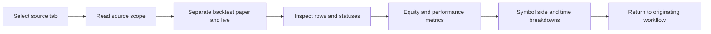

# 🧾 Trades History

<figure><figcaption>
Formion — Trades History
</figcaption></figure>

**Trades History** consolidates tracked strategies, signals and account sources into a review workspace. Source selection determines what the trade rows and aggregate metrics represent, so start with the source before interpreting a chart.

## What you see

The source tabs include **All Bots**, **cTrader**, **Research Ledger**, **AI Advisor**, **Screener**, **Telegram Signals** and **Funding Carry**, among other available strategy sources. Each source has a description; review it to understand the record’s scope.

The workspace provides trade rows and statuses, equity and performance metrics, with available breakdowns by symbol, side, session or hour. Coverage depends on the source and recorded trades. An empty source is not evidence that a trade was placed and lost.

## Review a record

1. Choose All Bots for an overview, then select a specific source for a focused review. Funding Carry’s paper-book link opens its source directly.
2. Read the source description and identify whether the record is a historical backtest, forward paper tracking or live account activity.
3. Inspect trade rows: instrument, direction, entry/exit context and status. Separate still-open positions from resolved trades.
4. Review the available equity curve and metrics such as win rate, profit factor, expectancy and drawdown. Compare sample size and the period covered.
5. Use the available symbol, side, session and hour breakdowns to see whether the aggregate result is concentrated in a subset of trades.
6. Return to the originating workflow to investigate a result: Telegram Signals for parsed channel calls, Strategy Lab for a tested strategy, or the connected account for live fills.

## Read outcomes carefully

A backtest replays historical conditions; a forward paper trade tracks a simulated position as new prices arrive; a live fill is an actual account execution. Keep these categories distinct even when they share a chart format. A paper row does not establish that an order filled live, and a source’s percentage return may use a different denominator from another source.


Use a single source for a fair comparison of strategies or periods. Confirm status, costs and return units before drawing conclusions from an aggregate chart.


[Journal](journal.md) complements this ledger with your own trade review. Related: [Telegram Signals](telegram-signals.md) · [Strategy Lab](strategy-lab.md) · [Funding Carry](funding-carry.md) · [Brokers](brokers.md).

